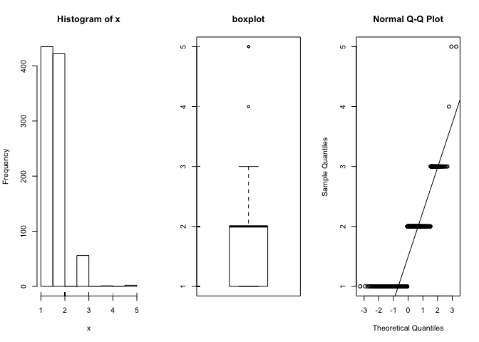

Homework 02
================
Biol 364 Student

## GitHub Documents

This is an R Markdown format used for publishing markdown documents to
GitHub. When you click the **Knit** button all R code chunks are run and
a markdown file (.md) suitable for publishing to GitHub is generated.

## Including Code

You can include R code in the document as follows:

``` r
summary(cars)
```

    ##      speed           dist       
    ##  Min.   : 4.0   Min.   :  2.00  
    ##  1st Qu.:12.0   1st Qu.: 26.00  
    ##  Median :15.0   Median : 36.00  
    ##  Mean   :15.4   Mean   : 42.98  
    ##  3rd Qu.:19.0   3rd Qu.: 56.00  
    ##  Max.   :25.0   Max.   :120.00

## Including Plots

You can also embed plots, for example:

<!-- -->

Note that the `echo = FALSE` parameter was added to the code chunk to
prevent printing of the R code that generated the plot.

## The NCHA-II Dataset

Follow this link to see copies of the Web surveys completed by Bucknell
students in 2014 and 2016. Note that there are some differences in the
surveys in the two years.
<https://www.acha.org/NCHA/About_ACHA_NCHA/Survey/NCHA/About/Survey.aspx>

``` r
library(haven)
NCHA <- read_sav("NCHA-II_WEB_SPRING_2014_and_2016_for_Ken_Field_class_project.SAV")
View(NCHA)
```

Each of the columns has a name that refers to the question number on the
web-based form. It also has a label that gives a short version of the
question. However, R doesn’t know how to handle this data type very
well, so you will often want to tell R to convert the column into a
factor or a numeric type. We also want to convert the GPA question into
a format that makes more sense. We will make a new column “GPA” that
converts the survey results into a 4 point scale.

63) What is your approximate cumulative grade average?  A  B  C  D/F
     N/A

<!-- end list -->

``` r
library(UsingR)
```

    ## Loading required package: MASS

    ## Loading required package: HistData

    ## Loading required package: Hmisc

    ## Loading required package: lattice

    ## Loading required package: survival

    ## Loading required package: Formula

    ## Loading required package: ggplot2

    ## 
    ## Attaching package: 'Hmisc'

    ## The following objects are masked from 'package:base':
    ## 
    ##     format.pval, units

    ## 
    ## Attaching package: 'UsingR'

    ## The following object is masked from 'package:survival':
    ## 
    ##     cancer

``` r
summary(NCHA$NQ63)
```

    ##    Min. 1st Qu.  Median    Mean 3rd Qu.    Max.    NA's 
    ##   1.000   1.000   2.000   1.595   2.000   5.000      20

``` r
#simple.eda(NCHA$NQ63) ### This will give an error because of the data type
simple.eda(as.numeric(NCHA$NQ63))
```

<!-- -->

``` r
NCHA$GPA <- 5 - as.numeric(NCHA$NQ63)
```

``` r
dim(NCHA)
```

    ## [1] 936  28

``` r
summary(NCHA)
```

    ##    SurveyYear        NQ1           School              NQ2B5      
    ##  Min.   :2014   Min.   :1.000   Length:936         Min.   :1.000  
    ##  1st Qu.:2014   1st Qu.:2.000   Class :character   1st Qu.:1.000  
    ##  Median :2014   Median :2.000   Mode  :character   Median :1.000  
    ##  Mean   :2015   Mean   :2.306                      Mean   :1.269  
    ##  3rd Qu.:2016   3rd Qu.:3.000                      3rd Qu.:2.000  
    ##  Max.   :2016   Max.   :6.000                      Max.   :2.000  
    ##                 NA's   :7                          NA's   :5      
    ##      NQ3B5           NQ31A8          NQ33K            NQ42      
    ##  Min.   :1.000   Min.   :1.000   Min.   :1.000   Min.   :1.000  
    ##  1st Qu.:1.000   1st Qu.:1.000   1st Qu.:1.000   1st Qu.:3.000  
    ##  Median :2.000   Median :1.000   Median :1.000   Median :4.000  
    ##  Mean   :1.695   Mean   :1.049   Mean   :1.246   Mean   :3.897  
    ##  3rd Qu.:2.000   3rd Qu.:1.000   3rd Qu.:1.000   3rd Qu.:5.000  
    ##  Max.   :2.000   Max.   :5.000   Max.   :2.000   Max.   :8.000  
    ##  NA's   :7       NA's   :15      NA's   :12      NA's   :14     
    ##       NQ43           NQ44A           NQ44B           NQ44D      
    ##  Min.   :1.000   Min.   :1.000   Min.   :1.000   Min.   :1.000  
    ##  1st Qu.:2.000   1st Qu.:1.000   1st Qu.:3.000   1st Qu.:1.000  
    ##  Median :3.000   Median :1.000   Median :5.000   Median :2.000  
    ##  Mean   :2.768   Mean   :1.984   Mean   :4.735   Mean   :2.453  
    ##  3rd Qu.:3.000   3rd Qu.:3.000   3rd Qu.:6.000   3rd Qu.:3.000  
    ##  Max.   :5.000   Max.   :8.000   Max.   :8.000   Max.   :8.000  
    ##  NA's   :12      NA's   :11      NA's   :11      NA's   :11     
    ##      NQ45D4          NQ44C           RNQ47A         NQ51      
    ##  Min.   :1.000   Min.   :1.000   Min.   :1.0   Min.   :1.000  
    ##  1st Qu.:1.000   1st Qu.:1.000   1st Qu.:1.0   1st Qu.:1.000  
    ##  Median :2.000   Median :3.000   Median :1.0   Median :2.000  
    ##  Mean   :1.871   Mean   :3.073   Mean   :1.3   Mean   :2.402  
    ##  3rd Qu.:2.000   3rd Qu.:4.000   3rd Qu.:2.0   3rd Qu.:4.000  
    ##  Max.   :6.000   Max.   :8.000   Max.   :2.0   Max.   :7.000  
    ##  NA's   :12      NA's   :12      NA's   :686   NA's   :25     
    ##       NQ52           NQ54A            NQ54B             NQ54C       
    ##  Min.   :1.000   Min.   :0.0000   Min.   :0.00000   Min.   :0.0000  
    ##  1st Qu.:1.000   1st Qu.:1.0000   1st Qu.:0.00000   1st Qu.:0.0000  
    ##  Median :1.000   Median :1.0000   Median :0.00000   Median :0.0000  
    ##  Mean   :1.014   Mean   :0.8355   Mean   :0.03526   Mean   :0.0438  
    ##  3rd Qu.:1.000   3rd Qu.:1.0000   3rd Qu.:0.00000   3rd Qu.:0.0000  
    ##  Max.   :3.000   Max.   :1.0000   Max.   :1.00000   Max.   :1.0000  
    ##  NA's   :22                                                         
    ##      NQ54D             NQ54E             NQ54F             NQ54G        
    ##  Min.   :0.00000   Min.   :0.00000   Min.   :0.00000   Min.   :0.00000  
    ##  1st Qu.:0.00000   1st Qu.:0.00000   1st Qu.:0.00000   1st Qu.:0.00000  
    ##  Median :0.00000   Median :0.00000   Median :0.00000   Median :0.00000  
    ##  Mean   :0.08654   Mean   :0.01068   Mean   :0.03098   Mean   :0.01389  
    ##  3rd Qu.:0.00000   3rd Qu.:0.00000   3rd Qu.:0.00000   3rd Qu.:0.00000  
    ##  Max.   :1.00000   Max.   :1.00000   Max.   :1.00000   Max.   :1.00000  
    ##                                                                         
    ##       NQ55            NQ59            NQ63            GPA       
    ##  Min.   :1.000   Min.   :1.000   Min.   :1.000   Min.   :0.000  
    ##  1st Qu.:1.000   1st Qu.:1.000   1st Qu.:1.000   1st Qu.:3.000  
    ##  Median :1.000   Median :1.000   Median :2.000   Median :3.000  
    ##  Mean   :1.079   Mean   :1.349   Mean   :1.595   Mean   :3.405  
    ##  3rd Qu.:1.000   3rd Qu.:2.000   3rd Qu.:2.000   3rd Qu.:4.000  
    ##  Max.   :2.000   Max.   :2.000   Max.   :5.000   Max.   :4.000  
    ##  NA's   :25      NA's   :20      NA's   :20      NA's   :20

``` r
summary(NCHA$NQ43)
```

    ##    Min. 1st Qu.  Median    Mean 3rd Qu.    Max.    NA's 
    ##   1.000   2.000   3.000   2.768   3.000   5.000      12

``` r
simple.eda(as.numeric(NCHA$NQ43))
```

<!-- -->

After exploring the dataset, formulate some tentative hypotheses that
you wish to test.

``` r
library(ggplot2)
library(cowplot)
```

    ## 
    ## Attaching package: 'cowplot'

    ## The following object is masked from 'package:ggplot2':
    ## 
    ##     ggsave

``` r
ggplot(NCHA) +
  aes(x = NQ43) +
  geom_bar() +
  theme_cowplot()
```

    ## Don't know how to automatically pick scale for object of type haven_labelled. Defaulting to continuous.

    ## Warning: Removed 12 rows containing non-finite values (stat_count).

<!-- -->

``` r
mosaicplot(~ GPA + NQ43, data = NCHA, color = TRUE)
```

<!-- -->

``` r
ggplot(NCHA) +
  aes(x = as.numeric(NQ43), y = GPA) +
  geom_jitter(aes(color = factor(NQ51)), na.rm=TRUE) +
  theme_cowplot() +
  theme(legend.position = "right") +
  labs(color="Class Year") + 
  xlab("Problem with sleepiness (last 7 days)") + 
  ylab("Approximate GPA")
```

<!-- -->

43) People sometimes feel sleepy during the daytime. In the past 7 days,
    how much of a problem have you had with sleepiness (feeling sleepy,
    struggling to stay awake) during your daytime activities?  No
    problem at all  A little problem  More than a little problem  A
    big problem  A very big problem

44) What is your year in school?  1st year undergraduate  2nd year
    undergraduate  3rd year undergraduate  4th year undergraduate 
    5th year or more undergraduate  Graduate or professional  Not
    seeking a degree  Other

# Acknowledgements
