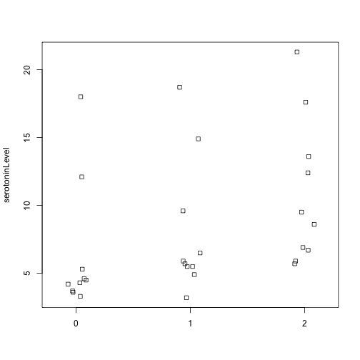
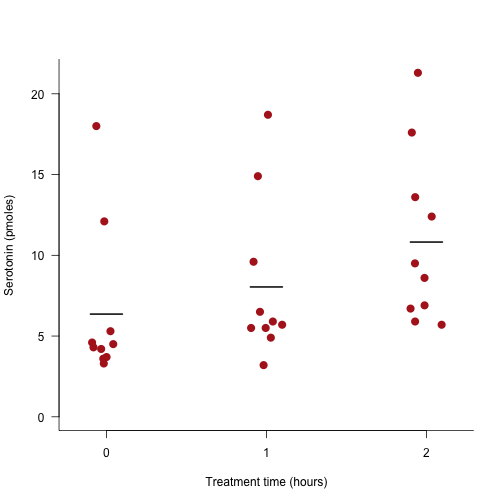
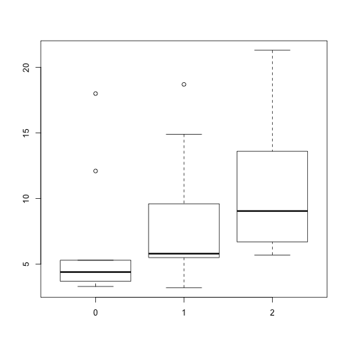
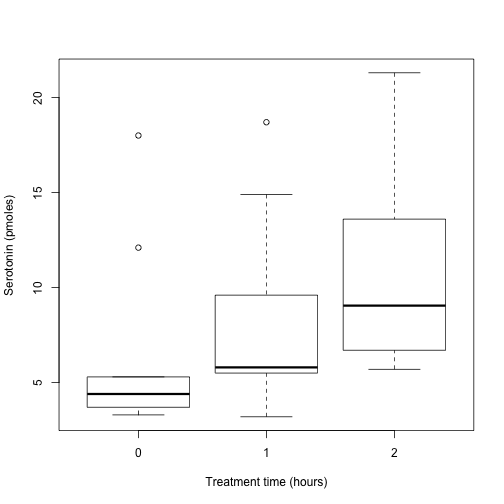

Lecture02 Biology 364/664 Bucknell
========================================================
author: Ken Field
date: 1/17/2019
autosize: true

Rules of Graphing
========================================================

The Analysis of Biological Data
Whitlock & Schluter

- Show the data.
- Make patterns in the data easy to see.
- Represent magnitudes honestly.
- Draw graphical elements clearly.

Locust serotonin
========================================================


```r
locustData <- read.csv(url("http://whitlockschluter.zoology.ubc.ca/wp-content/data/chapter02/chap02f1_2locustSerotonin.csv"))
summary(locustData)
```

```
 serotoninLevel   treatmentTime
 Min.   : 3.200   Min.   :0    
 1st Qu.: 4.675   1st Qu.:0    
 Median : 5.900   Median :1    
 Mean   : 8.407   Mean   :1    
 3rd Qu.:11.475   3rd Qu.:2    
 Max.   :21.300   Max.   :2    
```

```r
dim(locustData)
```

```
[1] 30  2
```

Plain Stripchart
========================================================


```r
stripchart(serotoninLevel ~ treatmentTime, data = locustData, method = "jitter", 
	vertical = TRUE)
```



Stripchart & Boxplot
========================================================


***



Label your axes!
========================================================


from https://xkcd.com/833/ 

***


Boxplot Range
========================================================
This determines how far the plot whiskers extend out from the box. If range is positive, the whiskers extend to the most extreme data point which is no more than range times the interquartile range from the box. A value of zero causes the whiskers to extend to the data extremes.

Default: range=1.5
***


Plot and Data Types
========================================================

