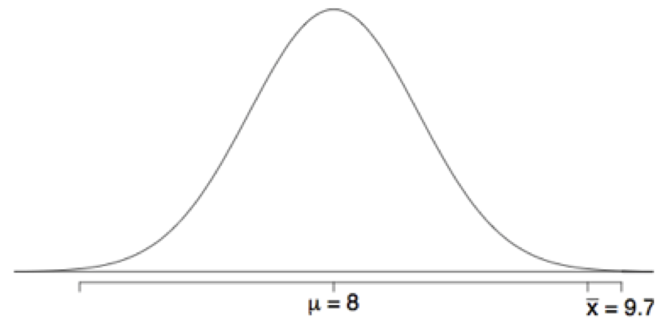
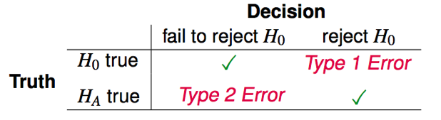

Lecture03 Biology 364/664 Bucknell
========================================================
author: Ken Field
date: 28 Jan 2019
autosize: true

Hypothesis testing framework
========================================================

- We start with a null hypothesis (H0) that represents the status quo.
- We also have an alternative hypothesis (HA) that represents our research question, i.e. what we're testing for.
- We conduct a hypothesis test under the assumption that the null hypothesis is true, either via simulation or traditional methods based on the central limit theorem (coming up next...).
- If the test results suggest that the data do not provide convincing evidence for the alternative hypothesis, we stick with the null hypothesis. If they do, then we reject the null hypothesis in favor of the alternative.

Application
========================================================

A survey asked Duke University students how many colleges they applied to, and 206 students responded to this question. This sample yielded an average of 9.7 college applications with a standard deviation of 7. College Board website states that counselors recommend students apply to roughly 8 colleges.  Do these data provide convincing evidence that the average number of colleges all Duke students apply to is higher than recommended?

There may be two explanations why our sample mean is higher than the recommended 8 schools.
- The true population mean is different.
- The true population mean is 8, and the difference between the true population mean and the sample mean is simply due to natural sampling variability

* Null Hypothesis: The average number of colleges Duke students apply to is 8 (as recommended)
* Alternative Hypothesis: Mean > 8

Assumptions
========================================================

Which of the following is not a condition that needs to be met to proceed with this hypothesis test?

1. Students in the sample should be independent of each other with respect to how many colleges they applied to.
2. Sampling should have been done randomly.
3. The sample size should be less than 10% of the population of all Duke students.
4. There should be at least 10 successes and 10 failures in the sample.
5. The distribution of the number of colleges students apply to should not be extremely skewed.

p-values
========================================================

**p-value**: probability of observing data at least as favorable to HA as our current data set (a sample mean greater than 9.7), if in fact H0 were true (the true population mean was 8).

 

P(x̄ > 9.7 | µ = 8) = P(Z > 3.4) = 0.0003

Decision Errors
========================================================

There are two competing hypotheses: the null and the alternative. In a hypothesis test, we make a decision about which might be true, but our choice might be incorrect.

 

- A Type 1 Error is rejecting the null hypothesis when H0 is true.
- A Type 2 Error is failing to reject the null hypothesis when HA is true.

Choosing a significance level
========================================================

- Choosing a significance level for a test is important in many contexts, and the traditional level is 0.05. However, it is often helpful to adjust the significance level based on the application. 
- We may select a level that is smaller or larger than 0.05 depending on the consequences of any conclusions reached from the test.
- If making a Type 1 Error is dangerous or especially costly, we should choose a small significance level (e.g. 0.01). Under this scenario we want to be very cautious about rejecting the null hypothesis, so we demand very strong evidence favoring HA before we would reject H0.
- If a Type 2 Error is relatively more dangerous or much more costly than a Type 1 Error, then we should choose a higher significance level (e.g. 0.10). Here we want to be cautious about failing to reject H0 when the null is actually false.

