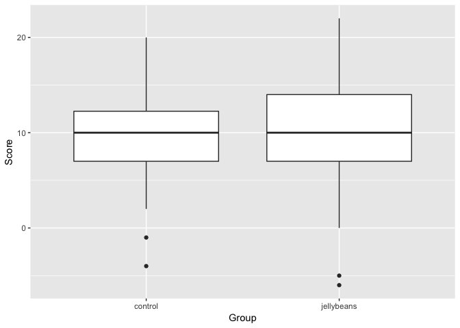
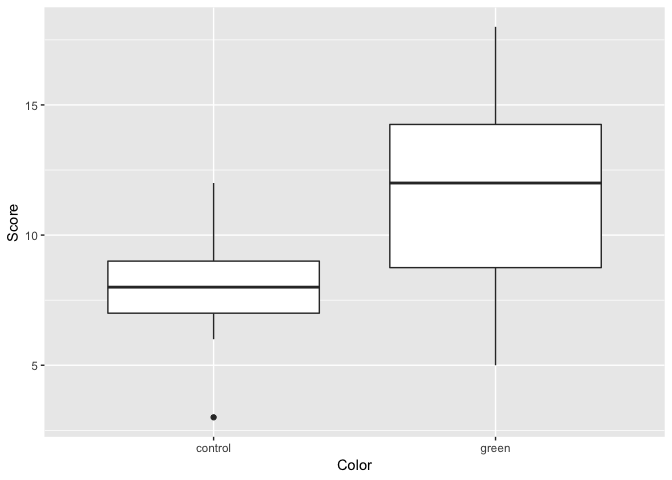

Lab 05 Warmup
================
Prof. Ken Field, Bucknell University
2/10/2019

## Loading Data

Scientists have been asked to investigate whether jelly beans cause
acne. They enrolled 200 high school students in a study where the
control group (n=100) avoided all jellybeans for 2 months. The treatment
group (n=100) were given a free bag of jellybeans every week and were
told to consume all of them before the next week. At the end of the
study, the acne level of each participant was scored.

``` r
acne <- read.csv("acne.csv")
```

## Statistical Test

The scientists determined that there was no link between jelly beans and
acne.

``` r
t.test(Score ~ Group, data = acne)
```

    ## 
    ##  Welch Two Sample t-test
    ## 
    ## data:  Score by Group
    ## t = -0.5573, df = 190.9, p-value = 0.578
    ## alternative hypothesis: true difference in means is not equal to 0
    ## 95 percent confidence interval:
    ##  -1.7703396  0.9903396
    ## sample estimates:
    ##    mean in group control mean in group jellybeans 
    ##                     9.93                    10.32

``` r
ggplot(acne, aes(x=Group, y=Score)) + 
  geom_boxplot()
```

<!-- -->

But people are skeptical and think that it might not be all jellybeans,
but only those of a certain color. So the scientists stop playing
Minecraft long enough to conduct a second study. This time they have a
control group (n=10) and twenty groups (n=10 per group) that each eat
bags of only a single color of jellybean.

``` r
acne2 <- read.csv("acne2.csv")
# a for loop probably would have been better!
t.test(Score ~ Color, data = filter(acne2, Color == "control" | Color == "purple"))
```

    ## 
    ##  Welch Two Sample t-test
    ## 
    ## data:  Score by Color
    ## t = 0.14026, df = 15.281, p-value = 0.8903
    ## alternative hypothesis: true difference in means is not equal to 0
    ## 95 percent confidence interval:
    ##  -2.834487  3.234487
    ## sample estimates:
    ## mean in group control  mean in group purple 
    ##                   7.9                   7.7

``` r
t.test(Score ~ Color, data = filter(acne2, Color == "control" | Color == "brown"))
```

    ## 
    ##  Welch Two Sample t-test
    ## 
    ## data:  Score by Color
    ## t = 1.4653, df = 12.082, p-value = 0.1684
    ## alternative hypothesis: true difference in means is not equal to 0
    ## 95 percent confidence interval:
    ##  -1.408745  7.208745
    ## sample estimates:
    ##   mean in group brown mean in group control 
    ##                  10.8                   7.9

``` r
t.test(Score ~ Color, data = filter(acne2, Color == "control" | Color == "pink"))
```

    ## 
    ##  Welch Two Sample t-test
    ## 
    ## data:  Score by Color
    ## t = -1.7045, df = 10.644, p-value = 0.1173
    ## alternative hypothesis: true difference in means is not equal to 0
    ## 95 percent confidence interval:
    ##  -10.334582   1.334582
    ## sample estimates:
    ## mean in group control    mean in group pink 
    ##                   7.9                  12.4

``` r
t.test(Score ~ Color, data = filter(acne2, Color == "control" | Color == "blue"))
```

    ## 
    ##  Welch Two Sample t-test
    ## 
    ## data:  Score by Color
    ## t = 1.4449, df = 12.805, p-value = 0.1725
    ## alternative hypothesis: true difference in means is not equal to 0
    ## 95 percent confidence interval:
    ##  -1.293348  6.493348
    ## sample estimates:
    ##    mean in group blue mean in group control 
    ##                  10.5                   7.9

``` r
t.test(Score ~ Color, data = filter(acne2, Color == "control" | Color == "teal"))
```

    ## 
    ##  Welch Two Sample t-test
    ## 
    ## data:  Score by Color
    ## t = -1.1976, df = 17.655, p-value = 0.2469
    ## alternative hypothesis: true difference in means is not equal to 0
    ## 95 percent confidence interval:
    ##  -3.85952  1.05952
    ## sample estimates:
    ## mean in group control    mean in group teal 
    ##                   7.9                   9.3

``` r
t.test(Score ~ Color, data = filter(acne2, Color == "control" | Color == "salmon"))
```

    ## 
    ##  Welch Two Sample t-test
    ## 
    ## data:  Score by Color
    ## t = -0.61758, df = 12.21, p-value = 0.5482
    ## alternative hypothesis: true difference in means is not equal to 0
    ## 95 percent confidence interval:
    ##  -5.425551  3.025551
    ## sample estimates:
    ## mean in group control  mean in group salmon 
    ##                   7.9                   9.1

``` r
t.test(Score ~ Color, data = filter(acne2, Color == "control" | Color == "red"))
```

    ## 
    ##  Welch Two Sample t-test
    ## 
    ## data:  Score by Color
    ## t = -1.8214, df = 13.012, p-value = 0.09161
    ## alternative hypothesis: true difference in means is not equal to 0
    ## 95 percent confidence interval:
    ##  -6.9951793  0.5951793
    ## sample estimates:
    ## mean in group control     mean in group red 
    ##                   7.9                  11.1

``` r
t.test(Score ~ Color, data = filter(acne2, Color == "control" | Color == "turquoise"))
```

    ## 
    ##  Welch Two Sample t-test
    ## 
    ## data:  Score by Color
    ## t = -0.98584, df = 16.29, p-value = 0.3386
    ## alternative hypothesis: true difference in means is not equal to 0
    ## 95 percent confidence interval:
    ##  -4.091411  1.491411
    ## sample estimates:
    ##   mean in group control mean in group turquoise 
    ##                     7.9                     9.2

``` r
t.test(Score ~ Color, data = filter(acne2, Color == "control" | Color == "magenta"))
```

    ## 
    ##  Welch Two Sample t-test
    ## 
    ## data:  Score by Color
    ## t = -0.36266, df = 12.258, p-value = 0.723
    ## alternative hypothesis: true difference in means is not equal to 0
    ## 95 percent confidence interval:
    ##  -4.895701  3.495701
    ## sample estimates:
    ## mean in group control mean in group magenta 
    ##                   7.9                   8.6

``` r
t.test(Score ~ Color, data = filter(acne2, Color == "control" | Color == "yellow"))
```

    ## 
    ##  Welch Two Sample t-test
    ## 
    ## data:  Score by Color
    ## t = -1.496, df = 11.597, p-value = 0.1614
    ## alternative hypothesis: true difference in means is not equal to 0
    ## 95 percent confidence interval:
    ##  -7.87864  1.47864
    ## sample estimates:
    ## mean in group control  mean in group yellow 
    ##                   7.9                  11.1

``` r
t.test(Score ~ Color, data = filter(acne2, Color == "control" | Color == "grey"))
```

    ## 
    ##  Welch Two Sample t-test
    ## 
    ## data:  Score by Color
    ## t = -1.8534, df = 13.804, p-value = 0.08532
    ## alternative hypothesis: true difference in means is not equal to 0
    ## 95 percent confidence interval:
    ##  -6.4762652  0.4762652
    ## sample estimates:
    ## mean in group control    mean in group grey 
    ##                   7.9                  10.9

``` r
t.test(Score ~ Color, data = filter(acne2, Color == "control" | Color == "tan"))
```

    ## 
    ##  Welch Two Sample t-test
    ## 
    ## data:  Score by Color
    ## t = -0.637, df = 14.134, p-value = 0.5343
    ## alternative hypothesis: true difference in means is not equal to 0
    ## 95 percent confidence interval:
    ##  -4.364011  2.364011
    ## sample estimates:
    ## mean in group control     mean in group tan 
    ##                   7.9                   8.9

``` r
t.test(Score ~ Color, data = filter(acne2, Color == "control" | Color == "cyan"))
```

    ## 
    ##  Welch Two Sample t-test
    ## 
    ## data:  Score by Color
    ## t = 0.053325, df = 12.472, p-value = 0.9583
    ## alternative hypothesis: true difference in means is not equal to 0
    ## 95 percent confidence interval:
    ##  -3.96878  4.16878
    ## sample estimates:
    ## mean in group control    mean in group cyan 
    ##                   7.9                   7.8

``` r
t.test(Score ~ Color, data = filter(acne2, Color == "control" | Color == "green"))
```

    ## 
    ##  Welch Two Sample t-test
    ## 
    ## data:  Score by Color
    ## t = -2.349, df = 14.097, p-value = 0.03392
    ## alternative hypothesis: true difference in means is not equal to 0
    ## 95 percent confidence interval:
    ##  -7.0761946 -0.3238054
    ## sample estimates:
    ## mean in group control   mean in group green 
    ##                   7.9                  11.6

``` r
t.test(Score ~ Color, data = filter(acne2, Color == "control" | Color == "mauve"))
```

    ## 
    ##  Welch Two Sample t-test
    ## 
    ## data:  Score by Color
    ## t = -0.77922, df = 13.497, p-value = 0.4493
    ## alternative hypothesis: true difference in means is not equal to 0
    ## 95 percent confidence interval:
    ##  -4.89078  2.29078
    ## sample estimates:
    ## mean in group control   mean in group mauve 
    ##                   7.9                   9.2

``` r
t.test(Score ~ Color, data = filter(acne2, Color == "control" | Color == "beige"))
```

    ## 
    ##  Welch Two Sample t-test
    ## 
    ## data:  Score by Color
    ## t = 1.0234, df = 11.123, p-value = 0.3279
    ## alternative hypothesis: true difference in means is not equal to 0
    ## 95 percent confidence interval:
    ##  -2.754789  7.554789
    ## sample estimates:
    ##   mean in group beige mean in group control 
    ##                  10.3                   7.9

``` r
t.test(Score ~ Color, data = filter(acne2, Color == "control" | Color == "lilac"))
```

    ## 
    ##  Welch Two Sample t-test
    ## 
    ## data:  Score by Color
    ## t = -1.4612, df = 12.063, p-value = 0.1695
    ## alternative hypothesis: true difference in means is not equal to 0
    ## 95 percent confidence interval:
    ##  -7.221709  1.421709
    ## sample estimates:
    ## mean in group control   mean in group lilac 
    ##                   7.9                  10.8

``` r
t.test(Score ~ Color, data = filter(acne2, Color == "control" | Color == "black"))
```

    ## 
    ##  Welch Two Sample t-test
    ## 
    ## data:  Score by Color
    ## t = 0.25076, df = 13.96, p-value = 0.8057
    ## alternative hypothesis: true difference in means is not equal to 0
    ## 95 percent confidence interval:
    ##  -3.022146  3.822146
    ## sample estimates:
    ##   mean in group black mean in group control 
    ##                   8.3                   7.9

``` r
t.test(Score ~ Color, data = filter(acne2, Color == "control" | Color == "peach"))
```

    ## 
    ##  Welch Two Sample t-test
    ## 
    ## data:  Score by Color
    ## t = -0.6436, df = 13.264, p-value = 0.5308
    ## alternative hypothesis: true difference in means is not equal to 0
    ## 95 percent confidence interval:
    ##  -4.784893  2.584893
    ## sample estimates:
    ## mean in group control   mean in group peach 
    ##                   7.9                   9.0

``` r
t.test(Score ~ Color, data = filter(acne2, Color == "control" | Color == "orange"))
```

    ## 
    ##  Welch Two Sample t-test
    ## 
    ## data:  Score by Color
    ## t = -1.1485, df = 12.672, p-value = 0.272
    ## alternative hypothesis: true difference in means is not equal to 0
    ## 95 percent confidence interval:
    ##  -6.060593  1.860593
    ## sample estimates:
    ## mean in group control  mean in group orange 
    ##                   7.9                  10.0

## Whoa

``` r
ggplot(filter(acne2, Color == "control" | Color == "green"), aes(x=Color, y=Score)) + 
  geom_boxplot()
```

<!-- -->

<https://xkcd.com/882/>

## Behind the numbers

Both acne datasets were generated using a random normal distribution.

``` r
acne <- data.frame(round(rnorm(200,10,5)))
names(acne) = c("Score")
acne$Group <- c(rep("control", each=100), rep("jellybeans", each=100))

jellybeans = c("control","purple","brown","pink","blue","teal",
               "salmon","red","turquoise","magenta","yellow",
               "grey","tan","cyan","mauve","beige",
               "green","lilac","black","peach","orange")

acne2 <- data.frame(round(rnorm(210,10,5)))
names(acne2) = c("Score")
acne2$Color <- c(rep(jellybeans, each=10))
```
