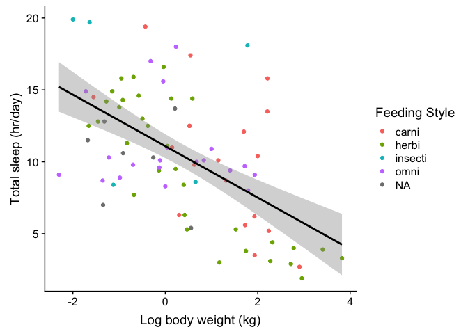
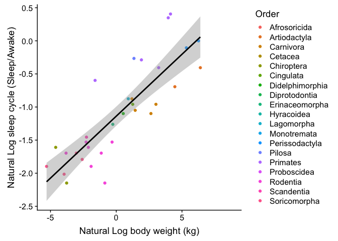

Lab 06
================
Biology Student
20 Feb 2019

Loading Libraries
-----------------

Objectives for Lab 6
--------------------

1.  Working with time series
2.  Clustering
3.  Dimension Reduction

Background
----------

We will be using the dataset from a Driven Data competition: <https://www.drivendata.org/competitions/44/dengai-predicting-disease-spread/>

The data for this competition comes from multiple sources aimed at supporting the Predict the Next Pandemic Initiative (<https://www.whitehouse.gov/blog/2015/06/05/back-future-using-historical-dengue-data-predict-next-epidemic>). Dengue surveillance data is provided by the U.S. Centers for Disease Control and prevention, as well as the Department of Defense's Naval Medical Research Unit 6 and the Armed Forces Health Surveillance Center, in collaboration with the Peruvian government and U.S. universities. Environmental and climate data is provided by the National Oceanic and Atmospheric Administration (NOAA), an agency of the U.S. Department of Commerce.

The data is provided in two separate files:

1.  dengue\_features\_train: weekly weather and vegetation data for two cities
2.  dengue\_labels\_train: weekly number of dengue cases in each city

There are two cities, San Juan and Iquitos, with test data for each city spanning 5 and 3 years respectively. The data for each city have been concatenated along with a city column indicating the source: *sj* for San Juan and *iq* for Iquitos.

``` r
dengue_features_train <- read_csv("https://s3.amazonaws.com/drivendata/data/44/public/dengue_features_train.csv")
```

    ## Parsed with column specification:
    ## cols(
    ##   .default = col_double(),
    ##   city = col_character(),
    ##   week_start_date = col_date(format = "")
    ## )

    ## See spec(...) for full column specifications.

``` r
str(dengue_features_train)
```

    ## Classes 'spec_tbl_df', 'tbl_df', 'tbl' and 'data.frame': 1456 obs. of  24 variables:
    ##  $ city                                 : chr  "sj" "sj" "sj" "sj" ...
    ##  $ year                                 : num  1990 1990 1990 1990 1990 1990 1990 1990 1990 1990 ...
    ##  $ weekofyear                           : num  18 19 20 21 22 23 24 25 26 27 ...
    ##  $ week_start_date                      : Date, format: "1990-04-30" "1990-05-07" ...
    ##  $ ndvi_ne                              : num  0.1226 0.1699 0.0323 0.1286 0.1962 ...
    ##  $ ndvi_nw                              : num  0.104 0.142 0.173 0.245 0.262 ...
    ##  $ ndvi_se                              : num  0.198 0.162 0.157 0.228 0.251 ...
    ##  $ ndvi_sw                              : num  0.178 0.155 0.171 0.236 0.247 ...
    ##  $ precipitation_amt_mm                 : num  12.42 22.82 34.54 15.36 7.52 ...
    ##  $ reanalysis_air_temp_k                : num  298 298 299 299 300 ...
    ##  $ reanalysis_avg_temp_k                : num  298 298 299 299 300 ...
    ##  $ reanalysis_dew_point_temp_k          : num  292 294 295 295 296 ...
    ##  $ reanalysis_max_air_temp_k            : num  300 301 300 301 302 ...
    ##  $ reanalysis_min_air_temp_k            : num  296 296 297 297 298 ...
    ##  $ reanalysis_precip_amt_kg_per_m2      : num  32 17.9 26.1 13.9 12.2 ...
    ##  $ reanalysis_relative_humidity_percent : num  73.4 77.4 82.1 80.3 80.5 ...
    ##  $ reanalysis_sat_precip_amt_mm         : num  12.42 22.82 34.54 15.36 7.52 ...
    ##  $ reanalysis_specific_humidity_g_per_kg: num  14 15.4 16.8 16.7 17.2 ...
    ##  $ reanalysis_tdtr_k                    : num  2.63 2.37 2.3 2.43 3.01 ...
    ##  $ station_avg_temp_c                   : num  25.4 26.7 26.7 27.5 28.9 ...
    ##  $ station_diur_temp_rng_c              : num  6.9 6.37 6.49 6.77 9.37 ...
    ##  $ station_max_temp_c                   : num  29.4 31.7 32.2 33.3 35 34.4 32.2 33.9 33.9 33.9 ...
    ##  $ station_min_temp_c                   : num  20 22.2 22.8 23.3 23.9 23.9 23.3 22.8 22.8 24.4 ...
    ##  $ station_precip_mm                    : num  16 8.6 41.4 4 5.8 39.1 29.7 21.1 21.1 1.1 ...
    ##  - attr(*, "spec")=
    ##   .. cols(
    ##   ..   city = col_character(),
    ##   ..   year = col_double(),
    ##   ..   weekofyear = col_double(),
    ##   ..   week_start_date = col_date(format = ""),
    ##   ..   ndvi_ne = col_double(),
    ##   ..   ndvi_nw = col_double(),
    ##   ..   ndvi_se = col_double(),
    ##   ..   ndvi_sw = col_double(),
    ##   ..   precipitation_amt_mm = col_double(),
    ##   ..   reanalysis_air_temp_k = col_double(),
    ##   ..   reanalysis_avg_temp_k = col_double(),
    ##   ..   reanalysis_dew_point_temp_k = col_double(),
    ##   ..   reanalysis_max_air_temp_k = col_double(),
    ##   ..   reanalysis_min_air_temp_k = col_double(),
    ##   ..   reanalysis_precip_amt_kg_per_m2 = col_double(),
    ##   ..   reanalysis_relative_humidity_percent = col_double(),
    ##   ..   reanalysis_sat_precip_amt_mm = col_double(),
    ##   ..   reanalysis_specific_humidity_g_per_kg = col_double(),
    ##   ..   reanalysis_tdtr_k = col_double(),
    ##   ..   station_avg_temp_c = col_double(),
    ##   ..   station_diur_temp_rng_c = col_double(),
    ##   ..   station_max_temp_c = col_double(),
    ##   ..   station_min_temp_c = col_double(),
    ##   ..   station_precip_mm = col_double()
    ##   .. )

``` r
summary(dengue_features_train)
```

    ##      city                year        weekofyear    week_start_date     
    ##  Length:1456        Min.   :1990   Min.   : 1.00   Min.   :1990-04-30  
    ##  Class :character   1st Qu.:1997   1st Qu.:13.75   1st Qu.:1997-04-28  
    ##  Mode  :character   Median :2002   Median :26.50   Median :2002-05-28  
    ##                     Mean   :2001   Mean   :26.50   Mean   :2001-07-09  
    ##                     3rd Qu.:2005   3rd Qu.:39.25   3rd Qu.:2005-11-26  
    ##                     Max.   :2010   Max.   :53.00   Max.   :2010-06-25  
    ##                                                                        
    ##     ndvi_ne            ndvi_nw            ndvi_se        
    ##  Min.   :-0.40625   Min.   :-0.45610   Min.   :-0.01553  
    ##  1st Qu.: 0.04495   1st Qu.: 0.04922   1st Qu.: 0.15509  
    ##  Median : 0.12882   Median : 0.12143   Median : 0.19605  
    ##  Mean   : 0.14229   Mean   : 0.13055   Mean   : 0.20378  
    ##  3rd Qu.: 0.24848   3rd Qu.: 0.21660   3rd Qu.: 0.24885  
    ##  Max.   : 0.50836   Max.   : 0.45443   Max.   : 0.53831  
    ##  NA's   :194        NA's   :52         NA's   :22        
    ##     ndvi_sw         precipitation_amt_mm reanalysis_air_temp_k
    ##  Min.   :-0.06346   Min.   :  0.00       Min.   :294.6        
    ##  1st Qu.: 0.14421   1st Qu.:  9.80       1st Qu.:297.7        
    ##  Median : 0.18945   Median : 38.34       Median :298.6        
    ##  Mean   : 0.20231   Mean   : 45.76       Mean   :298.7        
    ##  3rd Qu.: 0.24698   3rd Qu.: 70.23       3rd Qu.:299.8        
    ##  Max.   : 0.54602   Max.   :390.60       Max.   :302.2        
    ##  NA's   :22         NA's   :13           NA's   :10           
    ##  reanalysis_avg_temp_k reanalysis_dew_point_temp_k
    ##  Min.   :294.9         Min.   :289.6              
    ##  1st Qu.:298.3         1st Qu.:294.1              
    ##  Median :299.3         Median :295.6              
    ##  Mean   :299.2         Mean   :295.2              
    ##  3rd Qu.:300.2         3rd Qu.:296.5              
    ##  Max.   :302.9         Max.   :298.4              
    ##  NA's   :10            NA's   :10                 
    ##  reanalysis_max_air_temp_k reanalysis_min_air_temp_k
    ##  Min.   :297.8             Min.   :286.9            
    ##  1st Qu.:301.0             1st Qu.:293.9            
    ##  Median :302.4             Median :296.2            
    ##  Mean   :303.4             Mean   :295.7            
    ##  3rd Qu.:305.5             3rd Qu.:297.9            
    ##  Max.   :314.0             Max.   :299.9            
    ##  NA's   :10                NA's   :10               
    ##  reanalysis_precip_amt_kg_per_m2 reanalysis_relative_humidity_percent
    ##  Min.   :  0.00                  Min.   :57.79                       
    ##  1st Qu.: 13.05                  1st Qu.:77.18                       
    ##  Median : 27.25                  Median :80.30                       
    ##  Mean   : 40.15                  Mean   :82.16                       
    ##  3rd Qu.: 52.20                  3rd Qu.:86.36                       
    ##  Max.   :570.50                  Max.   :98.61                       
    ##  NA's   :10                      NA's   :10                          
    ##  reanalysis_sat_precip_amt_mm reanalysis_specific_humidity_g_per_kg
    ##  Min.   :  0.00               Min.   :11.72                        
    ##  1st Qu.:  9.80               1st Qu.:15.56                        
    ##  Median : 38.34               Median :17.09                        
    ##  Mean   : 45.76               Mean   :16.75                        
    ##  3rd Qu.: 70.23               3rd Qu.:17.98                        
    ##  Max.   :390.60               Max.   :20.46                        
    ##  NA's   :13                   NA's   :10                           
    ##  reanalysis_tdtr_k station_avg_temp_c station_diur_temp_rng_c
    ##  Min.   : 1.357    Min.   :21.40      Min.   : 4.529         
    ##  1st Qu.: 2.329    1st Qu.:26.30      1st Qu.: 6.514         
    ##  Median : 2.857    Median :27.41      Median : 7.300         
    ##  Mean   : 4.904    Mean   :27.19      Mean   : 8.059         
    ##  3rd Qu.: 7.625    3rd Qu.:28.16      3rd Qu.: 9.567         
    ##  Max.   :16.029    Max.   :30.80      Max.   :15.800         
    ##  NA's   :10        NA's   :43         NA's   :43             
    ##  station_max_temp_c station_min_temp_c station_precip_mm
    ##  Min.   :26.70      Min.   :14.7       Min.   :  0.00   
    ##  1st Qu.:31.10      1st Qu.:21.1       1st Qu.:  8.70   
    ##  Median :32.80      Median :22.2       Median : 23.85   
    ##  Mean   :32.45      Mean   :22.1       Mean   : 39.33   
    ##  3rd Qu.:33.90      3rd Qu.:23.3       3rd Qu.: 53.90   
    ##  Max.   :42.20      Max.   :25.6       Max.   :543.30   
    ##  NA's   :20         NA's   :14         NA's   :22

``` r
dengue_labels_train <- read_csv("https://s3.amazonaws.com/drivendata/data/44/public/dengue_labels_train.csv")
```

    ## Parsed with column specification:
    ## cols(
    ##   city = col_character(),
    ##   year = col_double(),
    ##   weekofyear = col_double(),
    ##   total_cases = col_double()
    ## )

``` r
str(dengue_labels_train)
```

    ## Classes 'spec_tbl_df', 'tbl_df', 'tbl' and 'data.frame': 1456 obs. of  4 variables:
    ##  $ city       : chr  "sj" "sj" "sj" "sj" ...
    ##  $ year       : num  1990 1990 1990 1990 1990 1990 1990 1990 1990 1990 ...
    ##  $ weekofyear : num  18 19 20 21 22 23 24 25 26 27 ...
    ##  $ total_cases: num  4 5 4 3 6 2 4 5 10 6 ...
    ##  - attr(*, "spec")=
    ##   .. cols(
    ##   ..   city = col_character(),
    ##   ..   year = col_double(),
    ##   ..   weekofyear = col_double(),
    ##   ..   total_cases = col_double()
    ##   .. )

``` r
summary(dengue_labels_train)
```

    ##      city                year        weekofyear     total_cases    
    ##  Length:1456        Min.   :1990   Min.   : 1.00   Min.   :  0.00  
    ##  Class :character   1st Qu.:1997   1st Qu.:13.75   1st Qu.:  5.00  
    ##  Mode  :character   Median :2002   Median :26.50   Median : 12.00  
    ##                     Mean   :2001   Mean   :26.50   Mean   : 24.68  
    ##                     3rd Qu.:2005   3rd Qu.:39.25   3rd Qu.: 28.00  
    ##                     Max.   :2010   Max.   :53.00   Max.   :461.00

Feature Descriptions
--------------------

You are provided the following set of information on a (year, weekofyear) timescale:

(Where appropriate, units are provided as a \_unit suffix on the feature name.)

City and date indicators

-   city – City abbreviations: sj for San Juan and iq for Iquitos
-   week\_start\_date – Date given in yyyy-mm-dd format

NOAA's GHCN daily climate data weather station measurements

-   station\_max\_temp\_c – Maximum temperature
-   station\_min\_temp\_c – Minimum temperature
-   station\_avg\_temp\_c – Average temperature
-   station\_precip\_mm – Total precipitation
-   station\_diur\_temp\_rng\_c – Diurnal temperature range

PERSIANN satellite precipitation measurements (0.25x0.25 degree scale)

-   precipitation\_amt\_mm – Total precipitation

NOAA's NCEP Climate Forecast System Reanalysis measurements (0.5x0.5 degree scale)

-   reanalysis\_sat\_precip\_amt\_mm – Total precipitation
-   reanalysis\_dew\_point\_temp\_k – Mean dew point temperature
-   reanalysis\_air\_temp\_k – Mean air temperature
-   reanalysis\_relative\_humidity\_percent – Mean relative humidity
-   reanalysis\_specific\_humidity\_g\_per\_kg – Mean specific humidity
-   reanalysis\_precip\_amt\_kg\_per\_m2 – Total precipitation
-   reanalysis\_max\_air\_temp\_k – Maximum air temperature
-   reanalysis\_min\_air\_temp\_k – Minimum air temperature
-   reanalysis\_avg\_temp\_k – Average air temperature
-   reanalysis\_tdtr\_k – Diurnal temperature range

Satellite vegetation - Normalized difference vegetation index (NDVI) - NOAA's CDR Normalized Difference Vegetation Index (0.5x0.5 degree scale) measurements

-   ndvi\_se – Pixel southeast of city centroid
-   ndvi\_sw – Pixel southwest of city centroid
-   ndvi\_ne – Pixel northeast of city centroid
-   ndvi\_nw – Pixel northwest of city centroid

Unadjusted p Values
-------------------

Use dplyr to arrange the data frame in order of p values. Use dplyr to filter the data frame for p values &lt; 0.05.

Bonferroni Correction
---------------------

As you can see, five of the variables show a significant (P&lt;0.05) P value. However, because García-Arenzana et al. (2014) tested 25 dietary variables, you'd expect one or two variables to show a significant result purely by chance, even if diet had no real effect on mammographic density. Applying the Bonferroni correction, you'd divide P=0.05 by the number of tests (25) to get the Bonferroni critical value, so a test would have to have P&lt;0.002 to be significant. Under that criterion, only the test for total calories is significant.

To apply the Bonferroni correction to this table, you can use the function p.adjust() and method = "bonferroni". Use dplyr to mutate the data frame, adding a column for Bonferroni-adjusted p values. Now which dietary variables are significant?

Limitations of the Bonferroni Correction
----------------------------------------

The Bonferroni correction is appropriate when a single false positive in a set of tests would be a problem. It is mainly useful when there are a fairly small number of multiple comparisons and you're looking for one or two that might be significant. However, if you have a large number of multiple comparisons and you're looking for many that might be significant, the Bonferroni correction may lead to a very high rate of false negatives. For example, let's say you're comparing the expression level of 20,000 genes between liver cancer tissue and normal liver tissue. Based on previous studies, you are hoping to find dozens or hundreds of genes with different expression levels. If you use the Bonferroni correction, a P value would have to be less than 0.05/20000=0.0000025 to be significant. Only genes with huge differences in expression will have a P value that low, and could miss out on a lot of important differences just because you wanted to be sure that your results did not include a single false positive.

Another important issue with the Bonferroni correction is deciding what a "family" of statistical tests is. García-Arenzana et al. (2014) tested 25 dietary variables, so are these tests one "family," making the critical P value 0.05/25? But they also measured 13 non-dietary variables such as age, education, and socioeconomic status; should they be included in the family of tests, making the critical P value 0.05/38? And what if in 2015, García-Arenzana et al. write another paper in which they compare 30 dietary variables between breast cancer and non-breast cancer patients; should they include those in their family of tests, and go back and reanalyze the data in their 2014 paper using a critical P value of 0.05/55? There is no firm rule on this; you'll have to use your judgment, based on just how bad a false positive would be. Obviously, you should make this decision before you look at the results, otherwise it would be too easy to subconsciously rationalize a family size that gives you the results you want.

Use p.adjust to test the effect of 55 comparisons by setting n=55. (Note you should never do this normally!)

False discovery rate: Benjamini–Hochberg procedure
--------------------------------------------------

An alternative approach is to control the false discovery rate. This is the proportion of "discoveries" (significant results) that are actually false positives. For example, let's say you're using microarrays to compare expression levels for 20,000 genes between liver tumors and normal liver cells. You're going to do additional experiments on any genes that show a significant difference between the normal and tumor cells, and you're willing to accept up to 10% of the genes with significant results being false positives; you'll find out they're false positives when you do the followup experiments. In this case, you would set your false discovery rate to 10%.

One good technique for controlling the false discovery rate was briefly mentioned by Simes (1986) and developed in detail by Benjamini and Hochberg (1995). Put the individual P values in order, from smallest to largest. The smallest P value has a rank of i=1, then next smallest has i=2, etc. Compare each individual P value to its Benjamini-Hochberg critical value, (i/m)Q, where i is the rank, m is the total number of tests, and Q is the false discovery rate you choose. The largest P value that has P&lt;(i/m)Q is significant, and all of the P values smaller than it are also significant, even the ones that aren't less than their Benjamini-Hochberg critical value.

Simes, R.J. 1986. An improved Bonferroni procedure for multiple tests of significance. Biometrika 73: 751-754.

Benjamini, Y., and Y. Hochberg. 1995. Controlling the false discovery rate: a practical and powerful approach to multiple testing. Journal of the Royal Statistical Society B 57: 289-300.

Use dplyr to mutate the data frame, adding a column for Benjamini-Hochberg-adjusted p values. This can be called using either the method "BH" or "fdr" in the p.adjust function. Now which dietary variables are significant at an FDR cutoff of 0.05? At an FDR cutoff of 0.25? How do the adjusted p-values for the BH procedure compare to the Bonferroni procedure?

You should carefully choose your false discovery rate BEFORE analyzing your data. Usually, when you're doing a large number of statistical tests, your experiment is just the first, exploratory step, and you're going to follow up with more experiments on the interesting individual results. If the cost of additional experiments is low and the cost of a false negative (missing a potentially important discovery) is high, you should probably use a fairly high false discovery rate, like 0.10 or 0.20, so that you don't miss anything important. Sometimes people use a false discovery rate of 0.05, probably because of confusion about the difference between false discovery rate and probability of a false positive when the null is true; a false discovery rate of 0.05 is probably too low for many experiments.

The Benjamini-Hochberg procedure is less sensitive than the Bonferroni procedure to your decision about what is a "family" of tests. If you increase the number of tests, and the distribution of P values is the same in the newly added tests as in the original tests, the Benjamini-Hochberg procedure will yield the same proportion of significant results. For example, if García-Arenzana et al. (2014) had looked at 50 variables instead of 25 and the new 25 tests had the same set of P values as the original 25, they would have 10 significant results under Benjamini-Hochberg with a false discovery rate of 0.25. This doesn't mean you can completely ignore the question of what constitutes a family; if you mix two sets of tests, one with some low P values and a second set without low P values, you will reduce the number of significant results compared to just analyzing the first set by itself.

Limitations of Benjamini-Hochberg
---------------------------------

The Bonferroni correction and Benjamini-Hochberg procedure assume that the individual tests are independent of each other, as when you are comparing sample A vs. sample B, C vs. D, E vs. F, etc. If you are comparing sample A vs. sample B, A vs. C, A vs. D, etc., the comparisons are not independent; if A is higher than B, there's a good chance that A will be higher than C as well. An example of an experimental design with multiple, non-independent comparisons is when you compare multiple variables between groups, and the variables are correlated with each other within groups. An example would be knocking out your favorite gene in mice and comparing everything you can think of on knockout vs. control mice: length, weight, strength, running speed, food consumption, feces production, etc. All of these variables are likely to be correlated within groups; mice that are longer will probably also weigh more, would be stronger, run faster, eat more food, and poop more. To analyze this kind of experiment, you can use a generalized linear model (see below).

When not to correct for multiple comparisons
--------------------------------------------

The goal of multiple comparisons corrections is to reduce the number of false positives, because false positives can be embarrassing, confusing, and cause you and other people to waste your time. An unfortunate byproduct of correcting for multiple comparisons is that you may increase the number of false negatives, where there really is an effect but you don't detect it as statistically significant. If false negatives are very costly, you may not want to correct for multiple comparisons at all. For example, let's say you've gone to a lot of trouble and expense to knock out your favorite gene, mannose-6-phosphate isomerase (Mpi), in a strain of mice that spontaneously develop lots of tumors. Hands trembling with excitement, you get the first Mpi-/- mice and start measuring things: blood pressure, growth rate, maze-learning speed, bone density, coat glossiness, everything you can think of to measure on a mouse. You measure 50 things on Mpi-/- mice and normal mice, run the approriate statistical tests, and the smallest P value is 0.013 for a difference in tumor size. If you use a Bonferroni correction, that P=0.013 won't be close to significant; it might not be significant with the Benjamini-Hochberg procedure, either. Should you conclude that there's no significant difference between the Mpi-/- and Mpi+/+ mice, write a boring little paper titled "Lack of anything interesting in Mpi-/- mice," and look for another project? No, your paper should be "Possible effect of Mpi on cancer." You should be suitably cautious, of course, and emphasize in the paper that there's a good chance that your result is a false positive; but the cost of a false positive—if further experiments show that Mpi really has no effect on tumors—is just a few more experiments. The cost of a false negative, on the other hand, could be that you've missed out on a hugely important discovery.

Generalized Linear Models
=========================

We are next going to revisit the msleep dataset that we introduced in Lab 01.

The msleep dataset is part of the ggplot2 package. It has 11 variables: name = species common name genus = genus name vore = feeding type (carnivore/herbivore/omnivore/insectivore) order = name of the order conservation = the IUCN conservation status of the species (lc/nt/en/domesticated vu/cd) sleep\_total = total sleep time (hours) sleep\_rem = REM sleep time (hours) sleep\_cycle = length of sleep cycle (hours) awake = time spent awake (hours) brainwt = brain weight (kg) bodywt = body weight (kg)

``` r
if (!require("ggplot2")) install.packages("ggplot2"); library(ggplot2)
if (!require("cowplot")) install.packages("cowplot"); library(cowplot)
```

    ## Loading required package: cowplot

    ## 
    ## Attaching package: 'cowplot'

    ## The following object is masked from 'package:ggplot2':
    ## 
    ##     ggsave

``` r
data(msleep)
str(msleep)
```

    ## Classes 'tbl_df', 'tbl' and 'data.frame':    83 obs. of  11 variables:
    ##  $ name        : chr  "Cheetah" "Owl monkey" "Mountain beaver" "Greater short-tailed shrew" ...
    ##  $ genus       : chr  "Acinonyx" "Aotus" "Aplodontia" "Blarina" ...
    ##  $ vore        : chr  "carni" "omni" "herbi" "omni" ...
    ##  $ order       : chr  "Carnivora" "Primates" "Rodentia" "Soricomorpha" ...
    ##  $ conservation: chr  "lc" NA "nt" "lc" ...
    ##  $ sleep_total : num  12.1 17 14.4 14.9 4 14.4 8.7 7 10.1 3 ...
    ##  $ sleep_rem   : num  NA 1.8 2.4 2.3 0.7 2.2 1.4 NA 2.9 NA ...
    ##  $ sleep_cycle : num  NA NA NA 0.133 0.667 ...
    ##  $ awake       : num  11.9 7 9.6 9.1 20 9.6 15.3 17 13.9 21 ...
    ##  $ brainwt     : num  NA 0.0155 NA 0.00029 0.423 NA NA NA 0.07 0.0982 ...
    ##  $ bodywt      : num  50 0.48 1.35 0.019 600 ...

Below is one of the graphs from Lab 1, where we found that total sleep is correlated with log body weight.

``` r
ggplot(msleep) +
  aes(x = log10(bodywt), y = sleep_total) +
  geom_point(aes(color = factor(vore))) +
  geom_smooth(method=lm , color="black", se=TRUE) +
  theme_cowplot() +
  labs(color="Feeding Style") +
  xlab("Log body weight (kg)") + 
  ylab("Total sleep (hr/day)")
```



The linear model provided strong evidence of the significance of this association.

``` r
sleepfit = lm(sleep_total ~ log(bodywt), data=msleep)
summary(sleepfit)
```

    ## 
    ## Call:
    ## lm(formula = sleep_total ~ log(bodywt), data = msleep)
    ## 
    ## Residuals:
    ##     Min      1Q  Median      3Q     Max 
    ## -6.4991 -2.5671 -0.1683  2.0471 10.1928 
    ## 
    ## Coefficients:
    ##             Estimate Std. Error t value Pr(>|t|)    
    ## (Intercept)  11.0891     0.4178  26.542  < 2e-16 ***
    ## log(bodywt)  -0.7771     0.1249  -6.222 2.05e-08 ***
    ## ---
    ## Signif. codes:  0 '***' 0.001 '**' 0.01 '*' 0.05 '.' 0.1 ' ' 1
    ## 
    ## Residual standard error: 3.683 on 81 degrees of freedom
    ## Multiple R-squared:  0.3233, Adjusted R-squared:  0.315 
    ## F-statistic: 38.71 on 1 and 81 DF,  p-value: 2.046e-08

Using a generalized linear model without an explicit "method" linking function is the same as using a linear model. The default method "glm.fit" uses iteratively reweighted least squares (IWLS).

``` r
sleepglm = glm(sleep_total ~ log10(bodywt), data=msleep)
summary(sleepglm)
```

    ## 
    ## Call:
    ## glm(formula = sleep_total ~ log10(bodywt), data = msleep)
    ## 
    ## Deviance Residuals: 
    ##     Min       1Q   Median       3Q      Max  
    ## -6.4991  -2.5671  -0.1683   2.0471  10.1928  
    ## 
    ## Coefficients:
    ##               Estimate Std. Error t value Pr(>|t|)    
    ## (Intercept)    11.0891     0.4178  26.542  < 2e-16 ***
    ## log10(bodywt)  -1.7894     0.2876  -6.222 2.05e-08 ***
    ## ---
    ## Signif. codes:  0 '***' 0.001 '**' 0.01 '*' 0.05 '.' 0.1 ' ' 1
    ## 
    ## (Dispersion parameter for gaussian family taken to be 13.56698)
    ## 
    ##     Null deviance: 1624.1  on 82  degrees of freedom
    ## Residual deviance: 1098.9  on 81  degrees of freedom
    ## AIC: 455.95
    ## 
    ## Number of Fisher Scoring iterations: 2

In this graph, we have used natural log transformations for both body weight and sleep cycle, to be consistent with the published analysis. We have also switched vore status for order (the reason for this will be clear later).

``` r
ggplot(msleep) +
  aes(x = log(bodywt), y = log(sleep_cycle)) +
  geom_point(aes(color = factor(order))) +
  geom_smooth(method=lm , color="black", se=TRUE) +
  theme_cowplot() +
  labs(color="Order") +
  xlab("Natural Log body weight (kg)") + 
  ylab("Natural Log sleep cycle (Sleep/Awake)")
```

    ## Warning: Removed 51 rows containing non-finite values (stat_smooth).

    ## Warning: Removed 51 rows containing missing values (geom_point).



Refer to the abstract of the original paper: <https://www.pnas.org/content/104/3/1051.abstract>

The authors conclude that they "provide strong evidence that time scales for sleep are set by the brain's, not the whole-body, metabolic rate."

Plot and compare the summary these two alternative models, using natural log transformations for both the brain/body weight and for sleep cycle.

How do we determine which model is preferred? Last week we discussed methods for model selection that focused on adjusted R squared or on p-values. A better alternative is to use either the Akaike information criterion or the Bayesian information criterion. <https://en.wikipedia.org/wiki/Akaike_information_criterion> <https://en.wikipedia.org/wiki/Bayesian_information_criterion>

The two methods primarily differ in the penalty for adding additional factors to the model. BIC provides a stronger penalty and will help favor simpler models. In this case, they would yield the same conclusion, as both models have the same number of parameters. Which model has the lower AIC?

Complex Generalized Linear Models
---------------------------------

Using the GLM we can also add categorical variable to see if they increase the power of the model to predict sleep cycle.

``` r
sleepfullglm = glm(log(sleep_cycle) ~ log10(bodywt) + log10(brainwt) + vore + order + conservation, data=msleep)
summary(sleepfullglm)
```

    ## 
    ## Call:
    ## glm(formula = log(sleep_cycle) ~ log10(bodywt) + log10(brainwt) + 
    ##     vore + order + conservation, data = msleep)
    ## 
    ## Deviance Residuals: 
    ##         4          5          9         12         14         17  
    ##  0.001731   0.000000  -0.033912   0.309516  -0.309516  -0.001731  
    ##        18         20         22         23         25         28  
    ##  0.000000   0.000000   0.000000   0.000000   0.000000   0.033912  
    ##        40         42         48         64         67         71  
    ##  0.000000   0.000000   0.000000  -0.107139   0.000000   0.107139  
    ##        74         77  
    ##  0.000000   0.000000  
    ## 
    ## Coefficients: (1 not defined because of singularities)
    ##                      Estimate Std. Error t value Pr(>|t|)
    ## (Intercept)          -1.52862    1.69837  -0.900    0.463
    ## log10(bodywt)        -0.07016    0.50752  -0.138    0.903
    ## log10(brainwt)       -0.25475    0.81781  -0.311    0.785
    ## voreherbi             1.22288    1.17425   1.041    0.407
    ## voreinsecti           1.20540    1.44586   0.834    0.492
    ## voreomni              0.78157    0.88001   0.888    0.468
    ## orderCarnivora        0.25012    0.58775   0.426    0.712
    ## orderChiroptera      -2.94455    2.62173  -1.123    0.378
    ## orderCingulata             NA         NA      NA       NA
    ## orderDidelphimorphia -1.00296    1.02830  -0.975    0.432
    ## orderErinaceomorpha  -1.25464    1.20314  -1.043    0.407
    ## orderLagomorpha      -1.03021    1.39440  -0.739    0.537
    ## orderPerissodactyla   0.44954    0.49614   0.906    0.461
    ## orderRodentia        -2.11847    1.67438  -1.265    0.333
    ## orderSoricomorpha    -2.39849    2.16116  -1.110    0.383
    ## conservationen       -0.01406    0.70063  -0.020    0.986
    ## conservationlc        0.10696    0.43044   0.248    0.827
    ## conservationnt       -0.25414    0.99677  -0.255    0.823
    ## conservationvu       -0.28329    0.63616  -0.445    0.700
    ## 
    ## (Dispersion parameter for gaussian family taken to be 0.1084319)
    ## 
    ##     Null deviance: 7.89355  on 19  degrees of freedom
    ## Residual deviance: 0.21686  on  2  degrees of freedom
    ##   (63 observations deleted due to missingness)
    ## AIC: 4.2732
    ## 
    ## Number of Fisher Scoring iterations: 2

This full model has a lower AIC, but all of the parameters fail to reach our significance threshold!

We obviously need to do drop some of the model parameters to improve the fit. Looking at the p values, you could simply guess which to eliminate. Alternatively, you could eliminate each one at a time to systematically test them.

``` r
if (!require("MASS")) install.packages("MASS"); library(MASS)
```

    ## Loading required package: MASS

    ## 
    ## Attaching package: 'MASS'

    ## The following object is masked from 'package:dplyr':
    ## 
    ##     select

``` r
dropterm(sleepfullglm)
```

    ## Single term deletions
    ## 
    ## Model:
    ## log(sleep_cycle) ~ log10(bodywt) + log10(brainwt) + vore + order + 
    ##     conservation
    ##                Df Deviance     AIC
    ## <none>             0.21686  4.2732
    ## log10(bodywt)   1  0.21894  2.4634
    ## log10(brainwt)  1  0.22738  3.2207
    ## vore            2  0.28146  5.4879
    ## order           8  0.85679 15.7515
    ## conservation    4  0.28238  1.5528

The full model has an AIC of 4.2732 (as seen in the previous code chunk and in the <none> row of the dropterm output). Dropping several of the terms decreases the AIC, which is what we want. You can see that the lowest AIC is found with dropping "conservation". (This makes sense as there is really not a reasonable expectation that conservation status should influence sleep cycles.) Construct a new model without the conservation term and test it again for dropping a term.

Continue dropping terms until the dropping any of the terms no longer decreases the AIC.

What was the final model? Does this support the conclusion in the abstract?

Interactions within models
--------------------------

It is important to consider whether the different terms within a model *interact* with each other. For example, the order chiroptera in our dataset might be special, compared to the other mammals. Perhaps the sleep cycle of bats depends on their brain size in a different way than other mammals because they fly? To test for such interactions in a model, you simply indicate interactions between terms by using \* instead of + between the terms:

instead of:

log(sleep\_cycle) ~ log10(brainwt) + order

we use:

log(sleep\_cycle) ~ log10(brainwt) \* order

or you can spell out each individual term and the interaction separately:

log(sleep\_cycle) ~ log10(brainwt) + order + log10(brainwt):order

Test a new version of your best model with an interaction between the terms and use dropterm to determine if it improves the model.

Note that dropterm does not try to individually drop the interacting terms - because the model would not make sense to keep the interaction but drop the main term. The model instead drops the interaction and tests that against the model without dropping the interaction.

Did adding an interaction improve this model?

Summary
-------

The example provided here used a linear linking function between each term and the variable of interest. GLMs can use other functions: <https://en.wikipedia.org/wiki/Generalized_linear_model#Link_function> The selection of this function will depend on the whether the response variables have error distribution models other than a normal distribution. Other link functions are also necessary if the outcome variable is categorical or logical.
