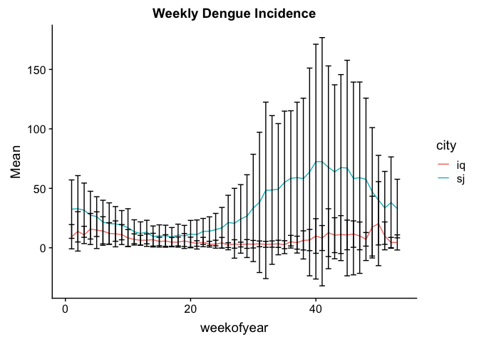
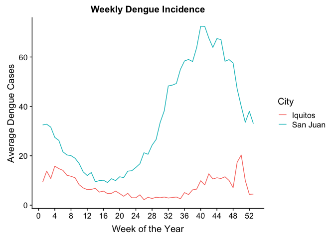
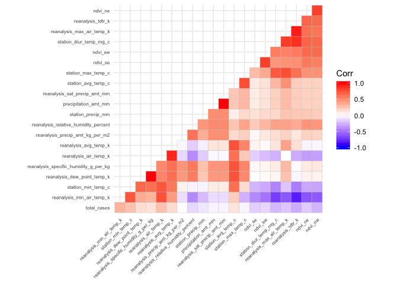
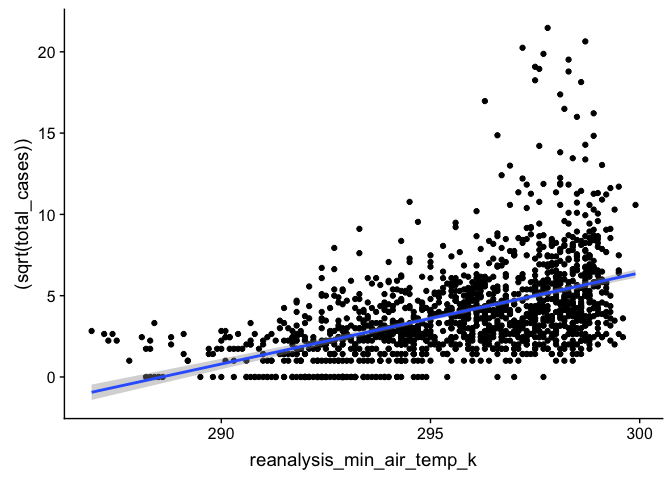
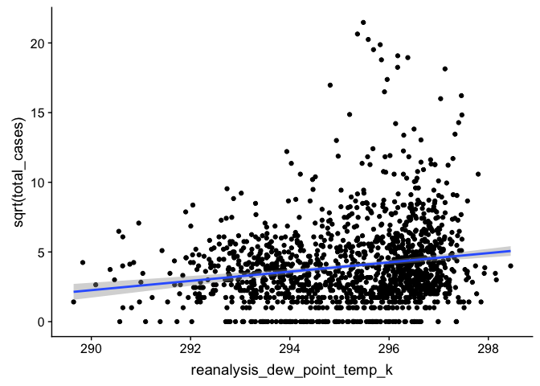
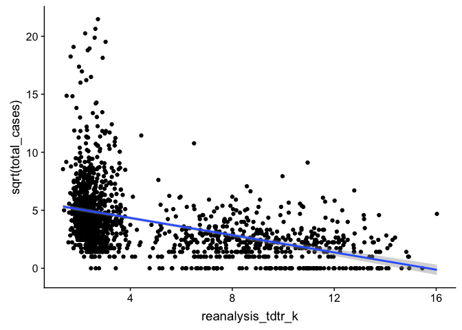
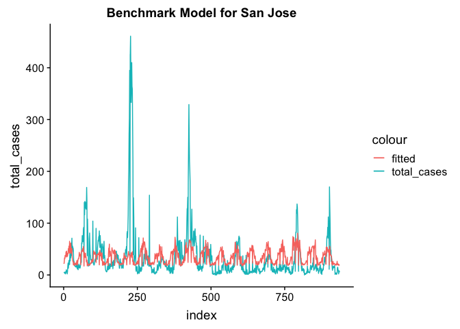
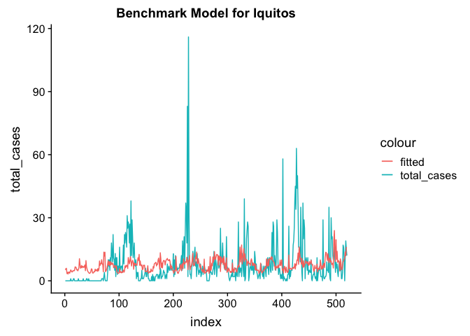
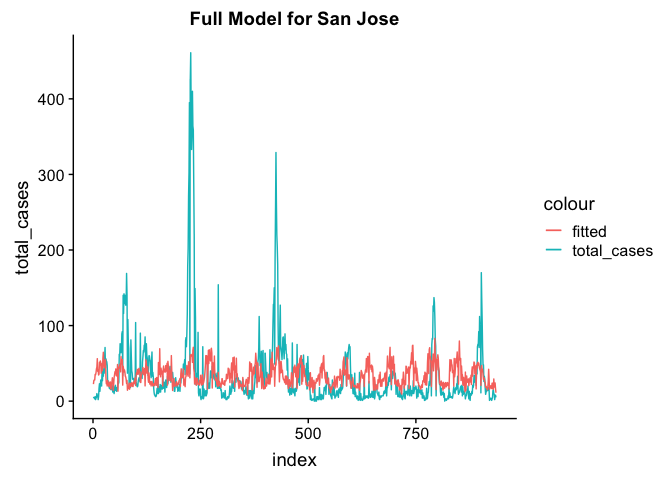
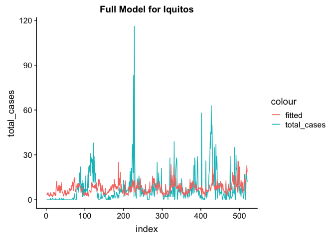

Takehome Midterm
================
Prof. Field
3/17/2019

  - [Introduction](#introduction)
      - [Loading Libraries](#loading-libraries)
      - [Objectives for Midterm Exam](#objectives-for-midterm-exam)
      - [Background](#background)
      - [Feature Descriptions](#feature-descriptions)
  - [Takehome Exam Begins here](#takehome-exam-begins-here)
      - [Data Wrangling](#data-wrangling)
      - [What is the average number of cases of Dengue for each week of
        the year for each
        city?](#what-is-the-average-number-of-cases-of-dengue-for-each-week-of-the-year-for-each-city)
      - [Data exploration of potential explanatory
        variables](#data-exploration-of-potential-explanatory-variables)
      - [Dengue incidence model](#dengue-incidence-model)
      - [Extend the Benchmark model](#extend-the-benchmark-model)
      - [Submitting results of model to Driven
        Data](#submitting-results-of-model-to-driven-data)
  - [Acknowledgements](#acknowledgements)

# Introduction

For the takehome midterm you will have 48 hours to complete the
objectives listed below. The deadline for submission is 28 March 2019 at
11am EST.

Date/Time started: 17 Mar 2019 10:24am to 12:17, then 12:40 to 2:25
Date/Time completed:

## Loading Libraries

Load all of your libraries in this code block. Indicate why each library
is necessary.

## Objectives for Midterm Exam

  - [ ] Import, clean, merge data tables
  - [ ] Present graphical summary of Dengue incidence data
  - [ ] Data exploration of potential explanatory variables
  - [ ] Test Benchmark model of Dengue incidence
  - [ ] Improve model of Dengue incidence

## Background

This dataset should be familiar from Lab 6. We will be using the Dengue
dataset from a Driven Data competition:
<https://www.drivendata.org/competitions/44/dengai-predicting-disease-spread/>

The data for this competition comes from multiple sources aimed at
supporting the Predict the Next Pandemic Initiative
(<https://www.whitehouse.gov/blog/2015/06/05/back-future-using-historical-dengue-data-predict-next-epidemic>).
Dengue surveillance data is provided by the U.S. Centers for Disease
Control and prevention, as well as the Department of Defense’s Naval
Medical Research Unit 6 and the Armed Forces Health Surveillance Center,
in collaboration with the Peruvian government and U.S. universities.
Environmental and climate data is provided by the National Oceanic and
Atmospheric Administration (NOAA), an agency of the U.S. Department of
Commerce.

The data is provided in two separate files:

1.  dengue\_features\_train: weekly weather and vegetation data for two
    cities
2.  dengue\_labels\_train: weekly number of dengue cases in each city

There are two cities, San Juan, Puerto Rico and Iquitos, Peru, with test
data for each city spanning 5 and 3 years respectively. The data for
each city have been concatenated along with a city column indicating the
source: *sj* for San Juan and *iq* for Iquitos.

``` r
dengue_features_train <- read_csv("https://s3.amazonaws.com/drivendata/data/44/public/dengue_features_train.csv")
```

    ## Parsed with column specification:
    ## cols(
    ##   .default = col_double(),
    ##   city = col_character(),
    ##   week_start_date = col_date(format = "")
    ## )

    ## See spec(...) for full column specifications.

``` r
str(dengue_features_train)
```

    ## Classes 'spec_tbl_df', 'tbl_df', 'tbl' and 'data.frame': 1456 obs. of  24 variables:
    ##  $ city                                 : chr  "sj" "sj" "sj" "sj" ...
    ##  $ year                                 : num  1990 1990 1990 1990 1990 1990 1990 1990 1990 1990 ...
    ##  $ weekofyear                           : num  18 19 20 21 22 23 24 25 26 27 ...
    ##  $ week_start_date                      : Date, format: "1990-04-30" "1990-05-07" ...
    ##  $ ndvi_ne                              : num  0.1226 0.1699 0.0323 0.1286 0.1962 ...
    ##  $ ndvi_nw                              : num  0.104 0.142 0.173 0.245 0.262 ...
    ##  $ ndvi_se                              : num  0.198 0.162 0.157 0.228 0.251 ...
    ##  $ ndvi_sw                              : num  0.178 0.155 0.171 0.236 0.247 ...
    ##  $ precipitation_amt_mm                 : num  12.42 22.82 34.54 15.36 7.52 ...
    ##  $ reanalysis_air_temp_k                : num  298 298 299 299 300 ...
    ##  $ reanalysis_avg_temp_k                : num  298 298 299 299 300 ...
    ##  $ reanalysis_dew_point_temp_k          : num  292 294 295 295 296 ...
    ##  $ reanalysis_max_air_temp_k            : num  300 301 300 301 302 ...
    ##  $ reanalysis_min_air_temp_k            : num  296 296 297 297 298 ...
    ##  $ reanalysis_precip_amt_kg_per_m2      : num  32 17.9 26.1 13.9 12.2 ...
    ##  $ reanalysis_relative_humidity_percent : num  73.4 77.4 82.1 80.3 80.5 ...
    ##  $ reanalysis_sat_precip_amt_mm         : num  12.42 22.82 34.54 15.36 7.52 ...
    ##  $ reanalysis_specific_humidity_g_per_kg: num  14 15.4 16.8 16.7 17.2 ...
    ##  $ reanalysis_tdtr_k                    : num  2.63 2.37 2.3 2.43 3.01 ...
    ##  $ station_avg_temp_c                   : num  25.4 26.7 26.7 27.5 28.9 ...
    ##  $ station_diur_temp_rng_c              : num  6.9 6.37 6.49 6.77 9.37 ...
    ##  $ station_max_temp_c                   : num  29.4 31.7 32.2 33.3 35 34.4 32.2 33.9 33.9 33.9 ...
    ##  $ station_min_temp_c                   : num  20 22.2 22.8 23.3 23.9 23.9 23.3 22.8 22.8 24.4 ...
    ##  $ station_precip_mm                    : num  16 8.6 41.4 4 5.8 39.1 29.7 21.1 21.1 1.1 ...
    ##  - attr(*, "spec")=
    ##   .. cols(
    ##   ..   city = col_character(),
    ##   ..   year = col_double(),
    ##   ..   weekofyear = col_double(),
    ##   ..   week_start_date = col_date(format = ""),
    ##   ..   ndvi_ne = col_double(),
    ##   ..   ndvi_nw = col_double(),
    ##   ..   ndvi_se = col_double(),
    ##   ..   ndvi_sw = col_double(),
    ##   ..   precipitation_amt_mm = col_double(),
    ##   ..   reanalysis_air_temp_k = col_double(),
    ##   ..   reanalysis_avg_temp_k = col_double(),
    ##   ..   reanalysis_dew_point_temp_k = col_double(),
    ##   ..   reanalysis_max_air_temp_k = col_double(),
    ##   ..   reanalysis_min_air_temp_k = col_double(),
    ##   ..   reanalysis_precip_amt_kg_per_m2 = col_double(),
    ##   ..   reanalysis_relative_humidity_percent = col_double(),
    ##   ..   reanalysis_sat_precip_amt_mm = col_double(),
    ##   ..   reanalysis_specific_humidity_g_per_kg = col_double(),
    ##   ..   reanalysis_tdtr_k = col_double(),
    ##   ..   station_avg_temp_c = col_double(),
    ##   ..   station_diur_temp_rng_c = col_double(),
    ##   ..   station_max_temp_c = col_double(),
    ##   ..   station_min_temp_c = col_double(),
    ##   ..   station_precip_mm = col_double()
    ##   .. )

``` r
summary(dengue_features_train)
```

    ##      city                year        weekofyear    week_start_date     
    ##  Length:1456        Min.   :1990   Min.   : 1.00   Min.   :1990-04-30  
    ##  Class :character   1st Qu.:1997   1st Qu.:13.75   1st Qu.:1997-04-28  
    ##  Mode  :character   Median :2002   Median :26.50   Median :2002-05-28  
    ##                     Mean   :2001   Mean   :26.50   Mean   :2001-07-09  
    ##                     3rd Qu.:2005   3rd Qu.:39.25   3rd Qu.:2005-11-26  
    ##                     Max.   :2010   Max.   :53.00   Max.   :2010-06-25  
    ##                                                                        
    ##     ndvi_ne            ndvi_nw            ndvi_se        
    ##  Min.   :-0.40625   Min.   :-0.45610   Min.   :-0.01553  
    ##  1st Qu.: 0.04495   1st Qu.: 0.04922   1st Qu.: 0.15509  
    ##  Median : 0.12882   Median : 0.12143   Median : 0.19605  
    ##  Mean   : 0.14229   Mean   : 0.13055   Mean   : 0.20378  
    ##  3rd Qu.: 0.24848   3rd Qu.: 0.21660   3rd Qu.: 0.24885  
    ##  Max.   : 0.50836   Max.   : 0.45443   Max.   : 0.53831  
    ##  NA's   :194        NA's   :52         NA's   :22        
    ##     ndvi_sw         precipitation_amt_mm reanalysis_air_temp_k
    ##  Min.   :-0.06346   Min.   :  0.00       Min.   :294.6        
    ##  1st Qu.: 0.14421   1st Qu.:  9.80       1st Qu.:297.7        
    ##  Median : 0.18945   Median : 38.34       Median :298.6        
    ##  Mean   : 0.20231   Mean   : 45.76       Mean   :298.7        
    ##  3rd Qu.: 0.24698   3rd Qu.: 70.23       3rd Qu.:299.8        
    ##  Max.   : 0.54602   Max.   :390.60       Max.   :302.2        
    ##  NA's   :22         NA's   :13           NA's   :10           
    ##  reanalysis_avg_temp_k reanalysis_dew_point_temp_k
    ##  Min.   :294.9         Min.   :289.6              
    ##  1st Qu.:298.3         1st Qu.:294.1              
    ##  Median :299.3         Median :295.6              
    ##  Mean   :299.2         Mean   :295.2              
    ##  3rd Qu.:300.2         3rd Qu.:296.5              
    ##  Max.   :302.9         Max.   :298.4              
    ##  NA's   :10            NA's   :10                 
    ##  reanalysis_max_air_temp_k reanalysis_min_air_temp_k
    ##  Min.   :297.8             Min.   :286.9            
    ##  1st Qu.:301.0             1st Qu.:293.9            
    ##  Median :302.4             Median :296.2            
    ##  Mean   :303.4             Mean   :295.7            
    ##  3rd Qu.:305.5             3rd Qu.:297.9            
    ##  Max.   :314.0             Max.   :299.9            
    ##  NA's   :10                NA's   :10               
    ##  reanalysis_precip_amt_kg_per_m2 reanalysis_relative_humidity_percent
    ##  Min.   :  0.00                  Min.   :57.79                       
    ##  1st Qu.: 13.05                  1st Qu.:77.18                       
    ##  Median : 27.25                  Median :80.30                       
    ##  Mean   : 40.15                  Mean   :82.16                       
    ##  3rd Qu.: 52.20                  3rd Qu.:86.36                       
    ##  Max.   :570.50                  Max.   :98.61                       
    ##  NA's   :10                      NA's   :10                          
    ##  reanalysis_sat_precip_amt_mm reanalysis_specific_humidity_g_per_kg
    ##  Min.   :  0.00               Min.   :11.72                        
    ##  1st Qu.:  9.80               1st Qu.:15.56                        
    ##  Median : 38.34               Median :17.09                        
    ##  Mean   : 45.76               Mean   :16.75                        
    ##  3rd Qu.: 70.23               3rd Qu.:17.98                        
    ##  Max.   :390.60               Max.   :20.46                        
    ##  NA's   :13                   NA's   :10                           
    ##  reanalysis_tdtr_k station_avg_temp_c station_diur_temp_rng_c
    ##  Min.   : 1.357    Min.   :21.40      Min.   : 4.529         
    ##  1st Qu.: 2.329    1st Qu.:26.30      1st Qu.: 6.514         
    ##  Median : 2.857    Median :27.41      Median : 7.300         
    ##  Mean   : 4.904    Mean   :27.19      Mean   : 8.059         
    ##  3rd Qu.: 7.625    3rd Qu.:28.16      3rd Qu.: 9.567         
    ##  Max.   :16.029    Max.   :30.80      Max.   :15.800         
    ##  NA's   :10        NA's   :43         NA's   :43             
    ##  station_max_temp_c station_min_temp_c station_precip_mm
    ##  Min.   :26.70      Min.   :14.7       Min.   :  0.00   
    ##  1st Qu.:31.10      1st Qu.:21.1       1st Qu.:  8.70   
    ##  Median :32.80      Median :22.2       Median : 23.85   
    ##  Mean   :32.45      Mean   :22.1       Mean   : 39.33   
    ##  3rd Qu.:33.90      3rd Qu.:23.3       3rd Qu.: 53.90   
    ##  Max.   :42.20      Max.   :25.6       Max.   :543.30   
    ##  NA's   :20         NA's   :14         NA's   :22

``` r
dengue_labels_train <- read_csv("https://s3.amazonaws.com/drivendata/data/44/public/dengue_labels_train.csv")
```

    ## Parsed with column specification:
    ## cols(
    ##   city = col_character(),
    ##   year = col_double(),
    ##   weekofyear = col_double(),
    ##   total_cases = col_double()
    ## )

``` r
str(dengue_labels_train)
```

    ## Classes 'spec_tbl_df', 'tbl_df', 'tbl' and 'data.frame': 1456 obs. of  4 variables:
    ##  $ city       : chr  "sj" "sj" "sj" "sj" ...
    ##  $ year       : num  1990 1990 1990 1990 1990 1990 1990 1990 1990 1990 ...
    ##  $ weekofyear : num  18 19 20 21 22 23 24 25 26 27 ...
    ##  $ total_cases: num  4 5 4 3 6 2 4 5 10 6 ...
    ##  - attr(*, "spec")=
    ##   .. cols(
    ##   ..   city = col_character(),
    ##   ..   year = col_double(),
    ##   ..   weekofyear = col_double(),
    ##   ..   total_cases = col_double()
    ##   .. )

``` r
summary(dengue_labels_train)
```

    ##      city                year        weekofyear     total_cases    
    ##  Length:1456        Min.   :1990   Min.   : 1.00   Min.   :  0.00  
    ##  Class :character   1st Qu.:1997   1st Qu.:13.75   1st Qu.:  5.00  
    ##  Mode  :character   Median :2002   Median :26.50   Median : 12.00  
    ##                     Mean   :2001   Mean   :26.50   Mean   : 24.68  
    ##                     3rd Qu.:2005   3rd Qu.:39.25   3rd Qu.: 28.00  
    ##                     Max.   :2010   Max.   :53.00   Max.   :461.00

## Feature Descriptions

You are provided the following set of information on a (year,
weekofyear) timescale:

(Where appropriate, units are provided as a \_unit suffix on the feature
name.)

City and date indicators

  - city – City abbreviations: sj for San Juan and iq for Iquitos
  - week\_start\_date – Date given in yyyy-mm-dd format

NOAA’s GHCN daily climate data weather station measurements

  - station\_max\_temp\_c – Maximum temperature
  - station\_min\_temp\_c – Minimum temperature
  - station\_avg\_temp\_c – Average temperature
  - station\_precip\_mm – Total precipitation
  - station\_diur\_temp\_rng\_c – Diurnal temperature range

PERSIANN satellite precipitation measurements (0.25x0.25 degree scale)

  - precipitation\_amt\_mm – Total precipitation

NOAA’s NCEP Climate Forecast System Reanalysis measurements (0.5x0.5
degree scale)

  - reanalysis\_sat\_precip\_amt\_mm – Total precipitation
  - reanalysis\_dew\_point\_temp\_k – Mean dew point temperature
  - reanalysis\_air\_temp\_k – Mean air temperature
  - reanalysis\_relative\_humidity\_percent – Mean relative humidity
  - reanalysis\_specific\_humidity\_g\_per\_kg – Mean specific humidity
  - reanalysis\_precip\_amt\_kg\_per\_m2 – Total precipitation
  - reanalysis\_max\_air\_temp\_k – Maximum air temperature
  - reanalysis\_min\_air\_temp\_k – Minimum air temperature
  - reanalysis\_avg\_temp\_k – Average air temperature
  - reanalysis\_tdtr\_k – Diurnal temperature range

Satellite vegetation - Normalized difference vegetation index (NDVI) -
NOAA’s CDR Normalized Difference Vegetation Index (0.5x0.5 degree scale)
measurements

  - ndvi\_se – Pixel southeast of city centroid
  - ndvi\_sw – Pixel southwest of city centroid
  - ndvi\_ne – Pixel northeast of city centroid
  - ndvi\_nw – Pixel northwest of city centroid

# Takehome Exam Begins here

As a reminder, you may consult your previous homework and group
projects, textbook and other readings, and online resources. Online
resources may be used to research ways to solve each problem, but you
may not pose questions in online forums about the specific assignment.
You may consult with Prof. Field or with other classmates about
technical problems (e.g. where to find a file), but not about how to
answer any of the questions.

## Data Wrangling

Use this section to manipulate the two data frames. 1. Follow the
Exploratory Data Analysis Checklist (below) to verify the imported data
a. Ensure that each variable is the appropriate data class and has
values that makes sense b. For external verification, at a minimum,
check that the annual Dengue incidence numbers for each city are
realistic 2. Merge the two data frames, verifying that no information
was lost during the merge 3. Check the data for NAs both before and
after the merge (note that eliminating all rows or columns with NAs will
have consequences)

### Check the packaging

``` r
dim(dengue_features_train)
```

    ## [1] 1456   24

``` r
dim(dengue_labels_train)
```

    ## [1] 1456    4

``` r
colnames(dengue_features_train)
```

    ##  [1] "city"                                 
    ##  [2] "year"                                 
    ##  [3] "weekofyear"                           
    ##  [4] "week_start_date"                      
    ##  [5] "ndvi_ne"                              
    ##  [6] "ndvi_nw"                              
    ##  [7] "ndvi_se"                              
    ##  [8] "ndvi_sw"                              
    ##  [9] "precipitation_amt_mm"                 
    ## [10] "reanalysis_air_temp_k"                
    ## [11] "reanalysis_avg_temp_k"                
    ## [12] "reanalysis_dew_point_temp_k"          
    ## [13] "reanalysis_max_air_temp_k"            
    ## [14] "reanalysis_min_air_temp_k"            
    ## [15] "reanalysis_precip_amt_kg_per_m2"      
    ## [16] "reanalysis_relative_humidity_percent" 
    ## [17] "reanalysis_sat_precip_amt_mm"         
    ## [18] "reanalysis_specific_humidity_g_per_kg"
    ## [19] "reanalysis_tdtr_k"                    
    ## [20] "station_avg_temp_c"                   
    ## [21] "station_diur_temp_rng_c"              
    ## [22] "station_max_temp_c"                   
    ## [23] "station_min_temp_c"                   
    ## [24] "station_precip_mm"

``` r
colnames(dengue_labels_train)
```

    ## [1] "city"        "year"        "weekofyear"  "total_cases"

``` r
sum(dengue_features_train$weekofyear==dengue_labels_train$weekofyear)
```

    ## [1] 1456

``` r
sum(dengue_features_train$weekofyear!=dengue_labels_train$weekofyear)
```

    ## [1] 0

### Run str()

``` r
str(dengue_features_train)
```

    ## Classes 'spec_tbl_df', 'tbl_df', 'tbl' and 'data.frame': 1456 obs. of  24 variables:
    ##  $ city                                 : chr  "sj" "sj" "sj" "sj" ...
    ##  $ year                                 : num  1990 1990 1990 1990 1990 1990 1990 1990 1990 1990 ...
    ##  $ weekofyear                           : num  18 19 20 21 22 23 24 25 26 27 ...
    ##  $ week_start_date                      : Date, format: "1990-04-30" "1990-05-07" ...
    ##  $ ndvi_ne                              : num  0.1226 0.1699 0.0323 0.1286 0.1962 ...
    ##  $ ndvi_nw                              : num  0.104 0.142 0.173 0.245 0.262 ...
    ##  $ ndvi_se                              : num  0.198 0.162 0.157 0.228 0.251 ...
    ##  $ ndvi_sw                              : num  0.178 0.155 0.171 0.236 0.247 ...
    ##  $ precipitation_amt_mm                 : num  12.42 22.82 34.54 15.36 7.52 ...
    ##  $ reanalysis_air_temp_k                : num  298 298 299 299 300 ...
    ##  $ reanalysis_avg_temp_k                : num  298 298 299 299 300 ...
    ##  $ reanalysis_dew_point_temp_k          : num  292 294 295 295 296 ...
    ##  $ reanalysis_max_air_temp_k            : num  300 301 300 301 302 ...
    ##  $ reanalysis_min_air_temp_k            : num  296 296 297 297 298 ...
    ##  $ reanalysis_precip_amt_kg_per_m2      : num  32 17.9 26.1 13.9 12.2 ...
    ##  $ reanalysis_relative_humidity_percent : num  73.4 77.4 82.1 80.3 80.5 ...
    ##  $ reanalysis_sat_precip_amt_mm         : num  12.42 22.82 34.54 15.36 7.52 ...
    ##  $ reanalysis_specific_humidity_g_per_kg: num  14 15.4 16.8 16.7 17.2 ...
    ##  $ reanalysis_tdtr_k                    : num  2.63 2.37 2.3 2.43 3.01 ...
    ##  $ station_avg_temp_c                   : num  25.4 26.7 26.7 27.5 28.9 ...
    ##  $ station_diur_temp_rng_c              : num  6.9 6.37 6.49 6.77 9.37 ...
    ##  $ station_max_temp_c                   : num  29.4 31.7 32.2 33.3 35 34.4 32.2 33.9 33.9 33.9 ...
    ##  $ station_min_temp_c                   : num  20 22.2 22.8 23.3 23.9 23.9 23.3 22.8 22.8 24.4 ...
    ##  $ station_precip_mm                    : num  16 8.6 41.4 4 5.8 39.1 29.7 21.1 21.1 1.1 ...
    ##  - attr(*, "spec")=
    ##   .. cols(
    ##   ..   city = col_character(),
    ##   ..   year = col_double(),
    ##   ..   weekofyear = col_double(),
    ##   ..   week_start_date = col_date(format = ""),
    ##   ..   ndvi_ne = col_double(),
    ##   ..   ndvi_nw = col_double(),
    ##   ..   ndvi_se = col_double(),
    ##   ..   ndvi_sw = col_double(),
    ##   ..   precipitation_amt_mm = col_double(),
    ##   ..   reanalysis_air_temp_k = col_double(),
    ##   ..   reanalysis_avg_temp_k = col_double(),
    ##   ..   reanalysis_dew_point_temp_k = col_double(),
    ##   ..   reanalysis_max_air_temp_k = col_double(),
    ##   ..   reanalysis_min_air_temp_k = col_double(),
    ##   ..   reanalysis_precip_amt_kg_per_m2 = col_double(),
    ##   ..   reanalysis_relative_humidity_percent = col_double(),
    ##   ..   reanalysis_sat_precip_amt_mm = col_double(),
    ##   ..   reanalysis_specific_humidity_g_per_kg = col_double(),
    ##   ..   reanalysis_tdtr_k = col_double(),
    ##   ..   station_avg_temp_c = col_double(),
    ##   ..   station_diur_temp_rng_c = col_double(),
    ##   ..   station_max_temp_c = col_double(),
    ##   ..   station_min_temp_c = col_double(),
    ##   ..   station_precip_mm = col_double()
    ##   .. )

``` r
str(dengue_labels_train)
```

    ## Classes 'spec_tbl_df', 'tbl_df', 'tbl' and 'data.frame': 1456 obs. of  4 variables:
    ##  $ city       : chr  "sj" "sj" "sj" "sj" ...
    ##  $ year       : num  1990 1990 1990 1990 1990 1990 1990 1990 1990 1990 ...
    ##  $ weekofyear : num  18 19 20 21 22 23 24 25 26 27 ...
    ##  $ total_cases: num  4 5 4 3 6 2 4 5 10 6 ...
    ##  - attr(*, "spec")=
    ##   .. cols(
    ##   ..   city = col_character(),
    ##   ..   year = col_double(),
    ##   ..   weekofyear = col_double(),
    ##   ..   total_cases = col_double()
    ##   .. )

### Look at the top and the bottom of your data

``` r
head(dengue_features_train)
```

    ## # A tibble: 6 x 24
    ##   city   year weekofyear week_start_date ndvi_ne ndvi_nw ndvi_se ndvi_sw
    ##   <chr> <dbl>      <dbl> <date>            <dbl>   <dbl>   <dbl>   <dbl>
    ## 1 sj     1990         18 1990-04-30       0.123    0.104   0.198   0.178
    ## 2 sj     1990         19 1990-05-07       0.170    0.142   0.162   0.155
    ## 3 sj     1990         20 1990-05-14       0.0322   0.173   0.157   0.171
    ## 4 sj     1990         21 1990-05-21       0.129    0.245   0.228   0.236
    ## 5 sj     1990         22 1990-05-28       0.196    0.262   0.251   0.247
    ## 6 sj     1990         23 1990-06-04      NA        0.175   0.254   0.182
    ## # … with 16 more variables: precipitation_amt_mm <dbl>,
    ## #   reanalysis_air_temp_k <dbl>, reanalysis_avg_temp_k <dbl>,
    ## #   reanalysis_dew_point_temp_k <dbl>, reanalysis_max_air_temp_k <dbl>,
    ## #   reanalysis_min_air_temp_k <dbl>,
    ## #   reanalysis_precip_amt_kg_per_m2 <dbl>,
    ## #   reanalysis_relative_humidity_percent <dbl>,
    ## #   reanalysis_sat_precip_amt_mm <dbl>,
    ## #   reanalysis_specific_humidity_g_per_kg <dbl>, reanalysis_tdtr_k <dbl>,
    ## #   station_avg_temp_c <dbl>, station_diur_temp_rng_c <dbl>,
    ## #   station_max_temp_c <dbl>, station_min_temp_c <dbl>,
    ## #   station_precip_mm <dbl>

``` r
head(dengue_features_train)
```

    ## # A tibble: 6 x 24
    ##   city   year weekofyear week_start_date ndvi_ne ndvi_nw ndvi_se ndvi_sw
    ##   <chr> <dbl>      <dbl> <date>            <dbl>   <dbl>   <dbl>   <dbl>
    ## 1 sj     1990         18 1990-04-30       0.123    0.104   0.198   0.178
    ## 2 sj     1990         19 1990-05-07       0.170    0.142   0.162   0.155
    ## 3 sj     1990         20 1990-05-14       0.0322   0.173   0.157   0.171
    ## 4 sj     1990         21 1990-05-21       0.129    0.245   0.228   0.236
    ## 5 sj     1990         22 1990-05-28       0.196    0.262   0.251   0.247
    ## 6 sj     1990         23 1990-06-04      NA        0.175   0.254   0.182
    ## # … with 16 more variables: precipitation_amt_mm <dbl>,
    ## #   reanalysis_air_temp_k <dbl>, reanalysis_avg_temp_k <dbl>,
    ## #   reanalysis_dew_point_temp_k <dbl>, reanalysis_max_air_temp_k <dbl>,
    ## #   reanalysis_min_air_temp_k <dbl>,
    ## #   reanalysis_precip_amt_kg_per_m2 <dbl>,
    ## #   reanalysis_relative_humidity_percent <dbl>,
    ## #   reanalysis_sat_precip_amt_mm <dbl>,
    ## #   reanalysis_specific_humidity_g_per_kg <dbl>, reanalysis_tdtr_k <dbl>,
    ## #   station_avg_temp_c <dbl>, station_diur_temp_rng_c <dbl>,
    ## #   station_max_temp_c <dbl>, station_min_temp_c <dbl>,
    ## #   station_precip_mm <dbl>

``` r
head(dengue_labels_train)
```

    ## # A tibble: 6 x 4
    ##   city   year weekofyear total_cases
    ##   <chr> <dbl>      <dbl>       <dbl>
    ## 1 sj     1990         18           4
    ## 2 sj     1990         19           5
    ## 3 sj     1990         20           4
    ## 4 sj     1990         21           3
    ## 5 sj     1990         22           6
    ## 6 sj     1990         23           2

``` r
tail(dengue_labels_train)
```

    ## # A tibble: 6 x 4
    ##   city   year weekofyear total_cases
    ##   <chr> <dbl>      <dbl>       <dbl>
    ## 1 iq     2010         20           6
    ## 2 iq     2010         21           5
    ## 3 iq     2010         22           8
    ## 4 iq     2010         23           1
    ## 5 iq     2010         24           1
    ## 6 iq     2010         25           4

### Check your “n”s

``` r
colSums(is.na(dengue_features_train))
```

    ##                                  city 
    ##                                     0 
    ##                                  year 
    ##                                     0 
    ##                            weekofyear 
    ##                                     0 
    ##                       week_start_date 
    ##                                     0 
    ##                               ndvi_ne 
    ##                                   194 
    ##                               ndvi_nw 
    ##                                    52 
    ##                               ndvi_se 
    ##                                    22 
    ##                               ndvi_sw 
    ##                                    22 
    ##                  precipitation_amt_mm 
    ##                                    13 
    ##                 reanalysis_air_temp_k 
    ##                                    10 
    ##                 reanalysis_avg_temp_k 
    ##                                    10 
    ##           reanalysis_dew_point_temp_k 
    ##                                    10 
    ##             reanalysis_max_air_temp_k 
    ##                                    10 
    ##             reanalysis_min_air_temp_k 
    ##                                    10 
    ##       reanalysis_precip_amt_kg_per_m2 
    ##                                    10 
    ##  reanalysis_relative_humidity_percent 
    ##                                    10 
    ##          reanalysis_sat_precip_amt_mm 
    ##                                    13 
    ## reanalysis_specific_humidity_g_per_kg 
    ##                                    10 
    ##                     reanalysis_tdtr_k 
    ##                                    10 
    ##                    station_avg_temp_c 
    ##                                    43 
    ##               station_diur_temp_rng_c 
    ##                                    43 
    ##                    station_max_temp_c 
    ##                                    20 
    ##                    station_min_temp_c 
    ##                                    14 
    ##                     station_precip_mm 
    ##                                    22

``` r
colSums(is.na(dengue_labels_train))
```

    ##        city        year  weekofyear total_cases 
    ##           0           0           0           0

### Validate with at least one external data source

``` r
dengue_labels_train %>%
  group_by(city,year) %>%
  summarise(Weekly_mean=mean(total_cases), Weekly_max=max(total_cases), Yearly_total=sum(total_cases))
```

    ## # A tibble: 30 x 5
    ## # Groups:   city [2]
    ##    city   year Weekly_mean Weekly_max Yearly_total
    ##    <chr> <dbl>       <dbl>      <dbl>        <dbl>
    ##  1 iq     2000       0.154          1            4
    ##  2 iq     2001       0.269          4           14
    ##  3 iq     2002      13.5           38          704
    ##  4 iq     2003       2.19          10          114
    ##  5 iq     2004      12.3          116          638
    ##  6 iq     2005       5.98          16          311
    ##  7 iq     2006       8.38          39          436
    ##  8 iq     2007       7.02          28          365
    ##  9 iq     2008      15.4           63          801
    ## 10 iq     2009       6.23          35          324
    ## # … with 20 more rows

From: <http://www.denguevirusnet.com/epidemiology.html> “The most recent
island-wide epidemic occurred in 2007, when more than 10,000 cases were
diagnosed.” In 2007, there were 1969 cases in San Jose- so that makes
sense. “In Peru, nearly 400 cases have been reported until March 2013 of
whoch two of them were fatal.” We don’t have data for 2013, but the
numbers are lower than for Puerto Rico, so that is consistent.

### Merging the data

``` r
# Make sure that there is a unique index for each table to use for joining
dengue_features_train %>%
  mutate(city_year_week = paste(city, year, weekofyear, sep = "_")) -> dengue_features_train_indexed
dengue_labels_train %>%
  mutate(city_year_week = paste(city, year, weekofyear, sep = "_")) %>% 
  select(-city,-year,-weekofyear) -> dengue_labels_train_indexed
merged_dengue <- merge(dengue_labels_train_indexed, dengue_features_train_indexed, by="city_year_week")
head(merged_dengue)
```

    ##   city_year_week total_cases city year weekofyear week_start_date
    ## 1     iq_2000_26           0   iq 2000         26      2000-07-01
    ## 2     iq_2000_27           0   iq 2000         27      2000-07-08
    ## 3     iq_2000_28           0   iq 2000         28      2000-07-15
    ## 4     iq_2000_29           0   iq 2000         29      2000-07-22
    ## 5     iq_2000_30           0   iq 2000         30      2000-07-29
    ## 6     iq_2000_31           0   iq 2000         31      2000-08-05
    ##     ndvi_ne   ndvi_nw   ndvi_se   ndvi_sw precipitation_amt_mm
    ## 1 0.1928857 0.1322571 0.3408857 0.2472000                25.41
    ## 2 0.2168333 0.2761000 0.2894571 0.2416571                60.61
    ## 3 0.1767571 0.1731286 0.2041143 0.1280143                55.52
    ## 4 0.2277286 0.1454286 0.2542000 0.2003143                 5.60
    ## 5 0.3286429 0.3221286 0.2543714 0.3610429                62.76
    ## 6 0.2055286 0.1907571 0.2316714 0.2553143                16.24
    ##   reanalysis_air_temp_k reanalysis_avg_temp_k reanalysis_dew_point_temp_k
    ## 1              296.7400              298.4500                    295.1843
    ## 2              296.6343              298.4286                    295.3586
    ## 3              296.4157              297.3929                    295.6229
    ## 4              295.3571              296.2286                    292.7971
    ## 5              296.4329              297.6357                    293.9571
    ## 6              297.1914              298.2857                    291.7257
    ##   reanalysis_max_air_temp_k reanalysis_min_air_temp_k
    ## 1                     307.3                     293.1
    ## 2                     306.6                     291.1
    ## 3                     304.5                     292.6
    ## 4                     303.6                     288.6
    ## 5                     307.0                     291.5
    ## 6                     306.2                     288.5
    ##   reanalysis_precip_amt_kg_per_m2 reanalysis_relative_humidity_percent
    ## 1                           43.19                             92.41857
    ## 2                           46.00                             93.58143
    ## 3                           64.77                             95.84857
    ## 4                           23.96                             87.23429
    ## 5                           31.80                             88.16143
    ## 6                            1.00                             74.72857
    ##   reanalysis_sat_precip_amt_mm reanalysis_specific_humidity_g_per_kg
    ## 1                        25.41                              16.65143
    ## 2                        60.61                              16.86286
    ## 3                        55.52                              17.12000
    ## 4                         5.60                              14.43143
    ## 5                        62.76                              15.44429
    ## 6                        16.24                              13.42143
    ##   reanalysis_tdtr_k station_avg_temp_c station_diur_temp_rng_c
    ## 1          8.928571           26.40000                10.77500
    ## 2         10.314286           26.90000                11.56667
    ## 3          7.385714           26.80000                11.46667
    ## 4          9.114286           25.76667                10.53333
    ## 5          9.500000           26.60000                11.48000
    ## 6         13.771429           25.34000                10.94000
    ##   station_max_temp_c station_min_temp_c station_precip_mm
    ## 1               32.5               20.7               3.0
    ## 2               34.0               20.8              55.6
    ## 3               33.0               20.7              38.1
    ## 4               31.5               14.7              30.0
    ## 5               33.3               19.1               4.0
    ## 6               32.0               17.0              11.5

``` r
tail(merged_dengue)
```

    ##      city_year_week total_cases city year weekofyear week_start_date
    ## 1451      sj_2008_4          10   sj 2008          4      2008-01-22
    ## 1452      sj_2008_5           9   sj 2008          5      2008-01-29
    ## 1453      sj_2008_6           2   sj 2008          6      2008-02-05
    ## 1454      sj_2008_7           6   sj 2008          7      2008-02-12
    ## 1455      sj_2008_8           8   sj 2008          8      2008-02-19
    ## 1456      sj_2008_9           5   sj 2008          9      2008-02-26
    ##       ndvi_ne     ndvi_nw   ndvi_se   ndvi_sw precipitation_amt_mm
    ## 1451 -0.02680 -0.21530000 0.1126143 0.1602143                81.22
    ## 1452       NA -0.13540000 0.2233000 0.1709429                 0.00
    ## 1453 -0.11170 -0.00320000 0.2328429 0.2711714                 0.00
    ## 1454  0.07200 -0.06310000 0.1502000 0.1492714                 0.00
    ## 1455 -0.13865 -0.09506667 0.2460571 0.2281286                 0.00
    ## 1456       NA  0.01542000 0.2116286 0.1173429                 0.00
    ##      reanalysis_air_temp_k reanalysis_avg_temp_k
    ## 1451              297.9686              298.1286
    ## 1452              298.0214              298.1786
    ## 1453              297.2371              297.2786
    ## 1454              297.8386              297.9071
    ## 1455              297.9071              298.0571
    ## 1456              297.7657              298.0714
    ##      reanalysis_dew_point_temp_k reanalysis_max_air_temp_k
    ## 1451                    293.6357                     299.5
    ## 1452                    292.9571                     300.7
    ## 1453                    291.5371                     299.3
    ## 1454                    292.9414                     299.3
    ## 1455                    293.1343                     299.6
    ## 1456                    292.5029                     299.9
    ##      reanalysis_min_air_temp_k reanalysis_precip_amt_kg_per_m2
    ## 1451                     296.4                           27.16
    ## 1452                     294.3                            2.70
    ## 1453                     295.4                           19.70
    ## 1454                     296.5                           10.17
    ## 1455                     296.4                            8.30
    ## 1456                     296.3                            6.46
    ##      reanalysis_relative_humidity_percent reanalysis_sat_precip_amt_mm
    ## 1451                             77.16714                        81.22
    ## 1452                             73.56571                         0.00
    ## 1453                             70.64286                         0.00
    ## 1454                             74.22857                         0.00
    ## 1455                             74.78571                         0.00
    ## 1456                             72.66000                         0.00
    ##      reanalysis_specific_humidity_g_per_kg reanalysis_tdtr_k
    ## 1451                              15.06571          2.000000
    ## 1452                              14.40857          3.300000
    ## 1453                              13.22571          2.071429
    ## 1454                              14.36714          2.157143
    ## 1455                              14.53857          1.885714
    ## 1456                              13.96714          2.285714
    ##      station_avg_temp_c station_diur_temp_rng_c station_max_temp_c
    ## 1451           24.52857                4.585714               27.8
    ## 1452           24.57143                6.442857               28.9
    ## 1453           24.21429                5.157143               27.2
    ## 1454           24.80000                6.242857               28.3
    ## 1455           24.90000                5.785714               28.3
    ## 1456           24.74286                5.500000               27.8
    ##      station_min_temp_c station_precip_mm
    ## 1451               21.1              83.1
    ## 1452               20.0               3.1
    ## 1453               21.1              35.9
    ## 1454               21.1               6.4
    ## 1455               21.7              13.3
    ## 1456               21.1              12.9

### Dealing with the NAs

``` r
# fill NAs by the latest value
colSums(is.na(merged_dengue))
```

    ##                        city_year_week 
    ##                                     0 
    ##                           total_cases 
    ##                                     0 
    ##                                  city 
    ##                                     0 
    ##                                  year 
    ##                                     0 
    ##                            weekofyear 
    ##                                     0 
    ##                       week_start_date 
    ##                                     0 
    ##                               ndvi_ne 
    ##                                   194 
    ##                               ndvi_nw 
    ##                                    52 
    ##                               ndvi_se 
    ##                                    22 
    ##                               ndvi_sw 
    ##                                    22 
    ##                  precipitation_amt_mm 
    ##                                    13 
    ##                 reanalysis_air_temp_k 
    ##                                    10 
    ##                 reanalysis_avg_temp_k 
    ##                                    10 
    ##           reanalysis_dew_point_temp_k 
    ##                                    10 
    ##             reanalysis_max_air_temp_k 
    ##                                    10 
    ##             reanalysis_min_air_temp_k 
    ##                                    10 
    ##       reanalysis_precip_amt_kg_per_m2 
    ##                                    10 
    ##  reanalysis_relative_humidity_percent 
    ##                                    10 
    ##          reanalysis_sat_precip_amt_mm 
    ##                                    13 
    ## reanalysis_specific_humidity_g_per_kg 
    ##                                    10 
    ##                     reanalysis_tdtr_k 
    ##                                    10 
    ##                    station_avg_temp_c 
    ##                                    43 
    ##               station_diur_temp_rng_c 
    ##                                    43 
    ##                    station_max_temp_c 
    ##                                    20 
    ##                    station_min_temp_c 
    ##                                    14 
    ##                     station_precip_mm 
    ##                                    22

``` r
merged_dengue.filled <- merged_dengue %>% 
  fill(-city_year_week,-total_cases,-city,-year,-weekofyear,-week_start_date)
colSums(is.na(merged_dengue.filled))
```

    ##                        city_year_week 
    ##                                     0 
    ##                           total_cases 
    ##                                     0 
    ##                                  city 
    ##                                     0 
    ##                                  year 
    ##                                     0 
    ##                            weekofyear 
    ##                                     0 
    ##                       week_start_date 
    ##                                     0 
    ##                               ndvi_ne 
    ##                                     0 
    ##                               ndvi_nw 
    ##                                     0 
    ##                               ndvi_se 
    ##                                     0 
    ##                               ndvi_sw 
    ##                                     0 
    ##                  precipitation_amt_mm 
    ##                                     0 
    ##                 reanalysis_air_temp_k 
    ##                                     0 
    ##                 reanalysis_avg_temp_k 
    ##                                     0 
    ##           reanalysis_dew_point_temp_k 
    ##                                     0 
    ##             reanalysis_max_air_temp_k 
    ##                                     0 
    ##             reanalysis_min_air_temp_k 
    ##                                     0 
    ##       reanalysis_precip_amt_kg_per_m2 
    ##                                     0 
    ##  reanalysis_relative_humidity_percent 
    ##                                     0 
    ##          reanalysis_sat_precip_amt_mm 
    ##                                     0 
    ## reanalysis_specific_humidity_g_per_kg 
    ##                                     0 
    ##                     reanalysis_tdtr_k 
    ##                                     0 
    ##                    station_avg_temp_c 
    ##                                     0 
    ##               station_diur_temp_rng_c 
    ##                                     0 
    ##                    station_max_temp_c 
    ##                                     0 
    ##                    station_min_temp_c 
    ##                                     0 
    ##                     station_precip_mm 
    ##                                     0

## What is the average number of cases of Dengue for each week of the year for each city?

Provide a publication-quality graphic to present this comparison. You
are encouraged to explore options, but only your final graph in this
section will be used to evaluate this objective. Consider the most
effective way to illustrate any trends or important comparisons within
the data. Is weekly the most effective bin for incidence? If not,
present a better summary.

``` r
weekly_average <- merged_dengue.filled %>%
  group_by(city,weekofyear) %>%
  summarize(Mean=mean(total_cases), StdDev=sd(total_cases))

weekly_average
```

    ## # A tibble: 106 x 4
    ## # Groups:   city [2]
    ##    city  weekofyear  Mean StdDev
    ##    <chr>      <dbl> <dbl>  <dbl>
    ##  1 iq             1   9.3  10.2 
    ##  2 iq             2  13.8  16.6 
    ##  3 iq             3  10.8   7.27
    ##  4 iq             4  15.8  13.1 
    ##  5 iq             5  14.8  15.4 
    ##  6 iq             6  14.1  12.0 
    ##  7 iq             7  12.1   8.99
    ##  8 iq             8  11.7  10.9 
    ##  9 iq             9  11.1   8.41
    ## 10 iq            10   8.3   7.04
    ## # … with 96 more rows

``` r
# Tested with error bars at first - but this was a bad idea
weekly_average %>%
  ggplot(aes(x=weekofyear, y=Mean, group=city)) + 
  geom_line(aes(color=city)) +
  geom_errorbar(aes(ymin=Mean-StdDev, ymax=Mean+StdDev)) +
  ggtitle("Weekly Dengue Incidence") +
  theme_cowplot()
```

<!-- -->

``` r
weekly_average %>%
  ggplot(aes(x=weekofyear, y=Mean, group=city)) + 
  geom_line(aes(color=city)) +
  ggtitle("Weekly Dengue Incidence") +
  xlab("Week of the Year") +
  ylab("Average Dengue Cases") +
  scale_color_discrete(name="City", labels=c("Iquitos","San Juan")) +
  scale_x_continuous(breaks=0:52*4) +
  theme_cowplot()
```

<!-- -->

## Data exploration of potential explanatory variables

Consider whether transforming any of the variables might increase the
statistical power available. Explore the correlation of the potential
explanatory variables with each other and with dengue incidence. Present
a few publication-quality graphics to illustrate your most important
findings.

``` r
colnames(merged_dengue.filled)
```

    ##  [1] "city_year_week"                       
    ##  [2] "total_cases"                          
    ##  [3] "city"                                 
    ##  [4] "year"                                 
    ##  [5] "weekofyear"                           
    ##  [6] "week_start_date"                      
    ##  [7] "ndvi_ne"                              
    ##  [8] "ndvi_nw"                              
    ##  [9] "ndvi_se"                              
    ## [10] "ndvi_sw"                              
    ## [11] "precipitation_amt_mm"                 
    ## [12] "reanalysis_air_temp_k"                
    ## [13] "reanalysis_avg_temp_k"                
    ## [14] "reanalysis_dew_point_temp_k"          
    ## [15] "reanalysis_max_air_temp_k"            
    ## [16] "reanalysis_min_air_temp_k"            
    ## [17] "reanalysis_precip_amt_kg_per_m2"      
    ## [18] "reanalysis_relative_humidity_percent" 
    ## [19] "reanalysis_sat_precip_amt_mm"         
    ## [20] "reanalysis_specific_humidity_g_per_kg"
    ## [21] "reanalysis_tdtr_k"                    
    ## [22] "station_avg_temp_c"                   
    ## [23] "station_diur_temp_rng_c"              
    ## [24] "station_max_temp_c"                   
    ## [25] "station_min_temp_c"                   
    ## [26] "station_precip_mm"

``` r
merged_dengue.filled %>%
  dplyr::select(-city_year_week,-city,-year,-weekofyear,-week_start_date) %>%
  summarise_all(.funs= funs(Shapiro=shapiro.test(.)$p.value)) %>%
  t()
```

    ## Warning: funs() is soft deprecated as of dplyr 0.8.0
    ## please use list() instead
    ## 
    ## # Before:
    ## funs(name = f(.)
    ## 
    ## # After: 
    ## list(name = ~f(.))
    ## This warning is displayed once per session.

    ##                                                       [,1]
    ## total_cases_Shapiro                           1.910912e-53
    ## ndvi_ne_Shapiro                               2.686128e-07
    ## ndvi_nw_Shapiro                               8.475366e-06
    ## ndvi_se_Shapiro                               5.870916e-13
    ## ndvi_sw_Shapiro                               4.068730e-18
    ## precipitation_amt_mm_Shapiro                  1.322341e-33
    ## reanalysis_air_temp_k_Shapiro                 3.733780e-10
    ## reanalysis_avg_temp_k_Shapiro                 5.140850e-09
    ## reanalysis_dew_point_temp_k_Shapiro           6.260720e-23
    ## reanalysis_max_air_temp_k_Shapiro             2.744767e-27
    ## reanalysis_min_air_temp_k_Shapiro             6.002642e-23
    ## reanalysis_precip_amt_kg_per_m2_Shapiro       7.816118e-44
    ## reanalysis_relative_humidity_percent_Shapiro  9.512767e-25
    ## reanalysis_sat_precip_amt_mm_Shapiro          1.322341e-33
    ## reanalysis_specific_humidity_g_per_kg_Shapiro 9.549185e-20
    ## reanalysis_tdtr_k_Shapiro                     1.003667e-39
    ## station_avg_temp_c_Shapiro                    3.868546e-17
    ## station_diur_temp_rng_c_Shapiro               7.154461e-28
    ## station_max_temp_c_Shapiro                    2.466597e-12
    ## station_min_temp_c_Shapiro                    1.694905e-12
    ## station_precip_mm_Shapiro                     1.261543e-43

``` r
## None of them are normal 
merged_dengue.filled %>%
  dplyr::select(-city_year_week,-city,-year,-weekofyear,-week_start_date) %>%
  +0.01 %>%
  log10() %>%
  summarise_all(.funs= funs(Shapiro=shapiro.test(.)$p.value)) %>%
  t()
```

    ## Warning in lapply(X = x, FUN = .Generic, ...): NaNs produced

    ## Warning in lapply(X = x, FUN = .Generic, ...): NaNs produced
    
    ## Warning in lapply(X = x, FUN = .Generic, ...): NaNs produced
    
    ## Warning in lapply(X = x, FUN = .Generic, ...): NaNs produced

    ##                                                       [,1]
    ## total_cases_Shapiro                           3.398919e-39
    ## ndvi_ne_Shapiro                               3.161723e-26
    ## ndvi_nw_Shapiro                               5.430088e-31
    ## ndvi_se_Shapiro                               9.937069e-16
    ## ndvi_sw_Shapiro                               4.984799e-13
    ## precipitation_amt_mm_Shapiro                  6.004402e-46
    ## reanalysis_air_temp_k_Shapiro                 3.518703e-10
    ## reanalysis_avg_temp_k_Shapiro                 3.872390e-09
    ## reanalysis_dew_point_temp_k_Shapiro           4.190629e-23
    ## reanalysis_max_air_temp_k_Shapiro             5.611094e-27
    ## reanalysis_min_air_temp_k_Shapiro             3.333096e-23
    ## reanalysis_precip_amt_kg_per_m2_Shapiro       1.855462e-24
    ## reanalysis_relative_humidity_percent_Shapiro  3.860379e-22
    ## reanalysis_sat_precip_amt_mm_Shapiro          6.004402e-46
    ## reanalysis_specific_humidity_g_per_kg_Shapiro 7.318570e-23
    ## reanalysis_tdtr_k_Shapiro                     6.710891e-34
    ## station_avg_temp_c_Shapiro                    2.026325e-19
    ## station_diur_temp_rng_c_Shapiro               1.464843e-20
    ## station_max_temp_c_Shapiro                    4.664514e-15
    ## station_min_temp_c_Shapiro                    2.863396e-16
    ## station_precip_mm_Shapiro                     3.166959e-37

``` r
## log transformation didn't really help with anything
```

``` r
merged_dengue.filled %>% 
  dplyr::select(-city_year_week,-city,-year,-weekofyear,-week_start_date) %>%
  cor(use = 'pairwise.complete.obs') -> correlation_matrix

ggcorrplot(correlation_matrix, type="lower", hc.order=TRUE, tl.cex=6)
```

<!-- -->

``` r
## After some trial and error, I decided to use sqrt of total cases to allow for better visualization (log also worked fine)

ggplot(merged_dengue, aes(x=reanalysis_min_air_temp_k, y=(sqrt(total_cases)))) +
  geom_point() +
  geom_smooth(method='lm')
```

    ## Warning: Removed 10 rows containing non-finite values (stat_smooth).

    ## Warning: Removed 10 rows containing missing values (geom_point).

<!-- -->

``` r
ggplot(merged_dengue, aes(x=reanalysis_dew_point_temp_k, y=sqrt(total_cases))) +
  geom_point() +
  geom_smooth(method='lm')
```

    ## Warning: Removed 10 rows containing non-finite values (stat_smooth).
    
    ## Warning: Removed 10 rows containing missing values (geom_point).

<!-- -->

``` r
ggplot(merged_dengue, aes(x=reanalysis_tdtr_k, y=sqrt(total_cases))) +
  geom_point() +
  geom_smooth(method='lm')
```

    ## Warning: Removed 10 rows containing non-finite values (stat_smooth).
    
    ## Warning: Removed 10 rows containing missing values (geom_point).

<!-- -->

## Dengue incidence model

Use a generalized linear model to determine the best model for the
weekly incidence of Dengue. At a first pass consider the “Benchmark”
model described here:
<https://shaulab.github.io/DrivenData/DengAI/Benchmark.html> This model
is calculated separately for San Jose and Iquitos and only uses the
following variables: - reanalysis\_specific\_humidity\_g\_per\_kg -
reanalysis\_dew\_point\_temp\_k - station\_avg\_temp\_c -
station\_min\_temp\_c The code for the Benchmark model uses a machine
learning approach to optimize the model. You should use the model
selection approach that we have used in BIOL 364, instead.

``` r
dengue.glm.1 <- glm.nb(total_cases ~ city + reanalysis_specific_humidity_g_per_kg + reanalysis_dew_point_temp_k + station_avg_temp_c + station_min_temp_c, 
                       data=merged_dengue.filled)

summary(dengue.glm.1)
```

    ## 
    ## Call:
    ## glm.nb(formula = total_cases ~ city + reanalysis_specific_humidity_g_per_kg + 
    ##     reanalysis_dew_point_temp_k + station_avg_temp_c + station_min_temp_c, 
    ##     data = merged_dengue.filled, init.theta = 0.9677716518, link = log)
    ## 
    ## Deviance Residuals: 
    ##     Min       1Q   Median       3Q      Max  
    ## -2.6337  -1.0458  -0.4212   0.1637   4.1779  
    ## 
    ## Coefficients:
    ##                                        Estimate Std. Error z value
    ## (Intercept)                           337.19119   86.24383   3.910
    ## citysj                                  1.80600    0.09990  18.078
    ## reanalysis_specific_humidity_g_per_kg   1.41028    0.30762   4.584
    ## reanalysis_dew_point_temp_k            -1.22096    0.30972  -3.942
    ## station_avg_temp_c                      0.02880    0.03832   0.751
    ## station_min_temp_c                      0.02997    0.03699   0.810
    ##                                       Pr(>|z|)    
    ## (Intercept)                           9.24e-05 ***
    ## citysj                                 < 2e-16 ***
    ## reanalysis_specific_humidity_g_per_kg 4.55e-06 ***
    ## reanalysis_dew_point_temp_k           8.08e-05 ***
    ## station_avg_temp_c                       0.452    
    ## station_min_temp_c                       0.418    
    ## ---
    ## Signif. codes:  0 '***' 0.001 '**' 0.01 '*' 0.05 '.' 0.1 ' ' 1
    ## 
    ## (Dispersion parameter for Negative Binomial(0.9678) family taken to be 1)
    ## 
    ##     Null deviance: 2406.4  on 1455  degrees of freedom
    ## Residual deviance: 1670.8  on 1450  degrees of freedom
    ## AIC: 11560
    ## 
    ## Number of Fisher Scoring iterations: 1
    ## 
    ## 
    ##               Theta:  0.9678 
    ##           Std. Err.:  0.0363 
    ## 
    ##  2 x log-likelihood:  -11546.1560

``` r
stepAIC(dengue.glm.1)
```

    ## Start:  AIC=11558.16
    ## total_cases ~ city + reanalysis_specific_humidity_g_per_kg + 
    ##     reanalysis_dew_point_temp_k + station_avg_temp_c + station_min_temp_c
    ## 
    ##                                         Df   AIC
    ## - station_avg_temp_c                     1 11557
    ## - station_min_temp_c                     1 11557
    ## <none>                                     11558
    ## - reanalysis_dew_point_temp_k            1 11570
    ## - reanalysis_specific_humidity_g_per_kg  1 11575
    ## - city                                   1 11852
    ## 
    ## Step:  AIC=11556.75
    ## total_cases ~ city + reanalysis_specific_humidity_g_per_kg + 
    ##     reanalysis_dew_point_temp_k + station_min_temp_c
    ## 
    ##                                         Df   AIC
    ## <none>                                     11557
    ## - station_min_temp_c                     1 11557
    ## - reanalysis_dew_point_temp_k            1 11569
    ## - reanalysis_specific_humidity_g_per_kg  1 11574
    ## - city                                   1 11886

    ## 
    ## Call:  glm.nb(formula = total_cases ~ city + reanalysis_specific_humidity_g_per_kg + 
    ##     reanalysis_dew_point_temp_k + station_min_temp_c, data = merged_dengue.filled, 
    ##     init.theta = 0.9673036393, link = log)
    ## 
    ## Coefficients:
    ##                           (Intercept)  
    ##                             343.38375  
    ##                                citysj  
    ##                               1.77842  
    ## reanalysis_specific_humidity_g_per_kg  
    ##                               1.43785  
    ##           reanalysis_dew_point_temp_k  
    ##                              -1.24194  
    ##                    station_min_temp_c  
    ##                               0.04536  
    ## 
    ## Degrees of Freedom: 1455 Total (i.e. Null);  1451 Residual
    ## Null Deviance:       2405 
    ## Residual Deviance: 1671  AIC: 11560

Graph the model

``` r
merged_dengue.filled$predicted.1 <- predict.glm(dengue.glm.1, merged_dengue.filled, type="response")
merged_dengue.filled %>% 
  filter(city=="sj") %>%
  mutate(index = as.numeric(row.names(.))) %>%
  ggplot(aes(x = index)) + ggtitle("Benchmark Model for San Jose") +
  geom_line(aes(y = total_cases, colour = "total_cases")) + 
  geom_line(aes(y = predicted.1, colour = "fitted"))
```

<!-- -->

``` r
merged_dengue.filled %>% 
  filter(city=="iq") %>%
  mutate(index = as.numeric(row.names(.))) %>%
  ggplot(aes(x = index)) + ggtitle("Benchmark Model for Iquitos") +
  geom_line(aes(y = total_cases, colour = "total_cases")) + 
  geom_line(aes(y = predicted.1, colour = "fitted"))
```

<!-- -->

## Extend the Benchmark model

Consider and test ways to improve the Benchmark model.

``` r
dengue.glm.full <- glm.nb(total_cases ~ city + ndvi_ne + ndvi_nw + ndvi_se + ndvi_sw +
                         precipitation_amt_mm + reanalysis_air_temp_k +
                         reanalysis_avg_temp_k + reanalysis_dew_point_temp_k + reanalysis_max_air_temp_k + reanalysis_min_air_temp_k +
                         reanalysis_precip_amt_kg_per_m2 + reanalysis_relative_humidity_percent + 
                         reanalysis_sat_precip_amt_mm + reanalysis_specific_humidity_g_per_kg + 
                         reanalysis_tdtr_k + station_avg_temp_c + station_diur_temp_rng_c + station_max_temp_c +
                         station_min_temp_c + station_precip_mm, 
                       data=merged_dengue.filled)
summary(dengue.glm.full)
```

    ## 
    ## Call:
    ## glm.nb(formula = total_cases ~ city + ndvi_ne + ndvi_nw + ndvi_se + 
    ##     ndvi_sw + precipitation_amt_mm + reanalysis_air_temp_k + 
    ##     reanalysis_avg_temp_k + reanalysis_dew_point_temp_k + reanalysis_max_air_temp_k + 
    ##     reanalysis_min_air_temp_k + reanalysis_precip_amt_kg_per_m2 + 
    ##     reanalysis_relative_humidity_percent + reanalysis_sat_precip_amt_mm + 
    ##     reanalysis_specific_humidity_g_per_kg + reanalysis_tdtr_k + 
    ##     station_avg_temp_c + station_diur_temp_rng_c + station_max_temp_c + 
    ##     station_min_temp_c + station_precip_mm, data = merged_dengue.filled, 
    ##     init.theta = 1.019359352, link = log)
    ## 
    ## Deviance Residuals: 
    ##     Min       1Q   Median       3Q      Max  
    ## -2.6031  -1.0421  -0.4165   0.2291   3.3561  
    ## 
    ## Coefficients: (1 not defined because of singularities)
    ##                                         Estimate Std. Error z value
    ## (Intercept)                            3.455e+02  9.307e+01   3.713
    ## citysj                                 1.336e+00  4.009e-01   3.333
    ## ndvi_ne                                1.642e+00  3.700e-01   4.438
    ## ndvi_nw                               -1.401e+00  4.108e-01  -3.412
    ## ndvi_se                               -3.044e+00  6.702e-01  -4.542
    ## ndvi_sw                                2.558e+00  6.421e-01   3.983
    ## precipitation_amt_mm                  -1.595e-03  8.199e-04  -1.946
    ## reanalysis_air_temp_k                  5.387e-01  4.185e-01   1.287
    ## reanalysis_avg_temp_k                 -1.319e-01  1.818e-01  -0.725
    ## reanalysis_dew_point_temp_k           -1.680e+00  4.918e-01  -3.416
    ## reanalysis_max_air_temp_k             -2.488e-02  4.088e-02  -0.609
    ## reanalysis_min_air_temp_k              2.510e-02  5.616e-02   0.447
    ## reanalysis_precip_amt_kg_per_m2        3.230e-04  8.741e-04   0.370
    ## reanalysis_relative_humidity_percent   6.796e-02  9.177e-02   0.741
    ## reanalysis_sat_precip_amt_mm                  NA         NA      NA
    ## reanalysis_specific_humidity_g_per_kg  1.509e+00  3.230e-01   4.673
    ## reanalysis_tdtr_k                     -6.749e-02  5.598e-02  -1.206
    ## station_avg_temp_c                    -1.026e-01  6.537e-02  -1.569
    ## station_diur_temp_rng_c                5.258e-02  3.936e-02   1.336
    ## station_max_temp_c                     6.255e-02  3.607e-02   1.734
    ## station_min_temp_c                     5.134e-02  4.436e-02   1.157
    ## station_precip_mm                      6.304e-04  7.069e-04   0.892
    ##                                       Pr(>|z|)    
    ## (Intercept)                           0.000205 ***
    ## citysj                                0.000860 ***
    ## ndvi_ne                               9.07e-06 ***
    ## ndvi_nw                               0.000645 ***
    ## ndvi_se                               5.58e-06 ***
    ## ndvi_sw                               6.80e-05 ***
    ## precipitation_amt_mm                  0.051654 .  
    ## reanalysis_air_temp_k                 0.197991    
    ## reanalysis_avg_temp_k                 0.468190    
    ## reanalysis_dew_point_temp_k           0.000635 ***
    ## reanalysis_max_air_temp_k             0.542841    
    ## reanalysis_min_air_temp_k             0.654888    
    ## reanalysis_precip_amt_kg_per_m2       0.711730    
    ## reanalysis_relative_humidity_percent  0.458966    
    ## reanalysis_sat_precip_amt_mm                NA    
    ## reanalysis_specific_humidity_g_per_kg 2.97e-06 ***
    ## reanalysis_tdtr_k                     0.227998    
    ## station_avg_temp_c                    0.116550    
    ## station_diur_temp_rng_c               0.181569    
    ## station_max_temp_c                    0.082945 .  
    ## station_min_temp_c                    0.247126    
    ## station_precip_mm                     0.372501    
    ## ---
    ## Signif. codes:  0 '***' 0.001 '**' 0.01 '*' 0.05 '.' 0.1 ' ' 1
    ## 
    ## (Dispersion parameter for Negative Binomial(1.0194) family taken to be 1)
    ## 
    ##     Null deviance: 2518.2  on 1455  degrees of freedom
    ## Residual deviance: 1667.0  on 1435  degrees of freedom
    ## AIC: 11513
    ## 
    ## Number of Fisher Scoring iterations: 1
    ## 
    ## 
    ##               Theta:  1.0194 
    ##           Std. Err.:  0.0386 
    ## 
    ##  2 x log-likelihood:  -11469.2730

``` r
dengue.glm.stepwise <- stepAIC(dengue.glm.full)
```

    ## Start:  AIC=11511.27
    ## total_cases ~ city + ndvi_ne + ndvi_nw + ndvi_se + ndvi_sw + 
    ##     precipitation_amt_mm + reanalysis_air_temp_k + reanalysis_avg_temp_k + 
    ##     reanalysis_dew_point_temp_k + reanalysis_max_air_temp_k + 
    ##     reanalysis_min_air_temp_k + reanalysis_precip_amt_kg_per_m2 + 
    ##     reanalysis_relative_humidity_percent + reanalysis_sat_precip_amt_mm + 
    ##     reanalysis_specific_humidity_g_per_kg + reanalysis_tdtr_k + 
    ##     station_avg_temp_c + station_diur_temp_rng_c + station_max_temp_c + 
    ##     station_min_temp_c + station_precip_mm
    ## 
    ## 
    ## Step:  AIC=11511.27
    ## total_cases ~ city + ndvi_ne + ndvi_nw + ndvi_se + ndvi_sw + 
    ##     precipitation_amt_mm + reanalysis_air_temp_k + reanalysis_avg_temp_k + 
    ##     reanalysis_dew_point_temp_k + reanalysis_max_air_temp_k + 
    ##     reanalysis_min_air_temp_k + reanalysis_precip_amt_kg_per_m2 + 
    ##     reanalysis_relative_humidity_percent + reanalysis_specific_humidity_g_per_kg + 
    ##     reanalysis_tdtr_k + station_avg_temp_c + station_diur_temp_rng_c + 
    ##     station_max_temp_c + station_min_temp_c + station_precip_mm
    ## 
    ##                                         Df   AIC
    ## - reanalysis_precip_amt_kg_per_m2        1 11509
    ## - reanalysis_min_air_temp_k              1 11510
    ## - reanalysis_max_air_temp_k              1 11510
    ## - reanalysis_relative_humidity_percent   1 11510
    ## - reanalysis_avg_temp_k                  1 11510
    ## - station_precip_mm                      1 11510
    ## - station_min_temp_c                     1 11511
    ## - reanalysis_air_temp_k                  1 11511
    ## - reanalysis_tdtr_k                      1 11511
    ## - station_diur_temp_rng_c                1 11511
    ## <none>                                     11511
    ## - station_avg_temp_c                     1 11512
    ## - station_max_temp_c                     1 11512
    ## - precipitation_amt_mm                   1 11513
    ## - reanalysis_dew_point_temp_k            1 11519
    ## - city                                   1 11521
    ## - ndvi_nw                                1 11524
    ## - ndvi_sw                                1 11526
    ## - ndvi_ne                                1 11528
    ## - reanalysis_specific_humidity_g_per_kg  1 11528
    ## - ndvi_se                                1 11529
    ## 
    ## Step:  AIC=11509.38
    ## total_cases ~ city + ndvi_ne + ndvi_nw + ndvi_se + ndvi_sw + 
    ##     precipitation_amt_mm + reanalysis_air_temp_k + reanalysis_avg_temp_k + 
    ##     reanalysis_dew_point_temp_k + reanalysis_max_air_temp_k + 
    ##     reanalysis_min_air_temp_k + reanalysis_relative_humidity_percent + 
    ##     reanalysis_specific_humidity_g_per_kg + reanalysis_tdtr_k + 
    ##     station_avg_temp_c + station_diur_temp_rng_c + station_max_temp_c + 
    ##     station_min_temp_c + station_precip_mm
    ## 
    ##                                         Df   AIC
    ## - reanalysis_min_air_temp_k              1 11508
    ## - reanalysis_max_air_temp_k              1 11508
    ## - reanalysis_avg_temp_k                  1 11508
    ## - reanalysis_relative_humidity_percent   1 11508
    ## - station_precip_mm                      1 11508
    ## - station_min_temp_c                     1 11509
    ## - reanalysis_tdtr_k                      1 11509
    ## - reanalysis_air_temp_k                  1 11509
    ## - station_diur_temp_rng_c                1 11509
    ## <none>                                     11509
    ## - station_avg_temp_c                     1 11510
    ## - station_max_temp_c                     1 11511
    ## - precipitation_amt_mm                   1 11511
    ## - reanalysis_dew_point_temp_k            1 11518
    ## - city                                   1 11520
    ## - ndvi_nw                                1 11522
    ## - ndvi_sw                                1 11524
    ## - ndvi_ne                                1 11526
    ## - reanalysis_specific_humidity_g_per_kg  1 11528
    ## - ndvi_se                                1 11528
    ## 
    ## Step:  AIC=11507.57
    ## total_cases ~ city + ndvi_ne + ndvi_nw + ndvi_se + ndvi_sw + 
    ##     precipitation_amt_mm + reanalysis_air_temp_k + reanalysis_avg_temp_k + 
    ##     reanalysis_dew_point_temp_k + reanalysis_max_air_temp_k + 
    ##     reanalysis_relative_humidity_percent + reanalysis_specific_humidity_g_per_kg + 
    ##     reanalysis_tdtr_k + station_avg_temp_c + station_diur_temp_rng_c + 
    ##     station_max_temp_c + station_min_temp_c + station_precip_mm
    ## 
    ##                                         Df   AIC
    ## - reanalysis_avg_temp_k                  1 11506
    ## - reanalysis_max_air_temp_k              1 11506
    ## - reanalysis_relative_humidity_percent   1 11506
    ## - station_precip_mm                      1 11506
    ## - station_min_temp_c                     1 11507
    ## - reanalysis_air_temp_k                  1 11507
    ## <none>                                     11508
    ## - station_diur_temp_rng_c                1 11508
    ## - station_avg_temp_c                     1 11508
    ## - station_max_temp_c                     1 11509
    ## - reanalysis_tdtr_k                      1 11509
    ## - precipitation_amt_mm                   1 11509
    ## - reanalysis_dew_point_temp_k            1 11517
    ## - city                                   1 11518
    ## - ndvi_nw                                1 11520
    ## - ndvi_sw                                1 11522
    ## - ndvi_ne                                1 11525
    ## - reanalysis_specific_humidity_g_per_kg  1 11526
    ## - ndvi_se                                1 11526
    ## 
    ## Step:  AIC=11505.92
    ## total_cases ~ city + ndvi_ne + ndvi_nw + ndvi_se + ndvi_sw + 
    ##     precipitation_amt_mm + reanalysis_air_temp_k + reanalysis_dew_point_temp_k + 
    ##     reanalysis_max_air_temp_k + reanalysis_relative_humidity_percent + 
    ##     reanalysis_specific_humidity_g_per_kg + reanalysis_tdtr_k + 
    ##     station_avg_temp_c + station_diur_temp_rng_c + station_max_temp_c + 
    ##     station_min_temp_c + station_precip_mm
    ## 
    ##                                         Df   AIC
    ## - reanalysis_max_air_temp_k              1 11504
    ## - station_precip_mm                      1 11505
    ## - reanalysis_relative_humidity_percent   1 11505
    ## - station_min_temp_c                     1 11505
    ## - reanalysis_air_temp_k                  1 11505
    ## - station_diur_temp_rng_c                1 11506
    ## <none>                                     11506
    ## - station_avg_temp_c                     1 11506
    ## - station_max_temp_c                     1 11507
    ## - precipitation_amt_mm                   1 11508
    ## - reanalysis_tdtr_k                      1 11509
    ## - reanalysis_dew_point_temp_k            1 11516
    ## - city                                   1 11517
    ## - ndvi_nw                                1 11519
    ## - ndvi_sw                                1 11521
    ## - ndvi_ne                                1 11523
    ## - reanalysis_specific_humidity_g_per_kg  1 11524
    ## - ndvi_se                                1 11524
    ## 
    ## Step:  AIC=11504.51
    ## total_cases ~ city + ndvi_ne + ndvi_nw + ndvi_se + ndvi_sw + 
    ##     precipitation_amt_mm + reanalysis_air_temp_k + reanalysis_dew_point_temp_k + 
    ##     reanalysis_relative_humidity_percent + reanalysis_specific_humidity_g_per_kg + 
    ##     reanalysis_tdtr_k + station_avg_temp_c + station_diur_temp_rng_c + 
    ##     station_max_temp_c + station_min_temp_c + station_precip_mm
    ## 
    ##                                         Df   AIC
    ## - reanalysis_relative_humidity_percent   1 11503
    ## - station_precip_mm                      1 11503
    ## - reanalysis_air_temp_k                  1 11504
    ## - station_min_temp_c                     1 11504
    ## - station_diur_temp_rng_c                1 11504
    ## <none>                                     11504
    ## - station_avg_temp_c                     1 11505
    ## - station_max_temp_c                     1 11505
    ## - precipitation_amt_mm                   1 11506
    ## - reanalysis_tdtr_k                      1 11513
    ## - reanalysis_dew_point_temp_k            1 11514
    ## - city                                   1 11517
    ## - ndvi_nw                                1 11518
    ## - ndvi_sw                                1 11519
    ## - ndvi_ne                                1 11522
    ## - reanalysis_specific_humidity_g_per_kg  1 11522
    ## - ndvi_se                                1 11523
    ## 
    ## Step:  AIC=11503.24
    ## total_cases ~ city + ndvi_ne + ndvi_nw + ndvi_se + ndvi_sw + 
    ##     precipitation_amt_mm + reanalysis_air_temp_k + reanalysis_dew_point_temp_k + 
    ##     reanalysis_specific_humidity_g_per_kg + reanalysis_tdtr_k + 
    ##     station_avg_temp_c + station_diur_temp_rng_c + station_max_temp_c + 
    ##     station_min_temp_c + station_precip_mm
    ## 
    ##                                         Df   AIC
    ## - station_precip_mm                      1 11502
    ## - station_min_temp_c                     1 11502
    ## - station_diur_temp_rng_c                1 11503
    ## <none>                                     11503
    ## - station_avg_temp_c                     1 11503
    ## - station_max_temp_c                     1 11504
    ## - precipitation_amt_mm                   1 11505
    ## - reanalysis_air_temp_k                  1 11505
    ## - reanalysis_tdtr_k                      1 11511
    ## - ndvi_nw                                1 11516
    ## - city                                   1 11516
    ## - ndvi_sw                                1 11518
    ## - reanalysis_dew_point_temp_k            1 11519
    ## - ndvi_ne                                1 11520
    ## - ndvi_se                                1 11522
    ## - reanalysis_specific_humidity_g_per_kg  1 11523
    ## 
    ## Step:  AIC=11502.23
    ## total_cases ~ city + ndvi_ne + ndvi_nw + ndvi_se + ndvi_sw + 
    ##     precipitation_amt_mm + reanalysis_air_temp_k + reanalysis_dew_point_temp_k + 
    ##     reanalysis_specific_humidity_g_per_kg + reanalysis_tdtr_k + 
    ##     station_avg_temp_c + station_diur_temp_rng_c + station_max_temp_c + 
    ##     station_min_temp_c
    ## 
    ##                                         Df   AIC
    ## - station_min_temp_c                     1 11501
    ## - station_diur_temp_rng_c                1 11502
    ## - station_avg_temp_c                     1 11502
    ## <none>                                     11502
    ## - precipitation_amt_mm                   1 11503
    ## - station_max_temp_c                     1 11503
    ## - reanalysis_air_temp_k                  1 11504
    ## - reanalysis_tdtr_k                      1 11511
    ## - city                                   1 11515
    ## - ndvi_nw                                1 11515
    ## - ndvi_sw                                1 11517
    ## - reanalysis_dew_point_temp_k            1 11518
    ## - ndvi_ne                                1 11520
    ## - ndvi_se                                1 11520
    ## - reanalysis_specific_humidity_g_per_kg  1 11521
    ## 
    ## Step:  AIC=11501.35
    ## total_cases ~ city + ndvi_ne + ndvi_nw + ndvi_se + ndvi_sw + 
    ##     precipitation_amt_mm + reanalysis_air_temp_k + reanalysis_dew_point_temp_k + 
    ##     reanalysis_specific_humidity_g_per_kg + reanalysis_tdtr_k + 
    ##     station_avg_temp_c + station_diur_temp_rng_c + station_max_temp_c
    ## 
    ##                                         Df   AIC
    ## - station_diur_temp_rng_c                1 11500
    ## - station_avg_temp_c                     1 11500
    ## <none>                                     11501
    ## - precipitation_amt_mm                   1 11502
    ## - station_max_temp_c                     1 11502
    ## - reanalysis_air_temp_k                  1 11503
    ## - reanalysis_tdtr_k                      1 11511
    ## - city                                   1 11513
    ## - ndvi_nw                                1 11515
    ## - ndvi_sw                                1 11516
    ## - reanalysis_dew_point_temp_k            1 11516
    ## - ndvi_ne                                1 11520
    ## - reanalysis_specific_humidity_g_per_kg  1 11520
    ## - ndvi_se                                1 11520
    ## 
    ## Step:  AIC=11500
    ## total_cases ~ city + ndvi_ne + ndvi_nw + ndvi_se + ndvi_sw + 
    ##     precipitation_amt_mm + reanalysis_air_temp_k + reanalysis_dew_point_temp_k + 
    ##     reanalysis_specific_humidity_g_per_kg + reanalysis_tdtr_k + 
    ##     station_avg_temp_c + station_max_temp_c
    ## 
    ##                                         Df   AIC
    ## - station_avg_temp_c                     1 11499
    ## <none>                                     11500
    ## - precipitation_amt_mm                   1 11501
    ## - reanalysis_air_temp_k                  1 11502
    ## - station_max_temp_c                     1 11503
    ## - reanalysis_tdtr_k                      1 11509
    ## - city                                   1 11511
    ## - ndvi_nw                                1 11513
    ## - ndvi_sw                                1 11514
    ## - reanalysis_dew_point_temp_k            1 11515
    ## - ndvi_ne                                1 11518
    ## - reanalysis_specific_humidity_g_per_kg  1 11518
    ## - ndvi_se                                1 11519
    ## 
    ## Step:  AIC=11498.92
    ## total_cases ~ city + ndvi_ne + ndvi_nw + ndvi_se + ndvi_sw + 
    ##     precipitation_amt_mm + reanalysis_air_temp_k + reanalysis_dew_point_temp_k + 
    ##     reanalysis_specific_humidity_g_per_kg + reanalysis_tdtr_k + 
    ##     station_max_temp_c
    ## 
    ##                                         Df   AIC
    ## <none>                                     11499
    ## - precipitation_amt_mm                   1 11499
    ## - reanalysis_air_temp_k                  1 11500
    ## - station_max_temp_c                     1 11501
    ## - reanalysis_tdtr_k                      1 11507
    ## - city                                   1 11511
    ## - ndvi_nw                                1 11512
    ## - ndvi_sw                                1 11514
    ## - reanalysis_dew_point_temp_k            1 11515
    ## - ndvi_ne                                1 11517
    ## - ndvi_se                                1 11517
    ## - reanalysis_specific_humidity_g_per_kg  1 11518

``` r
summary(dengue.glm.stepwise)
```

    ## 
    ## Call:
    ## glm.nb(formula = total_cases ~ city + ndvi_ne + ndvi_nw + ndvi_se + 
    ##     ndvi_sw + precipitation_amt_mm + reanalysis_air_temp_k + 
    ##     reanalysis_dew_point_temp_k + reanalysis_specific_humidity_g_per_kg + 
    ##     reanalysis_tdtr_k + station_max_temp_c, data = merged_dengue.filled, 
    ##     init.theta = 1.015711674, link = log)
    ## 
    ## Deviance Residuals: 
    ##     Min       1Q   Median       3Q      Max  
    ## -2.6311  -1.0521  -0.4146   0.2470   3.3495  
    ## 
    ## Coefficients:
    ##                                         Estimate Std. Error z value
    ## (Intercept)                            3.588e+02  8.760e+01   4.096
    ## citysj                                 1.178e+00  3.066e-01   3.841
    ## ndvi_ne                                1.662e+00  3.686e-01   4.510
    ## ndvi_nw                               -1.431e+00  4.090e-01  -3.499
    ## ndvi_se                               -3.054e+00  6.681e-01  -4.571
    ## ndvi_sw                                2.557e+00  6.410e-01   3.989
    ## precipitation_amt_mm                  -1.175e-03  7.443e-04  -1.579
    ## reanalysis_air_temp_k                  9.850e-02  5.457e-02   1.805
    ## reanalysis_dew_point_temp_k           -1.397e+00  3.048e-01  -4.584
    ## reanalysis_specific_humidity_g_per_kg  1.520e+00  3.098e-01   4.906
    ## reanalysis_tdtr_k                     -1.074e-01  3.367e-02  -3.190
    ## station_max_temp_c                     5.051e-02  2.437e-02   2.072
    ##                                       Pr(>|z|)    
    ## (Intercept)                           4.21e-05 ***
    ## citysj                                0.000122 ***
    ## ndvi_ne                               6.50e-06 ***
    ## ndvi_nw                               0.000467 ***
    ## ndvi_se                               4.86e-06 ***
    ## ndvi_sw                               6.65e-05 ***
    ## precipitation_amt_mm                  0.114280    
    ## reanalysis_air_temp_k                 0.071054 .  
    ## reanalysis_dew_point_temp_k           4.56e-06 ***
    ## reanalysis_specific_humidity_g_per_kg 9.29e-07 ***
    ## reanalysis_tdtr_k                     0.001424 ** 
    ## station_max_temp_c                    0.038229 *  
    ## ---
    ## Signif. codes:  0 '***' 0.001 '**' 0.01 '*' 0.05 '.' 0.1 ' ' 1
    ## 
    ## (Dispersion parameter for Negative Binomial(1.0157) family taken to be 1)
    ## 
    ##     Null deviance: 2510.3  on 1455  degrees of freedom
    ## Residual deviance: 1667.6  on 1444  degrees of freedom
    ## AIC: 11501
    ## 
    ## Number of Fisher Scoring iterations: 1
    ## 
    ## 
    ##               Theta:  1.0157 
    ##           Std. Err.:  0.0385 
    ## 
    ##  2 x log-likelihood:  -11474.9230

``` r
merged_dengue.filled$predicted.full <- predict.glm(dengue.glm.stepwise, merged_dengue.filled, type="response")
merged_dengue.filled %>% 
  filter(city=="sj") %>%
  mutate(index = as.numeric(row.names(.))) %>%
  ggplot(aes(x = index)) + ggtitle("Full Model for San Jose") +
  geom_line(aes(y = total_cases, color = "total_cases")) + 
  geom_line(aes(y = predicted.full, color = "fitted"))
```

<!-- -->

``` r
merged_dengue.filled %>% 
  filter(city=="iq") %>%
  mutate(index = as.numeric(row.names(.))) %>%
  ggplot(aes(x = index)) + ggtitle("Full Model for Iquitos") +
  geom_line(aes(y = total_cases, color = "total_cases")) + 
  geom_line(aes(y = predicted.full, color = "fitted"))
```

<!-- -->

### This was my attempt to improve the model with a lag period, but it didn’t work very well

Now to repeat but with a 1, 2, 3, or 4 week delay in dengue

``` r
# First I need to split the data by city
merged_dengue.filled.sj <- filter(merged_dengue.filled, city=="sj")
merged_dengue.filled.iq <- filter(merged_dengue.filled, city=="iq")

merged_dengue.filled.sj$delay1wk <- lag(merged_dengue.filled.sj$total_cases, 1)
merged_dengue.filled.sj$delay2wk <- lag(merged_dengue.filled.sj$total_cases, 2)
merged_dengue.filled.sj$delay3wk <- lag(merged_dengue.filled.sj$total_cases, 3)
merged_dengue.filled.sj$delay4wk <- lag(merged_dengue.filled.sj$total_cases, 4)

merged_dengue.filled.iq$delay1wk <- lag(merged_dengue.filled.iq$total_cases, 1)
merged_dengue.filled.iq$delay2wk <- lag(merged_dengue.filled.iq$total_cases, 2)
merged_dengue.filled.iq$delay3wk <- lag(merged_dengue.filled.iq$total_cases, 3)
merged_dengue.filled.iq$delay4wk <- lag(merged_dengue.filled.iq$total_cases, 4)

merged_dengue.filled.delay <- rbind(merged_dengue.filled.sj, merged_dengue.filled.iq)
```

Now to test the delay models.

``` r
dengue.glm.full.1wk <- glm.nb(delay1wk ~ city + ndvi_ne + ndvi_nw + ndvi_se + ndvi_sw +
                         precipitation_amt_mm + reanalysis_air_temp_k +
                         reanalysis_avg_temp_k + reanalysis_dew_point_temp_k + reanalysis_max_air_temp_k + reanalysis_min_air_temp_k +
                         reanalysis_precip_amt_kg_per_m2 + reanalysis_relative_humidity_percent + 
                         reanalysis_sat_precip_amt_mm + reanalysis_specific_humidity_g_per_kg + 
                         reanalysis_tdtr_k + station_avg_temp_c + station_diur_temp_rng_c + station_max_temp_c +
                         station_min_temp_c + station_precip_mm, 
                       data=merged_dengue.filled.delay)
summary(dengue.glm.full.1wk)
```

    ## 
    ## Call:
    ## glm.nb(formula = delay1wk ~ city + ndvi_ne + ndvi_nw + ndvi_se + 
    ##     ndvi_sw + precipitation_amt_mm + reanalysis_air_temp_k + 
    ##     reanalysis_avg_temp_k + reanalysis_dew_point_temp_k + reanalysis_max_air_temp_k + 
    ##     reanalysis_min_air_temp_k + reanalysis_precip_amt_kg_per_m2 + 
    ##     reanalysis_relative_humidity_percent + reanalysis_sat_precip_amt_mm + 
    ##     reanalysis_specific_humidity_g_per_kg + reanalysis_tdtr_k + 
    ##     station_avg_temp_c + station_diur_temp_rng_c + station_max_temp_c + 
    ##     station_min_temp_c + station_precip_mm, data = merged_dengue.filled.delay, 
    ##     init.theta = 0.962942118, link = log)
    ## 
    ## Deviance Residuals: 
    ##     Min       1Q   Median       3Q      Max  
    ## -2.5213  -1.0444  -0.4341   0.1773   4.2387  
    ## 
    ## Coefficients: (1 not defined because of singularities)
    ##                                         Estimate Std. Error z value
    ## (Intercept)                            4.049e+02  9.518e+01   4.254
    ## citysj                                 2.020e+00  4.106e-01   4.920
    ## ndvi_ne                                1.657e+00  3.794e-01   4.368
    ## ndvi_nw                               -1.450e+00  4.215e-01  -3.440
    ## ndvi_se                               -2.583e+00  6.855e-01  -3.768
    ## ndvi_sw                                1.529e+00  6.558e-01   2.331
    ## precipitation_amt_mm                  -2.075e-03  8.412e-04  -2.467
    ## reanalysis_air_temp_k                  8.446e-01  4.261e-01   1.982
    ## reanalysis_avg_temp_k                 -8.081e-02  1.850e-01  -0.437
    ## reanalysis_dew_point_temp_k           -2.261e+00  5.014e-01  -4.511
    ## reanalysis_max_air_temp_k              2.243e-02  4.174e-02   0.537
    ## reanalysis_min_air_temp_k             -3.809e-02  5.692e-02  -0.669
    ## reanalysis_precip_amt_kg_per_m2       -4.521e-04  8.991e-04  -0.503
    ## reanalysis_relative_humidity_percent   1.590e-01  9.349e-02   1.701
    ## reanalysis_sat_precip_amt_mm                  NA         NA      NA
    ## reanalysis_specific_humidity_g_per_kg  1.704e+00  3.304e-01   5.158
    ## reanalysis_tdtr_k                     -8.280e-02  5.704e-02  -1.452
    ## station_avg_temp_c                     2.671e-02  6.625e-02   0.403
    ## station_diur_temp_rng_c               -7.384e-04  4.003e-02  -0.018
    ## station_max_temp_c                     2.988e-02  3.697e-02   0.808
    ## station_min_temp_c                    -8.452e-02  4.478e-02  -1.887
    ## station_precip_mm                      7.964e-04  7.237e-04   1.100
    ##                                       Pr(>|z|)    
    ## (Intercept)                           2.10e-05 ***
    ## citysj                                8.64e-07 ***
    ## ndvi_ne                               1.25e-05 ***
    ## ndvi_nw                               0.000581 ***
    ## ndvi_se                               0.000164 ***
    ## ndvi_sw                               0.019760 *  
    ## precipitation_amt_mm                  0.013621 *  
    ## reanalysis_air_temp_k                 0.047480 *  
    ## reanalysis_avg_temp_k                 0.662267    
    ## reanalysis_dew_point_temp_k           6.46e-06 ***
    ## reanalysis_max_air_temp_k             0.591051    
    ## reanalysis_min_air_temp_k             0.503415    
    ## reanalysis_precip_amt_kg_per_m2       0.615062    
    ## reanalysis_relative_humidity_percent  0.088919 .  
    ## reanalysis_sat_precip_amt_mm                NA    
    ## reanalysis_specific_humidity_g_per_kg 2.50e-07 ***
    ## reanalysis_tdtr_k                     0.146634    
    ## station_avg_temp_c                    0.686825    
    ## station_diur_temp_rng_c               0.985284    
    ## station_max_temp_c                    0.418959    
    ## station_min_temp_c                    0.059127 .  
    ## station_precip_mm                     0.271119    
    ## ---
    ## Signif. codes:  0 '***' 0.001 '**' 0.01 '*' 0.05 '.' 0.1 ' ' 1
    ## 
    ## (Dispersion parameter for Negative Binomial(0.9629) family taken to be 1)
    ## 
    ##     Null deviance: 2394.0  on 1453  degrees of freedom
    ## Residual deviance: 1672.5  on 1433  degrees of freedom
    ##   (2 observations deleted due to missingness)
    ## AIC: 11586
    ## 
    ## Number of Fisher Scoring iterations: 1
    ## 
    ## 
    ##               Theta:  0.9629 
    ##           Std. Err.:  0.0362 
    ## 
    ##  2 x log-likelihood:  -11542.4260

``` r
stepAIC(dengue.glm.full.1wk)
```

    ## Start:  AIC=11584.43
    ## delay1wk ~ city + ndvi_ne + ndvi_nw + ndvi_se + ndvi_sw + precipitation_amt_mm + 
    ##     reanalysis_air_temp_k + reanalysis_avg_temp_k + reanalysis_dew_point_temp_k + 
    ##     reanalysis_max_air_temp_k + reanalysis_min_air_temp_k + reanalysis_precip_amt_kg_per_m2 + 
    ##     reanalysis_relative_humidity_percent + reanalysis_sat_precip_amt_mm + 
    ##     reanalysis_specific_humidity_g_per_kg + reanalysis_tdtr_k + 
    ##     station_avg_temp_c + station_diur_temp_rng_c + station_max_temp_c + 
    ##     station_min_temp_c + station_precip_mm
    ## 
    ## 
    ## Step:  AIC=11584.43
    ## delay1wk ~ city + ndvi_ne + ndvi_nw + ndvi_se + ndvi_sw + precipitation_amt_mm + 
    ##     reanalysis_air_temp_k + reanalysis_avg_temp_k + reanalysis_dew_point_temp_k + 
    ##     reanalysis_max_air_temp_k + reanalysis_min_air_temp_k + reanalysis_precip_amt_kg_per_m2 + 
    ##     reanalysis_relative_humidity_percent + reanalysis_specific_humidity_g_per_kg + 
    ##     reanalysis_tdtr_k + station_avg_temp_c + station_diur_temp_rng_c + 
    ##     station_max_temp_c + station_min_temp_c + station_precip_mm
    ## 
    ##                                         Df   AIC
    ## - station_diur_temp_rng_c                1 11582
    ## - station_avg_temp_c                     1 11583
    ## - reanalysis_avg_temp_k                  1 11583
    ## - reanalysis_precip_amt_kg_per_m2        1 11583
    ## - reanalysis_max_air_temp_k              1 11583
    ## - reanalysis_min_air_temp_k              1 11583
    ## - station_max_temp_c                     1 11583
    ## - station_precip_mm                      1 11584
    ## <none>                                     11584
    ## - reanalysis_tdtr_k                      1 11584
    ## - reanalysis_relative_humidity_percent   1 11586
    ## - station_min_temp_c                     1 11586
    ## - reanalysis_air_temp_k                  1 11587
    ## - ndvi_sw                                1 11588
    ## - precipitation_amt_mm                   1 11588
    ## - ndvi_se                                1 11596
    ## - ndvi_nw                                1 11598
    ## - ndvi_ne                                1 11601
    ## - reanalysis_dew_point_temp_k            1 11602
    ## - reanalysis_specific_humidity_g_per_kg  1 11605
    ## - city                                   1 11606
    ## 
    ## Step:  AIC=11582.43
    ## delay1wk ~ city + ndvi_ne + ndvi_nw + ndvi_se + ndvi_sw + precipitation_amt_mm + 
    ##     reanalysis_air_temp_k + reanalysis_avg_temp_k + reanalysis_dew_point_temp_k + 
    ##     reanalysis_max_air_temp_k + reanalysis_min_air_temp_k + reanalysis_precip_amt_kg_per_m2 + 
    ##     reanalysis_relative_humidity_percent + reanalysis_specific_humidity_g_per_kg + 
    ##     reanalysis_tdtr_k + station_avg_temp_c + station_max_temp_c + 
    ##     station_min_temp_c + station_precip_mm
    ## 
    ##                                         Df   AIC
    ## - station_avg_temp_c                     1 11581
    ## - reanalysis_avg_temp_k                  1 11581
    ## - reanalysis_precip_amt_kg_per_m2        1 11581
    ## - reanalysis_max_air_temp_k              1 11581
    ## - reanalysis_min_air_temp_k              1 11581
    ## - station_max_temp_c                     1 11581
    ## - station_precip_mm                      1 11582
    ## <none>                                     11582
    ## - reanalysis_tdtr_k                      1 11582
    ## - reanalysis_relative_humidity_percent   1 11584
    ## - reanalysis_air_temp_k                  1 11585
    ## - station_min_temp_c                     1 11585
    ## - ndvi_sw                                1 11586
    ## - precipitation_amt_mm                   1 11586
    ## - ndvi_se                                1 11594
    ## - ndvi_nw                                1 11596
    ## - ndvi_ne                                1 11599
    ## - reanalysis_dew_point_temp_k            1 11600
    ## - reanalysis_specific_humidity_g_per_kg  1 11603
    ## - city                                   1 11605
    ## 
    ## Step:  AIC=11580.6
    ## delay1wk ~ city + ndvi_ne + ndvi_nw + ndvi_se + ndvi_sw + precipitation_amt_mm + 
    ##     reanalysis_air_temp_k + reanalysis_avg_temp_k + reanalysis_dew_point_temp_k + 
    ##     reanalysis_max_air_temp_k + reanalysis_min_air_temp_k + reanalysis_precip_amt_kg_per_m2 + 
    ##     reanalysis_relative_humidity_percent + reanalysis_specific_humidity_g_per_kg + 
    ##     reanalysis_tdtr_k + station_max_temp_c + station_min_temp_c + 
    ##     station_precip_mm
    ## 
    ##                                         Df   AIC
    ## - reanalysis_precip_amt_kg_per_m2        1 11579
    ## - reanalysis_avg_temp_k                  1 11579
    ## - reanalysis_max_air_temp_k              1 11579
    ## - reanalysis_min_air_temp_k              1 11579
    ## - station_precip_mm                      1 11580
    ## <none>                                     11581
    ## - station_max_temp_c                     1 11581
    ## - reanalysis_tdtr_k                      1 11581
    ## - reanalysis_relative_humidity_percent   1 11582
    ## - reanalysis_air_temp_k                  1 11583
    ## - station_min_temp_c                     1 11583
    ## - ndvi_sw                                1 11584
    ## - precipitation_amt_mm                   1 11585
    ## - ndvi_se                                1 11592
    ## - ndvi_nw                                1 11594
    ## - ndvi_ne                                1 11597
    ## - reanalysis_dew_point_temp_k            1 11598
    ## - reanalysis_specific_humidity_g_per_kg  1 11601
    ## - city                                   1 11603
    ## 
    ## Step:  AIC=11578.84
    ## delay1wk ~ city + ndvi_ne + ndvi_nw + ndvi_se + ndvi_sw + precipitation_amt_mm + 
    ##     reanalysis_air_temp_k + reanalysis_avg_temp_k + reanalysis_dew_point_temp_k + 
    ##     reanalysis_max_air_temp_k + reanalysis_min_air_temp_k + reanalysis_relative_humidity_percent + 
    ##     reanalysis_specific_humidity_g_per_kg + reanalysis_tdtr_k + 
    ##     station_max_temp_c + station_min_temp_c + station_precip_mm
    ## 
    ##                                         Df   AIC
    ## - reanalysis_max_air_temp_k              1 11577
    ## - reanalysis_avg_temp_k                  1 11577
    ## - reanalysis_min_air_temp_k              1 11577
    ## - station_precip_mm                      1 11578
    ## - reanalysis_tdtr_k                      1 11579
    ## <none>                                     11579
    ## - station_max_temp_c                     1 11579
    ## - reanalysis_relative_humidity_percent   1 11580
    ## - reanalysis_air_temp_k                  1 11581
    ## - station_min_temp_c                     1 11581
    ## - ndvi_sw                                1 11582
    ## - precipitation_amt_mm                   1 11584
    ## - ndvi_se                                1 11590
    ## - ndvi_nw                                1 11592
    ## - ndvi_ne                                1 11595
    ## - reanalysis_dew_point_temp_k            1 11597
    ## - reanalysis_specific_humidity_g_per_kg  1 11599
    ## - city                                   1 11601
    ## 
    ## Step:  AIC=11577.09
    ## delay1wk ~ city + ndvi_ne + ndvi_nw + ndvi_se + ndvi_sw + precipitation_amt_mm + 
    ##     reanalysis_air_temp_k + reanalysis_avg_temp_k + reanalysis_dew_point_temp_k + 
    ##     reanalysis_min_air_temp_k + reanalysis_relative_humidity_percent + 
    ##     reanalysis_specific_humidity_g_per_kg + reanalysis_tdtr_k + 
    ##     station_max_temp_c + station_min_temp_c + station_precip_mm
    ## 
    ##                                         Df   AIC
    ## - reanalysis_avg_temp_k                  1 11575
    ## - reanalysis_min_air_temp_k              1 11576
    ## - station_precip_mm                      1 11576
    ## - reanalysis_tdtr_k                      1 11577
    ## <none>                                     11577
    ## - station_max_temp_c                     1 11578
    ## - reanalysis_relative_humidity_percent   1 11578
    ## - reanalysis_air_temp_k                  1 11580
    ## - station_min_temp_c                     1 11580
    ## - ndvi_sw                                1 11580
    ## - precipitation_amt_mm                   1 11582
    ## - ndvi_se                                1 11588
    ## - ndvi_nw                                1 11590
    ## - ndvi_ne                                1 11594
    ## - reanalysis_dew_point_temp_k            1 11595
    ## - reanalysis_specific_humidity_g_per_kg  1 11598
    ## - city                                   1 11599
    ## 
    ## Step:  AIC=11575.28
    ## delay1wk ~ city + ndvi_ne + ndvi_nw + ndvi_se + ndvi_sw + precipitation_amt_mm + 
    ##     reanalysis_air_temp_k + reanalysis_dew_point_temp_k + reanalysis_min_air_temp_k + 
    ##     reanalysis_relative_humidity_percent + reanalysis_specific_humidity_g_per_kg + 
    ##     reanalysis_tdtr_k + station_max_temp_c + station_min_temp_c + 
    ##     station_precip_mm
    ## 
    ##                                         Df   AIC
    ## - station_precip_mm                      1 11574
    ## - reanalysis_min_air_temp_k              1 11575
    ## <none>                                     11575
    ## - station_max_temp_c                     1 11576
    ## - reanalysis_relative_humidity_percent   1 11576
    ## - reanalysis_tdtr_k                      1 11577
    ## - reanalysis_air_temp_k                  1 11578
    ## - station_min_temp_c                     1 11578
    ## - ndvi_sw                                1 11578
    ## - precipitation_amt_mm                   1 11580
    ## - ndvi_se                                1 11586
    ## - ndvi_nw                                1 11588
    ## - ndvi_ne                                1 11592
    ## - reanalysis_dew_point_temp_k            1 11594
    ## - reanalysis_specific_humidity_g_per_kg  1 11596
    ## - city                                   1 11599
    ## 
    ## Step:  AIC=11574.49
    ## delay1wk ~ city + ndvi_ne + ndvi_nw + ndvi_se + ndvi_sw + precipitation_amt_mm + 
    ##     reanalysis_air_temp_k + reanalysis_dew_point_temp_k + reanalysis_min_air_temp_k + 
    ##     reanalysis_relative_humidity_percent + reanalysis_specific_humidity_g_per_kg + 
    ##     reanalysis_tdtr_k + station_max_temp_c + station_min_temp_c
    ## 
    ##                                         Df   AIC
    ## - reanalysis_min_air_temp_k              1 11574
    ## <none>                                     11574
    ## - station_max_temp_c                     1 11575
    ## - reanalysis_relative_humidity_percent   1 11576
    ## - reanalysis_tdtr_k                      1 11577
    ## - station_min_temp_c                     1 11577
    ## - reanalysis_air_temp_k                  1 11577
    ## - ndvi_sw                                1 11578
    ## - precipitation_amt_mm                   1 11578
    ## - ndvi_se                                1 11585
    ## - ndvi_nw                                1 11588
    ## - ndvi_ne                                1 11591
    ## - reanalysis_dew_point_temp_k            1 11594
    ## - reanalysis_specific_humidity_g_per_kg  1 11594
    ## - city                                   1 11598
    ## 
    ## Step:  AIC=11573.92
    ## delay1wk ~ city + ndvi_ne + ndvi_nw + ndvi_se + ndvi_sw + precipitation_amt_mm + 
    ##     reanalysis_air_temp_k + reanalysis_dew_point_temp_k + reanalysis_relative_humidity_percent + 
    ##     reanalysis_specific_humidity_g_per_kg + reanalysis_tdtr_k + 
    ##     station_max_temp_c + station_min_temp_c
    ## 
    ##                                         Df   AIC
    ## <none>                                     11574
    ## - reanalysis_tdtr_k                      1 11575
    ## - station_max_temp_c                     1 11575
    ## - reanalysis_relative_humidity_percent   1 11576
    ## - reanalysis_air_temp_k                  1 11576
    ## - station_min_temp_c                     1 11577
    ## - ndvi_sw                                1 11577
    ## - precipitation_amt_mm                   1 11577
    ## - ndvi_se                                1 11584
    ## - ndvi_nw                                1 11588
    ## - ndvi_ne                                1 11590
    ## - reanalysis_specific_humidity_g_per_kg  1 11594
    ## - reanalysis_dew_point_temp_k            1 11595
    ## - city                                   1 11599

    ## 
    ## Call:  glm.nb(formula = delay1wk ~ city + ndvi_ne + ndvi_nw + ndvi_se + 
    ##     ndvi_sw + precipitation_amt_mm + reanalysis_air_temp_k + 
    ##     reanalysis_dew_point_temp_k + reanalysis_relative_humidity_percent + 
    ##     reanalysis_specific_humidity_g_per_kg + reanalysis_tdtr_k + 
    ##     station_max_temp_c + station_min_temp_c, data = merged_dengue.filled.delay, 
    ##     init.theta = 0.9610968666, link = log)
    ## 
    ## Coefficients:
    ##                           (Intercept)  
    ##                            397.695822  
    ##                                citysj  
    ##                              1.995083  
    ##                               ndvi_ne  
    ##                              1.647494  
    ##                               ndvi_nw  
    ##                             -1.470242  
    ##                               ndvi_se  
    ##                             -2.439028  
    ##                               ndvi_sw  
    ##                              1.477142  
    ##                  precipitation_amt_mm  
    ##                             -0.001841  
    ##                 reanalysis_air_temp_k  
    ##                              0.788920  
    ##           reanalysis_dew_point_temp_k  
    ##                             -2.278469  
    ##  reanalysis_relative_humidity_percent  
    ##                              0.167965  
    ## reanalysis_specific_humidity_g_per_kg  
    ##                              1.671569  
    ##                     reanalysis_tdtr_k  
    ##                             -0.060270  
    ##                    station_max_temp_c  
    ##                              0.043517  
    ##                    station_min_temp_c  
    ##                             -0.074386  
    ## 
    ## Degrees of Freedom: 1453 Total (i.e. Null);  1440 Residual
    ##   (2 observations deleted due to missingness)
    ## Null Deviance:       2390 
    ## Residual Deviance: 1673  AIC: 11580

``` r
dengue.glm.full.2wk <- glm.nb(delay2wk ~ city + ndvi_ne + ndvi_nw + ndvi_se + ndvi_sw +
                         precipitation_amt_mm + reanalysis_air_temp_k +
                         reanalysis_avg_temp_k + reanalysis_dew_point_temp_k + reanalysis_max_air_temp_k + reanalysis_min_air_temp_k +
                         reanalysis_precip_amt_kg_per_m2 + reanalysis_relative_humidity_percent + 
                         reanalysis_sat_precip_amt_mm + reanalysis_specific_humidity_g_per_kg + 
                         reanalysis_tdtr_k + station_avg_temp_c + station_diur_temp_rng_c + station_max_temp_c +
                         station_min_temp_c + station_precip_mm, 
                       data=merged_dengue.filled.delay)
summary(dengue.glm.full.2wk)
```

    ## 
    ## Call:
    ## glm.nb(formula = delay2wk ~ city + ndvi_ne + ndvi_nw + ndvi_se + 
    ##     ndvi_sw + precipitation_amt_mm + reanalysis_air_temp_k + 
    ##     reanalysis_avg_temp_k + reanalysis_dew_point_temp_k + reanalysis_max_air_temp_k + 
    ##     reanalysis_min_air_temp_k + reanalysis_precip_amt_kg_per_m2 + 
    ##     reanalysis_relative_humidity_percent + reanalysis_sat_precip_amt_mm + 
    ##     reanalysis_specific_humidity_g_per_kg + reanalysis_tdtr_k + 
    ##     station_avg_temp_c + station_diur_temp_rng_c + station_max_temp_c + 
    ##     station_min_temp_c + station_precip_mm, data = merged_dengue.filled.delay, 
    ##     init.theta = 0.9721527004, link = log)
    ## 
    ## Deviance Residuals: 
    ##     Min       1Q   Median       3Q      Max  
    ## -2.5595  -1.0309  -0.4394   0.1972   4.4758  
    ## 
    ## Coefficients: (1 not defined because of singularities)
    ##                                         Estimate Std. Error z value
    ## (Intercept)                            4.573e+02  9.494e+01   4.817
    ## citysj                                 1.651e+00  4.113e-01   4.014
    ## ndvi_ne                                1.859e+00  3.781e-01   4.918
    ## ndvi_nw                               -1.476e+00  4.200e-01  -3.514
    ## ndvi_se                               -2.733e+00  6.852e-01  -3.989
    ## ndvi_sw                                1.679e+00  6.558e-01   2.561
    ## precipitation_amt_mm                  -1.952e-03  8.375e-04  -2.330
    ## reanalysis_air_temp_k                 -1.406e-01  4.329e-01  -0.325
    ## reanalysis_avg_temp_k                 -2.845e-02  1.858e-01  -0.153
    ## reanalysis_dew_point_temp_k           -1.454e+00  5.075e-01  -2.866
    ## reanalysis_max_air_temp_k             -2.687e-02  4.173e-02  -0.644
    ## reanalysis_min_air_temp_k              2.259e-02  5.723e-02   0.395
    ## reanalysis_precip_amt_kg_per_m2        6.729e-04  8.923e-04   0.754
    ## reanalysis_relative_humidity_percent  -4.224e-02  9.492e-02  -0.445
    ## reanalysis_sat_precip_amt_mm                  NA         NA      NA
    ## reanalysis_specific_humidity_g_per_kg  1.838e+00  3.295e-01   5.579
    ## reanalysis_tdtr_k                     -4.213e-02  5.714e-02  -0.737
    ## station_avg_temp_c                    -1.281e-01  6.664e-02  -1.922
    ## station_diur_temp_rng_c                1.029e-01  4.018e-02   2.562
    ## station_max_temp_c                     3.393e-02  3.686e-02   0.921
    ## station_min_temp_c                     2.692e-02  4.519e-02   0.596
    ## station_precip_mm                      1.150e-03  7.203e-04   1.597
    ##                                       Pr(>|z|)    
    ## (Intercept)                           1.46e-06 ***
    ## citysj                                5.97e-05 ***
    ## ndvi_ne                               8.76e-07 ***
    ## ndvi_nw                               0.000442 ***
    ## ndvi_se                               6.63e-05 ***
    ## ndvi_sw                               0.010450 *  
    ## precipitation_amt_mm                  0.019783 *  
    ## reanalysis_air_temp_k                 0.745310    
    ## reanalysis_avg_temp_k                 0.878293    
    ## reanalysis_dew_point_temp_k           0.004160 ** 
    ## reanalysis_max_air_temp_k             0.519649    
    ## reanalysis_min_air_temp_k             0.693046    
    ## reanalysis_precip_amt_kg_per_m2       0.450754    
    ## reanalysis_relative_humidity_percent  0.656292    
    ## reanalysis_sat_precip_amt_mm                NA    
    ## reanalysis_specific_humidity_g_per_kg 2.42e-08 ***
    ## reanalysis_tdtr_k                     0.460848    
    ## station_avg_temp_c                    0.054597 .  
    ## station_diur_temp_rng_c               0.010418 *  
    ## station_max_temp_c                    0.357283    
    ## station_min_temp_c                    0.551390    
    ## station_precip_mm                     0.110253    
    ## ---
    ## Signif. codes:  0 '***' 0.001 '**' 0.01 '*' 0.05 '.' 0.1 ' ' 1
    ## 
    ## (Dispersion parameter for Negative Binomial(0.9722) family taken to be 1)
    ## 
    ##     Null deviance: 2413.1  on 1451  degrees of freedom
    ## Residual deviance: 1667.1  on 1431  degrees of freedom
    ##   (4 observations deleted due to missingness)
    ## AIC: 11554
    ## 
    ## Number of Fisher Scoring iterations: 1
    ## 
    ## 
    ##               Theta:  0.9722 
    ##           Std. Err.:  0.0366 
    ## 
    ##  2 x log-likelihood:  -11509.7540

``` r
stepAIC(dengue.glm.full.2wk)
```

    ## Start:  AIC=11551.75
    ## delay2wk ~ city + ndvi_ne + ndvi_nw + ndvi_se + ndvi_sw + precipitation_amt_mm + 
    ##     reanalysis_air_temp_k + reanalysis_avg_temp_k + reanalysis_dew_point_temp_k + 
    ##     reanalysis_max_air_temp_k + reanalysis_min_air_temp_k + reanalysis_precip_amt_kg_per_m2 + 
    ##     reanalysis_relative_humidity_percent + reanalysis_sat_precip_amt_mm + 
    ##     reanalysis_specific_humidity_g_per_kg + reanalysis_tdtr_k + 
    ##     station_avg_temp_c + station_diur_temp_rng_c + station_max_temp_c + 
    ##     station_min_temp_c + station_precip_mm
    ## 
    ## 
    ## Step:  AIC=11551.75
    ## delay2wk ~ city + ndvi_ne + ndvi_nw + ndvi_se + ndvi_sw + precipitation_amt_mm + 
    ##     reanalysis_air_temp_k + reanalysis_avg_temp_k + reanalysis_dew_point_temp_k + 
    ##     reanalysis_max_air_temp_k + reanalysis_min_air_temp_k + reanalysis_precip_amt_kg_per_m2 + 
    ##     reanalysis_relative_humidity_percent + reanalysis_specific_humidity_g_per_kg + 
    ##     reanalysis_tdtr_k + station_avg_temp_c + station_diur_temp_rng_c + 
    ##     station_max_temp_c + station_min_temp_c + station_precip_mm
    ## 
    ##                                         Df   AIC
    ## - reanalysis_avg_temp_k                  1 11550
    ## - reanalysis_air_temp_k                  1 11550
    ## - reanalysis_min_air_temp_k              1 11550
    ## - reanalysis_relative_humidity_percent   1 11550
    ## - station_min_temp_c                     1 11550
    ## - reanalysis_max_air_temp_k              1 11550
    ## - reanalysis_tdtr_k                      1 11550
    ## - reanalysis_precip_amt_kg_per_m2        1 11550
    ## - station_max_temp_c                     1 11551
    ## <none>                                     11552
    ## - station_precip_mm                      1 11552
    ## - station_avg_temp_c                     1 11553
    ## - precipitation_amt_mm                   1 11555
    ## - station_diur_temp_rng_c                1 11556
    ## - ndvi_sw                                1 11556
    ## - reanalysis_dew_point_temp_k            1 11557
    ## - ndvi_se                                1 11564
    ## - city                                   1 11566
    ## - ndvi_nw                                1 11566
    ## - ndvi_ne                                1 11573
    ## - reanalysis_specific_humidity_g_per_kg  1 11576
    ## 
    ## Step:  AIC=11549.78
    ## delay2wk ~ city + ndvi_ne + ndvi_nw + ndvi_se + ndvi_sw + precipitation_amt_mm + 
    ##     reanalysis_air_temp_k + reanalysis_dew_point_temp_k + reanalysis_max_air_temp_k + 
    ##     reanalysis_min_air_temp_k + reanalysis_precip_amt_kg_per_m2 + 
    ##     reanalysis_relative_humidity_percent + reanalysis_specific_humidity_g_per_kg + 
    ##     reanalysis_tdtr_k + station_avg_temp_c + station_diur_temp_rng_c + 
    ##     station_max_temp_c + station_min_temp_c + station_precip_mm
    ## 
    ##                                         Df   AIC
    ## - reanalysis_air_temp_k                  1 11548
    ## - reanalysis_min_air_temp_k              1 11548
    ## - reanalysis_relative_humidity_percent   1 11548
    ## - station_min_temp_c                     1 11548
    ## - reanalysis_max_air_temp_k              1 11548
    ## - reanalysis_precip_amt_kg_per_m2        1 11548
    ## - station_max_temp_c                     1 11549
    ## - reanalysis_tdtr_k                      1 11549
    ## <none>                                     11550
    ## - station_precip_mm                      1 11550
    ## - station_avg_temp_c                     1 11551
    ## - precipitation_amt_mm                   1 11553
    ## - station_diur_temp_rng_c                1 11554
    ## - ndvi_sw                                1 11554
    ## - reanalysis_dew_point_temp_k            1 11555
    ## - ndvi_se                                1 11562
    ## - ndvi_nw                                1 11564
    ## - city                                   1 11564
    ## - ndvi_ne                                1 11571
    ## - reanalysis_specific_humidity_g_per_kg  1 11574
    ## 
    ## Step:  AIC=11547.9
    ## delay2wk ~ city + ndvi_ne + ndvi_nw + ndvi_se + ndvi_sw + precipitation_amt_mm + 
    ##     reanalysis_dew_point_temp_k + reanalysis_max_air_temp_k + 
    ##     reanalysis_min_air_temp_k + reanalysis_precip_amt_kg_per_m2 + 
    ##     reanalysis_relative_humidity_percent + reanalysis_specific_humidity_g_per_kg + 
    ##     reanalysis_tdtr_k + station_avg_temp_c + station_diur_temp_rng_c + 
    ##     station_max_temp_c + station_min_temp_c + station_precip_mm
    ## 
    ##                                         Df   AIC
    ## - reanalysis_relative_humidity_percent   1 11546
    ## - reanalysis_min_air_temp_k              1 11546
    ## - station_min_temp_c                     1 11546
    ## - reanalysis_max_air_temp_k              1 11546
    ## - reanalysis_precip_amt_kg_per_m2        1 11546
    ## - station_max_temp_c                     1 11547
    ## - reanalysis_tdtr_k                      1 11547
    ## <none>                                     11548
    ## - station_precip_mm                      1 11548
    ## - station_avg_temp_c                     1 11549
    ## - precipitation_amt_mm                   1 11551
    ## - station_diur_temp_rng_c                1 11552
    ## - ndvi_sw                                1 11552
    ## - ndvi_se                                1 11561
    ## - ndvi_nw                                1 11562
    ## - reanalysis_dew_point_temp_k            1 11564
    ## - city                                   1 11567
    ## - ndvi_ne                                1 11570
    ## - reanalysis_specific_humidity_g_per_kg  1 11572
    ## 
    ## Step:  AIC=11546.01
    ## delay2wk ~ city + ndvi_ne + ndvi_nw + ndvi_se + ndvi_sw + precipitation_amt_mm + 
    ##     reanalysis_dew_point_temp_k + reanalysis_max_air_temp_k + 
    ##     reanalysis_min_air_temp_k + reanalysis_precip_amt_kg_per_m2 + 
    ##     reanalysis_specific_humidity_g_per_kg + reanalysis_tdtr_k + 
    ##     station_avg_temp_c + station_diur_temp_rng_c + station_max_temp_c + 
    ##     station_min_temp_c + station_precip_mm
    ## 
    ##                                         Df   AIC
    ## - station_min_temp_c                     1 11544
    ## - reanalysis_max_air_temp_k              1 11544
    ## - reanalysis_precip_amt_kg_per_m2        1 11544
    ## - reanalysis_min_air_temp_k              1 11544
    ## - station_max_temp_c                     1 11545
    ## - reanalysis_tdtr_k                      1 11545
    ## <none>                                     11546
    ## - station_precip_mm                      1 11546
    ## - station_avg_temp_c                     1 11547
    ## - precipitation_amt_mm                   1 11550
    ## - ndvi_sw                                1 11550
    ## - station_diur_temp_rng_c                1 11550
    ## - ndvi_se                                1 11559
    ## - ndvi_nw                                1 11560
    ## - reanalysis_dew_point_temp_k            1 11566
    ## - ndvi_ne                                1 11568
    ## - reanalysis_specific_humidity_g_per_kg  1 11572
    ## - city                                   1 11589
    ## 
    ## Step:  AIC=11544.33
    ## delay2wk ~ city + ndvi_ne + ndvi_nw + ndvi_se + ndvi_sw + precipitation_amt_mm + 
    ##     reanalysis_dew_point_temp_k + reanalysis_max_air_temp_k + 
    ##     reanalysis_min_air_temp_k + reanalysis_precip_amt_kg_per_m2 + 
    ##     reanalysis_specific_humidity_g_per_kg + reanalysis_tdtr_k + 
    ##     station_avg_temp_c + station_diur_temp_rng_c + station_max_temp_c + 
    ##     station_precip_mm
    ## 
    ##                                         Df   AIC
    ## - reanalysis_max_air_temp_k              1 11543
    ## - reanalysis_precip_amt_kg_per_m2        1 11543
    ## - reanalysis_min_air_temp_k              1 11543
    ## - station_max_temp_c                     1 11543
    ## - reanalysis_tdtr_k                      1 11543
    ## <none>                                     11544
    ## - station_precip_mm                      1 11545
    ## - station_avg_temp_c                     1 11546
    ## - precipitation_amt_mm                   1 11548
    ## - ndvi_sw                                1 11548
    ## - station_diur_temp_rng_c                1 11549
    ## - ndvi_se                                1 11557
    ## - ndvi_nw                                1 11559
    ## - reanalysis_dew_point_temp_k            1 11564
    ## - ndvi_ne                                1 11566
    ## - reanalysis_specific_humidity_g_per_kg  1 11570
    ## - city                                   1 11587
    ## 
    ## Step:  AIC=11542.68
    ## delay2wk ~ city + ndvi_ne + ndvi_nw + ndvi_se + ndvi_sw + precipitation_amt_mm + 
    ##     reanalysis_dew_point_temp_k + reanalysis_min_air_temp_k + 
    ##     reanalysis_precip_amt_kg_per_m2 + reanalysis_specific_humidity_g_per_kg + 
    ##     reanalysis_tdtr_k + station_avg_temp_c + station_diur_temp_rng_c + 
    ##     station_max_temp_c + station_precip_mm
    ## 
    ##                                         Df   AIC
    ## - reanalysis_precip_amt_kg_per_m2        1 11541
    ## - reanalysis_min_air_temp_k              1 11541
    ## - station_max_temp_c                     1 11541
    ## <none>                                     11543
    ## - station_precip_mm                      1 11543
    ## - station_avg_temp_c                     1 11544
    ## - precipitation_amt_mm                   1 11546
    ## - reanalysis_tdtr_k                      1 11546
    ## - ndvi_sw                                1 11547
    ## - station_diur_temp_rng_c                1 11547
    ## - ndvi_se                                1 11556
    ## - ndvi_nw                                1 11557
    ## - reanalysis_dew_point_temp_k            1 11562
    ## - ndvi_ne                                1 11565
    ## - reanalysis_specific_humidity_g_per_kg  1 11568
    ## - city                                   1 11586
    ## 
    ## Step:  AIC=11541.02
    ## delay2wk ~ city + ndvi_ne + ndvi_nw + ndvi_se + ndvi_sw + precipitation_amt_mm + 
    ##     reanalysis_dew_point_temp_k + reanalysis_min_air_temp_k + 
    ##     reanalysis_specific_humidity_g_per_kg + reanalysis_tdtr_k + 
    ##     station_avg_temp_c + station_diur_temp_rng_c + station_max_temp_c + 
    ##     station_precip_mm
    ## 
    ##                                         Df   AIC
    ## - reanalysis_min_air_temp_k              1 11540
    ## - station_max_temp_c                     1 11540
    ## <none>                                     11541
    ## - station_precip_mm                      1 11542
    ## - station_avg_temp_c                     1 11543
    ## - precipitation_amt_mm                   1 11544
    ## - ndvi_sw                                1 11545
    ## - reanalysis_tdtr_k                      1 11546
    ## - station_diur_temp_rng_c                1 11546
    ## - ndvi_se                                1 11555
    ## - ndvi_nw                                1 11555
    ## - reanalysis_dew_point_temp_k            1 11562
    ## - ndvi_ne                                1 11563
    ## - reanalysis_specific_humidity_g_per_kg  1 11568
    ## - city                                   1 11584
    ## 
    ## Step:  AIC=11539.46
    ## delay2wk ~ city + ndvi_ne + ndvi_nw + ndvi_se + ndvi_sw + precipitation_amt_mm + 
    ##     reanalysis_dew_point_temp_k + reanalysis_specific_humidity_g_per_kg + 
    ##     reanalysis_tdtr_k + station_avg_temp_c + station_diur_temp_rng_c + 
    ##     station_max_temp_c + station_precip_mm
    ## 
    ##                                         Df   AIC
    ## - station_max_temp_c                     1 11538
    ## <none>                                     11540
    ## - station_precip_mm                      1 11540
    ## - station_avg_temp_c                     1 11541
    ## - precipitation_amt_mm                   1 11543
    ## - ndvi_sw                                1 11544
    ## - reanalysis_tdtr_k                      1 11544
    ## - station_diur_temp_rng_c                1 11545
    ## - ndvi_se                                1 11554
    ## - ndvi_nw                                1 11554
    ## - reanalysis_dew_point_temp_k            1 11560
    ## - ndvi_ne                                1 11561
    ## - reanalysis_specific_humidity_g_per_kg  1 11567
    ## - city                                   1 11613
    ## 
    ## Step:  AIC=11537.98
    ## delay2wk ~ city + ndvi_ne + ndvi_nw + ndvi_se + ndvi_sw + precipitation_amt_mm + 
    ##     reanalysis_dew_point_temp_k + reanalysis_specific_humidity_g_per_kg + 
    ##     reanalysis_tdtr_k + station_avg_temp_c + station_diur_temp_rng_c + 
    ##     station_precip_mm
    ## 
    ##                                         Df   AIC
    ## <none>                                     11538
    ## - station_precip_mm                      1 11538
    ## - station_avg_temp_c                     1 11539
    ## - precipitation_amt_mm                   1 11541
    ## - reanalysis_tdtr_k                      1 11543
    ## - ndvi_sw                                1 11543
    ## - station_diur_temp_rng_c                1 11547
    ## - ndvi_nw                                1 11552
    ## - ndvi_se                                1 11553
    ## - reanalysis_dew_point_temp_k            1 11558
    ## - ndvi_ne                                1 11560
    ## - reanalysis_specific_humidity_g_per_kg  1 11565
    ## - city                                   1 11614

    ## 
    ## Call:  glm.nb(formula = delay2wk ~ city + ndvi_ne + ndvi_nw + ndvi_se + 
    ##     ndvi_sw + precipitation_amt_mm + reanalysis_dew_point_temp_k + 
    ##     reanalysis_specific_humidity_g_per_kg + reanalysis_tdtr_k + 
    ##     station_avg_temp_c + station_diur_temp_rng_c + station_precip_mm, 
    ##     data = merged_dengue.filled.delay, init.theta = 0.9708186102, 
    ##     link = log)
    ## 
    ## Coefficients:
    ##                           (Intercept)  
    ##                             455.92382  
    ##                                citysj  
    ##                               1.89628  
    ##                               ndvi_ne  
    ##                               1.87005  
    ##                               ndvi_nw  
    ##                              -1.47815  
    ##                               ndvi_se  
    ##                              -2.83787  
    ##                               ndvi_sw  
    ##                               1.70166  
    ##                  precipitation_amt_mm  
    ##                              -0.00184  
    ##           reanalysis_dew_point_temp_k  
    ##                              -1.63759  
    ## reanalysis_specific_humidity_g_per_kg  
    ##                               1.85208  
    ##                     reanalysis_tdtr_k  
    ##                              -0.06415  
    ##                    station_avg_temp_c  
    ##                              -0.07516  
    ##               station_diur_temp_rng_c  
    ##                               0.10316  
    ##                     station_precip_mm  
    ##                               0.00108  
    ## 
    ## Degrees of Freedom: 1451 Total (i.e. Null);  1439 Residual
    ##   (4 observations deleted due to missingness)
    ## Null Deviance:       2410 
    ## Residual Deviance: 1667  AIC: 11540

``` r
dengue.glm.full.3wk <- glm.nb(delay3wk ~ city + ndvi_ne + ndvi_nw + ndvi_se + ndvi_sw +
                         precipitation_amt_mm + reanalysis_air_temp_k +
                         reanalysis_avg_temp_k + reanalysis_dew_point_temp_k + reanalysis_max_air_temp_k + reanalysis_min_air_temp_k +
                         reanalysis_precip_amt_kg_per_m2 + reanalysis_relative_humidity_percent + 
                         reanalysis_sat_precip_amt_mm + reanalysis_specific_humidity_g_per_kg + 
                         reanalysis_tdtr_k + station_avg_temp_c + station_diur_temp_rng_c + station_max_temp_c +
                         station_min_temp_c + station_precip_mm, 
                       data=merged_dengue.filled.delay)
summary(dengue.glm.full.3wk)
```

    ## 
    ## Call:
    ## glm.nb(formula = delay3wk ~ city + ndvi_ne + ndvi_nw + ndvi_se + 
    ##     ndvi_sw + precipitation_amt_mm + reanalysis_air_temp_k + 
    ##     reanalysis_avg_temp_k + reanalysis_dew_point_temp_k + reanalysis_max_air_temp_k + 
    ##     reanalysis_min_air_temp_k + reanalysis_precip_amt_kg_per_m2 + 
    ##     reanalysis_relative_humidity_percent + reanalysis_sat_precip_amt_mm + 
    ##     reanalysis_specific_humidity_g_per_kg + reanalysis_tdtr_k + 
    ##     station_avg_temp_c + station_diur_temp_rng_c + station_max_temp_c + 
    ##     station_min_temp_c + station_precip_mm, data = merged_dengue.filled.delay, 
    ##     init.theta = 0.9685094425, link = log)
    ## 
    ## Deviance Residuals: 
    ##     Min       1Q   Median       3Q      Max  
    ## -2.5454  -1.0419  -0.4618   0.1822   4.7493  
    ## 
    ## Coefficients: (1 not defined because of singularities)
    ##                                         Estimate Std. Error z value
    ## (Intercept)                            3.916e+02  9.498e+01   4.123
    ## citysj                                 1.565e+00  4.114e-01   3.805
    ## ndvi_ne                                2.157e+00  3.789e-01   5.692
    ## ndvi_nw                               -1.693e+00  4.210e-01  -4.020
    ## ndvi_se                               -3.435e+00  6.868e-01  -5.001
    ## ndvi_sw                                1.808e+00  6.573e-01   2.750
    ## precipitation_amt_mm                  -3.067e-03  8.407e-04  -3.649
    ## reanalysis_air_temp_k                  5.194e-01  4.273e-01   1.215
    ## reanalysis_avg_temp_k                 -2.511e-01  1.856e-01  -1.353
    ## reanalysis_dew_point_temp_k           -1.727e+00  5.020e-01  -3.440
    ## reanalysis_max_air_temp_k             -4.200e-02  4.180e-02  -1.005
    ## reanalysis_min_air_temp_k              7.965e-02  5.730e-02   1.390
    ## reanalysis_precip_amt_kg_per_m2        2.106e-03  8.914e-04   2.363
    ## reanalysis_relative_humidity_percent   5.580e-02  9.377e-02   0.595
    ## reanalysis_sat_precip_amt_mm                  NA         NA      NA
    ## reanalysis_specific_humidity_g_per_kg  1.597e+00  3.298e-01   4.841
    ## reanalysis_tdtr_k                      1.522e-02  5.715e-02   0.266
    ## station_avg_temp_c                    -1.117e-01  6.659e-02  -1.677
    ## station_diur_temp_rng_c                9.233e-02  4.023e-02   2.295
    ## station_max_temp_c                     1.141e-02  3.693e-02   0.309
    ## station_min_temp_c                     8.007e-03  4.508e-02   0.178
    ## station_precip_mm                      1.468e-03  7.213e-04   2.035
    ##                                       Pr(>|z|)    
    ## (Intercept)                           3.74e-05 ***
    ## citysj                                0.000142 ***
    ## ndvi_ne                               1.26e-08 ***
    ## ndvi_nw                               5.82e-05 ***
    ## ndvi_se                               5.70e-07 ***
    ## ndvi_sw                               0.005962 ** 
    ## precipitation_amt_mm                  0.000264 ***
    ## reanalysis_air_temp_k                 0.224189    
    ## reanalysis_avg_temp_k                 0.176118    
    ## reanalysis_dew_point_temp_k           0.000581 ***
    ## reanalysis_max_air_temp_k             0.314951    
    ## reanalysis_min_air_temp_k             0.164542    
    ## reanalysis_precip_amt_kg_per_m2       0.018128 *  
    ## reanalysis_relative_humidity_percent  0.551788    
    ## reanalysis_sat_precip_amt_mm                NA    
    ## reanalysis_specific_humidity_g_per_kg 1.29e-06 ***
    ## reanalysis_tdtr_k                     0.790071    
    ## station_avg_temp_c                    0.093508 .  
    ## station_diur_temp_rng_c               0.021729 *  
    ## station_max_temp_c                    0.757425    
    ## station_min_temp_c                    0.859021    
    ## station_precip_mm                     0.041815 *  
    ## ---
    ## Signif. codes:  0 '***' 0.001 '**' 0.01 '*' 0.05 '.' 0.1 ' ' 1
    ## 
    ## (Dispersion parameter for Negative Binomial(0.9685) family taken to be 1)
    ## 
    ##     Null deviance: 2403.9  on 1449  degrees of freedom
    ## Residual deviance: 1666.5  on 1429  degrees of freedom
    ##   (6 observations deleted due to missingness)
    ## AIC: 11545
    ## 
    ## Number of Fisher Scoring iterations: 1
    ## 
    ## 
    ##               Theta:  0.9685 
    ##           Std. Err.:  0.0365 
    ## 
    ##  2 x log-likelihood:  -11500.6490

``` r
stepAIC(dengue.glm.full.3wk)
```

    ## Start:  AIC=11542.65
    ## delay3wk ~ city + ndvi_ne + ndvi_nw + ndvi_se + ndvi_sw + precipitation_amt_mm + 
    ##     reanalysis_air_temp_k + reanalysis_avg_temp_k + reanalysis_dew_point_temp_k + 
    ##     reanalysis_max_air_temp_k + reanalysis_min_air_temp_k + reanalysis_precip_amt_kg_per_m2 + 
    ##     reanalysis_relative_humidity_percent + reanalysis_sat_precip_amt_mm + 
    ##     reanalysis_specific_humidity_g_per_kg + reanalysis_tdtr_k + 
    ##     station_avg_temp_c + station_diur_temp_rng_c + station_max_temp_c + 
    ##     station_min_temp_c + station_precip_mm
    ## 
    ## 
    ## Step:  AIC=11542.65
    ## delay3wk ~ city + ndvi_ne + ndvi_nw + ndvi_se + ndvi_sw + precipitation_amt_mm + 
    ##     reanalysis_air_temp_k + reanalysis_avg_temp_k + reanalysis_dew_point_temp_k + 
    ##     reanalysis_max_air_temp_k + reanalysis_min_air_temp_k + reanalysis_precip_amt_kg_per_m2 + 
    ##     reanalysis_relative_humidity_percent + reanalysis_specific_humidity_g_per_kg + 
    ##     reanalysis_tdtr_k + station_avg_temp_c + station_diur_temp_rng_c + 
    ##     station_max_temp_c + station_min_temp_c + station_precip_mm
    ## 
    ##                                         Df   AIC
    ## - station_min_temp_c                     1 11541
    ## - reanalysis_tdtr_k                      1 11541
    ## - station_max_temp_c                     1 11541
    ## - reanalysis_relative_humidity_percent   1 11541
    ## - reanalysis_max_air_temp_k              1 11542
    ## - reanalysis_air_temp_k                  1 11542
    ## - reanalysis_avg_temp_k                  1 11542
    ## <none>                                     11543
    ## - reanalysis_min_air_temp_k              1 11543
    ## - station_avg_temp_c                     1 11543
    ## - station_precip_mm                      1 11545
    ## - reanalysis_precip_amt_kg_per_m2        1 11545
    ## - station_diur_temp_rng_c                1 11546
    ## - ndvi_sw                                1 11548
    ## - reanalysis_dew_point_temp_k            1 11551
    ## - precipitation_amt_mm                   1 11554
    ## - city                                   1 11556
    ## - ndvi_nw                                1 11561
    ## - reanalysis_specific_humidity_g_per_kg  1 11561
    ## - ndvi_se                                1 11563
    ## - ndvi_ne                                1 11572
    ## 
    ## Step:  AIC=11540.68
    ## delay3wk ~ city + ndvi_ne + ndvi_nw + ndvi_se + ndvi_sw + precipitation_amt_mm + 
    ##     reanalysis_air_temp_k + reanalysis_avg_temp_k + reanalysis_dew_point_temp_k + 
    ##     reanalysis_max_air_temp_k + reanalysis_min_air_temp_k + reanalysis_precip_amt_kg_per_m2 + 
    ##     reanalysis_relative_humidity_percent + reanalysis_specific_humidity_g_per_kg + 
    ##     reanalysis_tdtr_k + station_avg_temp_c + station_diur_temp_rng_c + 
    ##     station_max_temp_c + station_precip_mm
    ## 
    ##                                         Df   AIC
    ## - reanalysis_tdtr_k                      1 11539
    ## - station_max_temp_c                     1 11539
    ## - reanalysis_relative_humidity_percent   1 11539
    ## - reanalysis_max_air_temp_k              1 11540
    ## - reanalysis_air_temp_k                  1 11540
    ## - reanalysis_avg_temp_k                  1 11540
    ## <none>                                     11541
    ## - reanalysis_min_air_temp_k              1 11541
    ## - station_avg_temp_c                     1 11542
    ## - station_precip_mm                      1 11543
    ## - reanalysis_precip_amt_kg_per_m2        1 11543
    ## - station_diur_temp_rng_c                1 11545
    ## - ndvi_sw                                1 11546
    ## - reanalysis_dew_point_temp_k            1 11549
    ## - precipitation_amt_mm                   1 11552
    ## - city                                   1 11554
    ## - reanalysis_specific_humidity_g_per_kg  1 11559
    ## - ndvi_nw                                1 11560
    ## - ndvi_se                                1 11561
    ## - ndvi_ne                                1 11571
    ## 
    ## Step:  AIC=11538.75
    ## delay3wk ~ city + ndvi_ne + ndvi_nw + ndvi_se + ndvi_sw + precipitation_amt_mm + 
    ##     reanalysis_air_temp_k + reanalysis_avg_temp_k + reanalysis_dew_point_temp_k + 
    ##     reanalysis_max_air_temp_k + reanalysis_min_air_temp_k + reanalysis_precip_amt_kg_per_m2 + 
    ##     reanalysis_relative_humidity_percent + reanalysis_specific_humidity_g_per_kg + 
    ##     station_avg_temp_c + station_diur_temp_rng_c + station_max_temp_c + 
    ##     station_precip_mm
    ## 
    ##                                         Df   AIC
    ## - station_max_temp_c                     1 11537
    ## - reanalysis_relative_humidity_percent   1 11537
    ## - reanalysis_max_air_temp_k              1 11538
    ## - reanalysis_air_temp_k                  1 11538
    ## - reanalysis_avg_temp_k                  1 11538
    ## <none>                                     11539
    ## - reanalysis_min_air_temp_k              1 11539
    ## - station_avg_temp_c                     1 11540
    ## - station_precip_mm                      1 11541
    ## - reanalysis_precip_amt_kg_per_m2        1 11541
    ## - station_diur_temp_rng_c                1 11543
    ## - ndvi_sw                                1 11544
    ## - reanalysis_dew_point_temp_k            1 11547
    ## - precipitation_amt_mm                   1 11550
    ## - city                                   1 11553
    ## - reanalysis_specific_humidity_g_per_kg  1 11558
    ## - ndvi_nw                                1 11558
    ## - ndvi_se                                1 11559
    ## - ndvi_ne                                1 11569
    ## 
    ## Step:  AIC=11536.83
    ## delay3wk ~ city + ndvi_ne + ndvi_nw + ndvi_se + ndvi_sw + precipitation_amt_mm + 
    ##     reanalysis_air_temp_k + reanalysis_avg_temp_k + reanalysis_dew_point_temp_k + 
    ##     reanalysis_max_air_temp_k + reanalysis_min_air_temp_k + reanalysis_precip_amt_kg_per_m2 + 
    ##     reanalysis_relative_humidity_percent + reanalysis_specific_humidity_g_per_kg + 
    ##     station_avg_temp_c + station_diur_temp_rng_c + station_precip_mm
    ## 
    ##                                         Df   AIC
    ## - reanalysis_relative_humidity_percent   1 11535
    ## - reanalysis_max_air_temp_k              1 11536
    ## - reanalysis_air_temp_k                  1 11536
    ## - reanalysis_avg_temp_k                  1 11537
    ## <none>                                     11537
    ## - reanalysis_min_air_temp_k              1 11537
    ## - station_avg_temp_c                     1 11539
    ## - station_precip_mm                      1 11539
    ## - reanalysis_precip_amt_kg_per_m2        1 11539
    ## - ndvi_sw                                1 11542
    ## - station_diur_temp_rng_c                1 11544
    ## - reanalysis_dew_point_temp_k            1 11545
    ## - precipitation_amt_mm                   1 11548
    ## - city                                   1 11551
    ## - reanalysis_specific_humidity_g_per_kg  1 11556
    ## - ndvi_nw                                1 11556
    ## - ndvi_se                                1 11558
    ## - ndvi_ne                                1 11567
    ## 
    ## Step:  AIC=11535.18
    ## delay3wk ~ city + ndvi_ne + ndvi_nw + ndvi_se + ndvi_sw + precipitation_amt_mm + 
    ##     reanalysis_air_temp_k + reanalysis_avg_temp_k + reanalysis_dew_point_temp_k + 
    ##     reanalysis_max_air_temp_k + reanalysis_min_air_temp_k + reanalysis_precip_amt_kg_per_m2 + 
    ##     reanalysis_specific_humidity_g_per_kg + station_avg_temp_c + 
    ##     station_diur_temp_rng_c + station_precip_mm
    ## 
    ##                                         Df   AIC
    ## - reanalysis_max_air_temp_k              1 11534
    ## - reanalysis_avg_temp_k                  1 11535
    ## <none>                                     11535
    ## - reanalysis_air_temp_k                  1 11536
    ## - reanalysis_min_air_temp_k              1 11536
    ## - station_avg_temp_c                     1 11537
    ## - station_precip_mm                      1 11537
    ## - reanalysis_precip_amt_kg_per_m2        1 11538
    ## - ndvi_sw                                1 11541
    ## - station_diur_temp_rng_c                1 11542
    ## - precipitation_amt_mm                   1 11546
    ## - reanalysis_dew_point_temp_k            1 11552
    ## - city                                   1 11554
    ## - ndvi_nw                                1 11554
    ## - reanalysis_specific_humidity_g_per_kg  1 11555
    ## - ndvi_se                                1 11556
    ## - ndvi_ne                                1 11565
    ## 
    ## Step:  AIC=11533.99
    ## delay3wk ~ city + ndvi_ne + ndvi_nw + ndvi_se + ndvi_sw + precipitation_amt_mm + 
    ##     reanalysis_air_temp_k + reanalysis_avg_temp_k + reanalysis_dew_point_temp_k + 
    ##     reanalysis_min_air_temp_k + reanalysis_precip_amt_kg_per_m2 + 
    ##     reanalysis_specific_humidity_g_per_kg + station_avg_temp_c + 
    ##     station_diur_temp_rng_c + station_precip_mm
    ## 
    ##                                         Df   AIC
    ## <none>                                     11534
    ## - reanalysis_air_temp_k                  1 11535
    ## - reanalysis_avg_temp_k                  1 11536
    ## - station_avg_temp_c                     1 11536
    ## - station_precip_mm                      1 11536
    ## - reanalysis_precip_amt_kg_per_m2        1 11537
    ## - reanalysis_min_air_temp_k              1 11537
    ## - ndvi_sw                                1 11539
    ## - station_diur_temp_rng_c                1 11540
    ## - precipitation_amt_mm                   1 11545
    ## - reanalysis_dew_point_temp_k            1 11550
    ## - ndvi_nw                                1 11553
    ## - reanalysis_specific_humidity_g_per_kg  1 11554
    ## - ndvi_se                                1 11555
    ## - city                                   1 11559
    ## - ndvi_ne                                1 11564

    ## 
    ## Call:  glm.nb(formula = delay3wk ~ city + ndvi_ne + ndvi_nw + ndvi_se + 
    ##     ndvi_sw + precipitation_amt_mm + reanalysis_air_temp_k + 
    ##     reanalysis_avg_temp_k + reanalysis_dew_point_temp_k + reanalysis_min_air_temp_k + 
    ##     reanalysis_precip_amt_kg_per_m2 + reanalysis_specific_humidity_g_per_kg + 
    ##     station_avg_temp_c + station_diur_temp_rng_c + station_precip_mm, 
    ##     data = merged_dengue.filled.delay, init.theta = 0.9678332255, 
    ##     link = log)
    ## 
    ## Coefficients:
    ##                           (Intercept)  
    ##                            396.816444  
    ##                                citysj  
    ##                              1.503561  
    ##                               ndvi_ne  
    ##                              2.164178  
    ##                               ndvi_nw  
    ##                             -1.708514  
    ##                               ndvi_se  
    ##                             -3.470972  
    ##                               ndvi_sw  
    ##                              1.790438  
    ##                  precipitation_amt_mm  
    ##                             -0.003030  
    ##                 reanalysis_air_temp_k  
    ##                              0.277040  
    ##                 reanalysis_avg_temp_k  
    ##                             -0.296062  
    ##           reanalysis_dew_point_temp_k  
    ##                             -1.490310  
    ##             reanalysis_min_air_temp_k  
    ##                              0.088371  
    ##       reanalysis_precip_amt_kg_per_m2  
    ##                              0.002122  
    ## reanalysis_specific_humidity_g_per_kg  
    ##                              1.610974  
    ##                    station_avg_temp_c  
    ##                             -0.095384  
    ##               station_diur_temp_rng_c  
    ##                              0.091955  
    ##                     station_precip_mm  
    ##                              0.001476  
    ## 
    ## Degrees of Freedom: 1449 Total (i.e. Null);  1434 Residual
    ##   (6 observations deleted due to missingness)
    ## Null Deviance:       2402 
    ## Residual Deviance: 1667  AIC: 11540

``` r
dengue.glm.full.4wk <- glm.nb(delay4wk ~ city + ndvi_ne + ndvi_nw + ndvi_se + ndvi_sw +
                         precipitation_amt_mm + reanalysis_air_temp_k +
                         reanalysis_avg_temp_k + reanalysis_dew_point_temp_k + reanalysis_max_air_temp_k + reanalysis_min_air_temp_k +
                         reanalysis_precip_amt_kg_per_m2 + reanalysis_relative_humidity_percent + 
                         reanalysis_sat_precip_amt_mm + reanalysis_specific_humidity_g_per_kg + 
                         reanalysis_tdtr_k + station_avg_temp_c + station_diur_temp_rng_c + station_max_temp_c +
                         station_min_temp_c + station_precip_mm, 
                       data=merged_dengue.filled.delay)
summary(dengue.glm.full.4wk)
```

    ## 
    ## Call:
    ## glm.nb(formula = delay4wk ~ city + ndvi_ne + ndvi_nw + ndvi_se + 
    ##     ndvi_sw + precipitation_amt_mm + reanalysis_air_temp_k + 
    ##     reanalysis_avg_temp_k + reanalysis_dew_point_temp_k + reanalysis_max_air_temp_k + 
    ##     reanalysis_min_air_temp_k + reanalysis_precip_amt_kg_per_m2 + 
    ##     reanalysis_relative_humidity_percent + reanalysis_sat_precip_amt_mm + 
    ##     reanalysis_specific_humidity_g_per_kg + reanalysis_tdtr_k + 
    ##     station_avg_temp_c + station_diur_temp_rng_c + station_max_temp_c + 
    ##     station_min_temp_c + station_precip_mm, data = merged_dengue.filled.delay, 
    ##     init.theta = 0.9554845165, link = log)
    ## 
    ## Deviance Residuals: 
    ##     Min       1Q   Median       3Q      Max  
    ## -2.5957  -1.0333  -0.4387   0.1951   5.2803  
    ## 
    ## Coefficients: (1 not defined because of singularities)
    ##                                         Estimate Std. Error z value
    ## (Intercept)                            4.734e+02  9.555e+01   4.955
    ## citysj                                 1.126e+00  4.146e-01   2.715
    ## ndvi_ne                                2.259e+00  3.813e-01   5.925
    ## ndvi_nw                               -1.521e+00  4.243e-01  -3.584
    ## ndvi_se                               -1.585e+00  6.903e-01  -2.296
    ## ndvi_sw                                6.771e-01  6.615e-01   1.024
    ## precipitation_amt_mm                  -2.452e-03  8.455e-04  -2.900
    ## reanalysis_air_temp_k                  1.441e-01  4.344e-01   0.332
    ## reanalysis_avg_temp_k                 -9.241e-02  1.875e-01  -0.493
    ## reanalysis_dew_point_temp_k           -1.763e+00  5.096e-01  -3.460
    ## reanalysis_max_air_temp_k             -8.885e-02  4.214e-02  -2.108
    ## reanalysis_min_air_temp_k              1.083e-01  5.783e-02   1.873
    ## reanalysis_precip_amt_kg_per_m2        5.397e-04  9.016e-04   0.599
    ## reanalysis_relative_humidity_percent   4.570e-03  9.535e-02   0.048
    ## reanalysis_sat_precip_amt_mm                  NA         NA      NA
    ## reanalysis_specific_humidity_g_per_kg  1.882e+00  3.318e-01   5.673
    ## reanalysis_tdtr_k                      4.525e-03  5.764e-02   0.079
    ## station_avg_temp_c                    -1.428e-01  6.724e-02  -2.123
    ## station_diur_temp_rng_c                2.334e-02  4.048e-02   0.577
    ## station_max_temp_c                     5.324e-02  3.712e-02   1.434
    ## station_min_temp_c                    -4.135e-02  4.601e-02  -0.899
    ## station_precip_mm                      1.127e-03  7.254e-04   1.553
    ##                                       Pr(>|z|)    
    ## (Intercept)                           7.24e-07 ***
    ## citysj                                0.006634 ** 
    ## ndvi_ne                               3.12e-09 ***
    ## ndvi_nw                               0.000339 ***
    ## ndvi_se                               0.021656 *  
    ## ndvi_sw                               0.305981    
    ## precipitation_amt_mm                  0.003735 ** 
    ## reanalysis_air_temp_k                 0.740080    
    ## reanalysis_avg_temp_k                 0.622121    
    ## reanalysis_dew_point_temp_k           0.000540 ***
    ## reanalysis_max_air_temp_k             0.035005 *  
    ## reanalysis_min_air_temp_k             0.061119 .  
    ## reanalysis_precip_amt_kg_per_m2       0.549423    
    ## reanalysis_relative_humidity_percent  0.961774    
    ## reanalysis_sat_precip_amt_mm                NA    
    ## reanalysis_specific_humidity_g_per_kg 1.40e-08 ***
    ## reanalysis_tdtr_k                     0.937429    
    ## station_avg_temp_c                    0.033752 *  
    ## station_diur_temp_rng_c               0.564179    
    ## station_max_temp_c                    0.151536    
    ## station_min_temp_c                    0.368864    
    ## station_precip_mm                     0.120411    
    ## ---
    ## Signif. codes:  0 '***' 0.001 '**' 0.01 '*' 0.05 '.' 0.1 ' ' 1
    ## 
    ## (Dispersion parameter for Negative Binomial(0.9555) family taken to be 1)
    ## 
    ##     Null deviance: 2372.4  on 1447  degrees of freedom
    ## Residual deviance: 1665.1  on 1427  degrees of freedom
    ##   (8 observations deleted due to missingness)
    ## AIC: 11551
    ## 
    ## Number of Fisher Scoring iterations: 1
    ## 
    ## 
    ##               Theta:  0.9555 
    ##           Std. Err.:  0.0359 
    ## 
    ##  2 x log-likelihood:  -11507.4000

``` r
stepAIC(dengue.glm.full.4wk)
```

    ## Start:  AIC=11549.4
    ## delay4wk ~ city + ndvi_ne + ndvi_nw + ndvi_se + ndvi_sw + precipitation_amt_mm + 
    ##     reanalysis_air_temp_k + reanalysis_avg_temp_k + reanalysis_dew_point_temp_k + 
    ##     reanalysis_max_air_temp_k + reanalysis_min_air_temp_k + reanalysis_precip_amt_kg_per_m2 + 
    ##     reanalysis_relative_humidity_percent + reanalysis_sat_precip_amt_mm + 
    ##     reanalysis_specific_humidity_g_per_kg + reanalysis_tdtr_k + 
    ##     station_avg_temp_c + station_diur_temp_rng_c + station_max_temp_c + 
    ##     station_min_temp_c + station_precip_mm
    ## 
    ## 
    ## Step:  AIC=11549.4
    ## delay4wk ~ city + ndvi_ne + ndvi_nw + ndvi_se + ndvi_sw + precipitation_amt_mm + 
    ##     reanalysis_air_temp_k + reanalysis_avg_temp_k + reanalysis_dew_point_temp_k + 
    ##     reanalysis_max_air_temp_k + reanalysis_min_air_temp_k + reanalysis_precip_amt_kg_per_m2 + 
    ##     reanalysis_relative_humidity_percent + reanalysis_specific_humidity_g_per_kg + 
    ##     reanalysis_tdtr_k + station_avg_temp_c + station_diur_temp_rng_c + 
    ##     station_max_temp_c + station_min_temp_c + station_precip_mm

    ## 
    ## Call:  glm.nb(formula = delay4wk ~ city + ndvi_ne + ndvi_nw + ndvi_se + 
    ##     ndvi_sw + precipitation_amt_mm + reanalysis_air_temp_k + 
    ##     reanalysis_avg_temp_k + reanalysis_dew_point_temp_k + reanalysis_max_air_temp_k + 
    ##     reanalysis_min_air_temp_k + reanalysis_precip_amt_kg_per_m2 + 
    ##     reanalysis_relative_humidity_percent + reanalysis_specific_humidity_g_per_kg + 
    ##     reanalysis_tdtr_k + station_avg_temp_c + station_diur_temp_rng_c + 
    ##     station_max_temp_c + station_min_temp_c + station_precip_mm, 
    ##     data = merged_dengue.filled.delay, init.theta = 0.9554841519, 
    ##     link = log)
    ## 
    ## Coefficients:
    ##                           (Intercept)  
    ##                             4.734e+02  
    ##                                citysj  
    ##                             1.126e+00  
    ##                               ndvi_ne  
    ##                             2.260e+00  
    ##                               ndvi_nw  
    ##                            -1.521e+00  
    ##                               ndvi_se  
    ##                            -1.585e+00  
    ##                               ndvi_sw  
    ##                             6.772e-01  
    ##                  precipitation_amt_mm  
    ##                            -2.452e-03  
    ##                 reanalysis_air_temp_k  
    ##                             1.442e-01  
    ##                 reanalysis_avg_temp_k  
    ##                            -9.241e-02  
    ##           reanalysis_dew_point_temp_k  
    ##                            -1.763e+00  
    ##             reanalysis_max_air_temp_k  
    ##                            -8.884e-02  
    ##             reanalysis_min_air_temp_k  
    ##                             1.083e-01  
    ##       reanalysis_precip_amt_kg_per_m2  
    ##                             5.397e-04  
    ##  reanalysis_relative_humidity_percent  
    ##                             4.578e-03  
    ## reanalysis_specific_humidity_g_per_kg  
    ##                             1.882e+00  
    ##                     reanalysis_tdtr_k  
    ##                             4.525e-03  
    ##                    station_avg_temp_c  
    ##                            -1.428e-01  
    ##               station_diur_temp_rng_c  
    ##                             2.334e-02  
    ##                    station_max_temp_c  
    ##                             5.324e-02  
    ##                    station_min_temp_c  
    ##                            -4.135e-02  
    ##                     station_precip_mm  
    ##                             1.127e-03  
    ## 
    ## Degrees of Freedom: 1447 Total (i.e. Null);  1427 Residual
    ##   (8 observations deleted due to missingness)
    ## Null Deviance:       2372 
    ## Residual Deviance: 1665  AIC: 11550

## Submitting results of model to Driven Data

``` r
# submitting the predictions
dengue_features_test <- read_csv("https://s3.amazonaws.com/drivendata/data/44/public/dengue_features_test.csv")
```

    ## Parsed with column specification:
    ## cols(
    ##   .default = col_double(),
    ##   city = col_character(),
    ##   week_start_date = col_date(format = "")
    ## )

    ## See spec(...) for full column specifications.

``` r
# checking that the format matches
head(dengue_features_test)
```

    ## # A tibble: 6 x 24
    ##   city   year weekofyear week_start_date  ndvi_ne  ndvi_nw ndvi_se ndvi_sw
    ##   <chr> <dbl>      <dbl> <date>             <dbl>    <dbl>   <dbl>   <dbl>
    ## 1 sj     2008         18 2008-04-29       -0.0189  -0.0189  0.103   0.0912
    ## 2 sj     2008         19 2008-05-06       -0.018   -0.0124  0.0820  0.0723
    ## 3 sj     2008         20 2008-05-13       -0.0015  NA       0.151   0.0915
    ## 4 sj     2008         21 2008-05-20       NA       -0.0199  0.124   0.126 
    ## 5 sj     2008         22 2008-05-27        0.0568   0.0398  0.0623  0.0759
    ## 6 sj     2008         23 2008-06-03       -0.044   -0.0305  0.132   0.0835
    ## # … with 16 more variables: precipitation_amt_mm <dbl>,
    ## #   reanalysis_air_temp_k <dbl>, reanalysis_avg_temp_k <dbl>,
    ## #   reanalysis_dew_point_temp_k <dbl>, reanalysis_max_air_temp_k <dbl>,
    ## #   reanalysis_min_air_temp_k <dbl>,
    ## #   reanalysis_precip_amt_kg_per_m2 <dbl>,
    ## #   reanalysis_relative_humidity_percent <dbl>,
    ## #   reanalysis_sat_precip_amt_mm <dbl>,
    ## #   reanalysis_specific_humidity_g_per_kg <dbl>, reanalysis_tdtr_k <dbl>,
    ## #   station_avg_temp_c <dbl>, station_diur_temp_rng_c <dbl>,
    ## #   station_max_temp_c <dbl>, station_min_temp_c <dbl>,
    ## #   station_precip_mm <dbl>

``` r
# dealing with the NAs
colSums(is.na(dengue_features_test))
```

    ##                                  city 
    ##                                     0 
    ##                                  year 
    ##                                     0 
    ##                            weekofyear 
    ##                                     0 
    ##                       week_start_date 
    ##                                     0 
    ##                               ndvi_ne 
    ##                                    43 
    ##                               ndvi_nw 
    ##                                    11 
    ##                               ndvi_se 
    ##                                     1 
    ##                               ndvi_sw 
    ##                                     1 
    ##                  precipitation_amt_mm 
    ##                                     2 
    ##                 reanalysis_air_temp_k 
    ##                                     2 
    ##                 reanalysis_avg_temp_k 
    ##                                     2 
    ##           reanalysis_dew_point_temp_k 
    ##                                     2 
    ##             reanalysis_max_air_temp_k 
    ##                                     2 
    ##             reanalysis_min_air_temp_k 
    ##                                     2 
    ##       reanalysis_precip_amt_kg_per_m2 
    ##                                     2 
    ##  reanalysis_relative_humidity_percent 
    ##                                     2 
    ##          reanalysis_sat_precip_amt_mm 
    ##                                     2 
    ## reanalysis_specific_humidity_g_per_kg 
    ##                                     2 
    ##                     reanalysis_tdtr_k 
    ##                                     2 
    ##                    station_avg_temp_c 
    ##                                    12 
    ##               station_diur_temp_rng_c 
    ##                                    12 
    ##                    station_max_temp_c 
    ##                                     3 
    ##                    station_min_temp_c 
    ##                                     9 
    ##                     station_precip_mm 
    ##                                     5

``` r
dengue_features_test.filled <- dengue_features_test %>% 
  fill(-city,-year,-weekofyear,-week_start_date)
colSums(is.na(dengue_features_test.filled))
```

    ##                                  city 
    ##                                     0 
    ##                                  year 
    ##                                     0 
    ##                            weekofyear 
    ##                                     0 
    ##                       week_start_date 
    ##                                     0 
    ##                               ndvi_ne 
    ##                                     0 
    ##                               ndvi_nw 
    ##                                     0 
    ##                               ndvi_se 
    ##                                     0 
    ##                               ndvi_sw 
    ##                                     0 
    ##                  precipitation_amt_mm 
    ##                                     0 
    ##                 reanalysis_air_temp_k 
    ##                                     0 
    ##                 reanalysis_avg_temp_k 
    ##                                     0 
    ##           reanalysis_dew_point_temp_k 
    ##                                     0 
    ##             reanalysis_max_air_temp_k 
    ##                                     0 
    ##             reanalysis_min_air_temp_k 
    ##                                     0 
    ##       reanalysis_precip_amt_kg_per_m2 
    ##                                     0 
    ##  reanalysis_relative_humidity_percent 
    ##                                     0 
    ##          reanalysis_sat_precip_amt_mm 
    ##                                     0 
    ## reanalysis_specific_humidity_g_per_kg 
    ##                                     0 
    ##                     reanalysis_tdtr_k 
    ##                                     0 
    ##                    station_avg_temp_c 
    ##                                     0 
    ##               station_diur_temp_rng_c 
    ##                                     0 
    ##                    station_max_temp_c 
    ##                                     0 
    ##                    station_min_temp_c 
    ##                                     0 
    ##                     station_precip_mm 
    ##                                     0

``` r
dengue_features_test.filled$predicted <- predict.glm(dengue.glm.stepwise, dengue_features_test.filled, type="response")

submissions = read.csv("https://s3.amazonaws.com/drivendata/data/44/public/submission_format.csv")
inner_join(submissions, rbind(dengue_features_test.filled)) %>%
  dplyr::select(city, year, weekofyear, total_cases = predicted) ->
predictions
```

    ## Joining, by = c("city", "year", "weekofyear")

    ## Warning: Column `city` joining factor and character vector, coercing into
    ## character vector

``` r
predictions$total_cases %>% round() -> predictions$total_cases
write.csv(predictions, 'predictions1.csv', row.names = FALSE)
```

# Acknowledgements

Correlation plot adapted from: How to use predict(): How to format to
submit to Driven Data:
<https://shaulab.github.io/DrivenData/DengAI/Benchmark.html>
